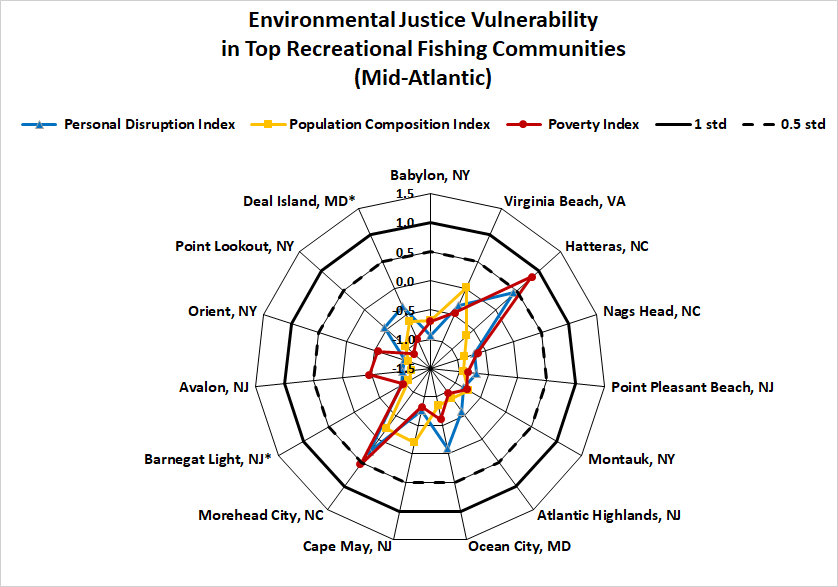

```{r setup, include=FALSE}

# library(tint)
# # invalidate cache when the package version changes
# knitr::opts_chunk$set(tidy = FALSE, cache.extra = packageVersion('tint'))
# options(htmltools.dir.version = FALSE)

#Default Rmd options
knitr::opts_chunk$set(echo = FALSE,
                      message = FALSE,
                      dev = "cairo_pdf",
                      warning = FALSE,
                      fig.width = 4,
                      fig.asp = 0.45,
                      fig.align = 'center'
                      ) #allows for inserting R code into captions

#Plotting and data libraries
#remotes::install_github("noaa-edab/ecodata@0.1.0") #change to 2020 ecodata version for release
library(tidyverse)
library(tidyr)
library(ecodata)
library(here)
library(kableExtra)

```

```{r, code = readLines("https://raw.githubusercontent.com/NOAA-EDAB/ecodata/master/chunk-scripts/human_dimensions_MAB.Rmd-setup.R")}
```

```{r, code = readLines("https://raw.githubusercontent.com/NOAA-EDAB/ecodata/master/chunk-scripts/human_dimensions_MAB.Rmd-GIS-setup.R")}
```

```{r, code = readLines("https://raw.githubusercontent.com/NOAA-EDAB/ecodata/master/chunk-scripts/macrofauna_MAB.Rmd-setup.R")}
```

```{r, code = readLines("https://raw.githubusercontent.com/NOAA-EDAB/ecodata/master/chunk-scripts/LTL_MAB.Rmd-setup.R")}
```

# Introduction
The Council approved an EAFM Guidance Document in 2016 which outlined a path forward to more fully incorporate ecosystem considerations into marine fisheries management^[http://www.mafmc.org/s/EAFM_Guidance-Doc_2017-02-07.pdf], and revised the document in February 2019^[http://www.mafmc.org/s/EAFM-Doc-Revised-2019-02-08.pdf]. The Council’s stated goal for EAFM is "to manage for ecologically sustainable utilization of living marine resources while maintaining ecosystem productivity, structure, and function." Ecologically sustainable utilization is further defined as "utilization that accommodates the needs of present and future generations, while maintaining the integrity, health, and diversity of the marine ecosystem." Of particular interest to the Council was the development of tools to incorporate the effects of species, fleet, habitat and climate interactions into its management and science programs. To accomplish this, the Council agreed to adopt a structured framework to first prioritize ecosystem interactions, second to specify key questions regarding high priority interactions and third tailor appropriate analyses to address them [@gaichas_framework_2016]. Because there are so many possible ecosystem interactions to consider, a risk assessment was adopted as the first step to identify a subset of high priority interactions [@holsman_ecosystem-based_2017]. The risk elements included in the Council's initial assessment spanned biological, ecological, social and economic issues (Table \ref{riskel}) and risk criteria for the assessment were based on a range of indicators and expert knowledge (Table \ref{allcriteria}).

This document updates the Mid-Atlantic Council’s initial EAFM risk assessment [@gaichas_implementing_2018] with indicators from the 2022 State of the Ecosystem report and with new analyses by Council Staff for the Management elements. The risk assessment was designed to help the Council decide where to focus limited resources to address ecosystem considerations by first clarifying priorities. Overall, the purpose of the EAFM risk assessment is to provide the Council with a proactive strategic planning tool for the sustainable management of marine resources under its jurisdiction, while taking interactions within the ecosystem into account. 

Many risk rankings are unchanged based on the updated indicators for 2022 and the Council's risk criteria. Below, we highlight only the elements where updated information has changed the perception of risk. In addition, we present new indicators based on Council feedback on the original risk analysis that the Council may wish to include in future updates to the EAFM risk assessment. As part of the Council’s 2022 Implementation Plan, the Council will initiate a comprehensive review of the risk assessment where new/different risk elements and analyses that could inform the risk criteria can be considered. This review will likely begin later in 2022 (the fall) and continue in 2023 and will likely include working with the Council’s Ecosystem and Ocean Planning Committee and Advisory Panel.

\newpage
```{r riskel, echo=FALSE, message=FALSE, warnings=FALSE, results='asis'}

#tab.cap="Risk Elements, Definitions, and Indicators Used\\label{riskel}",

elem <-read.table("riskelements.txt", sep="|", header=F, strip.white = T, stringsAsFactors = F)
elem <- elem[,2:4]
names(elem) <- c("Element", "Definition", "Indicator")

# elem$Element <- factor(all$Element, levels=c("Assessment performance", "F status", "B status", "Food web  (Council Predator)", "Food web  (Council Prey)", "Food web  (Protected Species Prey)",
#                                             "Ecosystem productivity", "Climate", "Distribution shifts", "Estuarine habitat", "Offshore habitat", "Commercial Revenue",
#                                             "Recreational Angler Days/Trips", "Commercial Fishery Resilience (Revenue Diversity)", "Commercial Fishery Resilience (Shoreside Support)",
#                                             "Fleet Resilience", "Social-Cultural", "Commercial", "Recreational", "Control", "Interactions", "Other ocean uses", "Regulatory complexity", 
#                                             "Discards", "Allocation"))

kable(elem, format = "latex", booktabs = T, longtable=T, caption="Risk Elements, Definitions, and Indicators Used\\label{riskel}") %>%
  kable_styling(font_size=8, latex_options=c("repeat_header")) %>%
  column_spec(1, width="2.5cm") %>%
  column_spec(2:3, width="7cm") %>%
  group_rows("Ecological",1,11) %>%
  group_rows("Economic",12,15) %>%
  group_rows("Social",16,17) %>%
  group_rows("Food Production",18,19) %>%
  group_rows("Management",20,25)
  #landscape()


```
 

\newpage
\pagestyle{plain}
```{r allcriteria,  echo=FALSE, message=FALSE, warnings=FALSE, results='asis'}

#tab.cap="Risk Ranking Criteria used for each Risk Element\\label{allcriteria}",

all<-read.table("riskrankingcriteria.txt", sep="|", header=T, strip.white = T, stringsAsFactors = F)
names(all) <- c("Element", "Ranking", "Criteria")
all$Ranking <- factor(all$Ranking, levels=c("Low", "Low-Moderate",  "Moderate-High", "High"))
all$Element <- factor(all$Element, levels=c("Assessment performance", "F status", "B status", "Food web  (MAFMC Predator)", "Food web  (MAFMC Prey)", "Food web  (Protected Species Prey)",
                                            "Ecosystem productivity", "Climate", "Distribution shifts", "Estuarine habitat", "Offshore habitat", "Commercial Revenue",
                                            "Recreational Angler Days/Trips", "Commercial Fishery Resilience (Revenue Diversity)", "Commercial Fishery Resilience (Shoreside Support)",
                                            "Fleet Resilience", "Social-Cultural", "Commercial", "Recreational", "Control", "Interactions", "Other ocean uses", "Regulatory complexity", 
                                            "Discards", "Allocation"))

allwide <- all %>% 
  spread(Ranking, Criteria)

kable(allwide, format = "latex", booktabs = T, longtable=T, caption="Risk Ranking Criteria used for each Risk Element\\label{allcriteria}") %>%
  kable_styling(font_size=8, latex_options=c("repeat_header")) %>%
  column_spec(1, width="2cm") %>%
  column_spec(2:5, width="5cm") %>%
  landscape()


```
\clearpage
\pagestyle{fancy}

# Changes from 2021: Ecological risk elements

## Species added: 1
Chub mackerel was formally added to the Mackerel, Squid, Butterfish (MSB) Fishery Management Plan (FMP) in December 2020. We ranked as many risk elements as possible for chub mackerel given data availability (Table \ref{sptable}). 

### Chub mackerel risk rankings and justifications

Chub mackerel **Assessment performance** ranks high risk because there is no stock assessment, nor data to conduct one in this region. **F status** and **B status** are unknown, but the weight of evidence indicates low risk of high fishing mortality or low biomass for this species in the Mid-Atlantic, and therefore rank low-moderate risk. Chub mackerel are not predators of MAFMC managed species, and we could not find evidence that chub mackerel are significant prey of MAFMC managed species^[https://fwdp.shinyapps.io/tm2020/] or protected species on the Northeast US shelf [@smith_consumption_2015], so they ranked low risk for all three **Food web** elements. Chub mackerel were not included in the Northeast US climate vulnerability assessment [@hare_vulnerability_2016], so we leave the **Climate** and **Distribution shifts** elements unranked until further study is completed. Chub mackerel do not depend on **Estuarine habitat**, so rank low risk for this element. 

## Decreased Risk: 0
No indicators for existing ecological elements have changed enough to warrant decreased risk rankings according to the Council risk critiera.

## Increased Risk: 0 
No indicators for existing ecological elements have changed enough to warrant increased risk rankings according to the Council risk critiera.

## Update on Estuarine Habitat Quality (Chesapeake Bay)
Many important MAFMC managed species (e.g., summer flounder, scup, black sea bass, and bluefish) use estuarine habitats as nurseries or are considered estuarine and nearshore coastal-dependent, and interact with other important estuarine-dependent species (e.g., striped bass and menhaden). An integrated measure of multiple water quality criteria shows a significantly increasing proportion of Chesapeake Bay waters meeting or exceeding EPA water quality standards over time (@zhang_chesapeake_2018; Fig. \ref{fig:cb-attainment}). This pattern was statistically linked to total nitrogen reduction, indicating responsiveness of water quality status to management actions implemented to reduce nutrients. Water quality trends and status may be used to inform aquaculture siting decisions in Chesapeake Bay.

```{r cb-attainment, fig.cap="Water quality attainment in Chesapeake Bay following rolling three year assessment periods.", code=readLines("https://raw.githubusercontent.com/NOAA-EDAB/ecodata/master/chunk-scripts/LTL_MAB.Rmd-ches-bay-wq.R")}

```

In 2019, we also reported on improving water quality in Chesapeake Bay, and suggested that the Council could reconsider high risk ratings for estuarine-dependent species if this trend continues. 

However, as reported in the 2020-2022 SOEs, the Chesapeake Bay experienced below average salinity in 2019, caused by the highest precipitation levels ever recorded for the watershed throughout 2018 and 2019. In 2020, Chesapeake Bay experienced a warmer than average winter, followed by a cooler than average spring, with potential impacts to striped bass and blue crabs as noted in the 2021 SOE. The Chesapeake Bay experienced a warmer-than-average winter and fall in 2021, and average conditions in the spring and summer. Trends in tidal freshwater submerged aquatic vegetation (SAV) have improved over time, while SAV in high salinity habitats declined.

These annual updates in Chesapeake Bay temperature, salinity, dissolved oxygen, and SAV may partially account for the recent drop in the overall water quality indicator. This suggests that high risk for estuarine-dependent species is still warranted. However, direct links between estuarine habitat conditions and population attributes for managed species (as reported in the SOE for Chesapeake Bay striped bass and blue crabs, as well as summer flounder and black sea bass) could be incorporated into future risk assessments as the science continues to develop.

## Update on Climate risks
Current risks to species productivity (and therefore to achieving OY) due to projected climate change in the Northeast US were derived from a comprehensive assessment [@hare_vulnerability_2016]. This assessment evaluated exposure of each species to multiple climate threats, including ocean and air temperature, ocean acidification, ocean salinity, ocean currents, precipitation, and sea level rise. The assessment also evaluated the sensitivity (*not extinction risk*) of each species based on habitat and prey specificity, sensitivity to temperature and ocean acidification, multiple life history factors, and number of non-climate stressors. Mid-Atlantic species were all either highly (77%) or very highly (23%) exposed to climate risk in this region, with a range of sensitivity (low-62%, moderate-15%, high-15%, and very high-8%) to expected climate change in the Northeast US. The combination of exposure and sensitivity results in the overall vulnerability ranking for each species (see the **Climate** column of Table \ref{sptable}). 

In 2021, the SOE was restuctured with an entire section focused on Climate risks to meeting fishery management objectives. New information has been added to the SOE that could be used to update species-specific Climate risk rankings in the future. The 2022 SOE includes multiple climate indicators including surface and bottom water temperature, marine heat waves, Gulf Stream position and warm core rings, cold pool area and persistence, and ocean acidification measurements. Combined with species sensitivity information from lab work, these indicators could be used to further clarify climate risks to managed species, as presented for surfclams and ocean acidification in the 2021-2022 SOEs.

Indicators can also be used to identify beneficial conditions for managed species. For example, since 2017, extraordinarily high availability of northern shortfin squid have been observed in the Mid-Atlantic, resulting in high fishery catch per unit effort (CPUE) and early fishery closures. High instances of squid catch near the shelf break are significantly related to low bottom temperatures (< 10 degrees C), high salinity ( >35.6 psu), increased chlorophyll frontal activity as well as the presence and orientation of warm core rings. Warm core rings are an important contributor to squid availability, likely influencing habitat conditions across different life stages. In particular, fishing effort was concentrated on the eastern edge of warm core rings, which are associated with upwelling and enhanced productivity. 


## Potential new indicators

### Habitat Climate Vulnerability combined with Species Climate Vulnerability

A Habitat Climate Vulnerability Assessment (HCVA) for habitat types in the Northeast US Large Marine Ecosystem was published in January 2021 [@farr_assessment_2021]. To better understand which species depend on vulnerable habitats, the Atlantic Coastal Fish Habitat Partnership (ACFHP) [habitat-species matrix](https://www.atlanticfishhabitat.org/species-habitat-matrix/) [@kritzer_importance_2016] was used in conjunction with the results of the HCVA and the Northeast Fish and Shellfish Climate Vulnerability Assessment (FCVA) completed in 2016 [@hare_vulnerability_2016]. The ACFHP matrix identified the importance of coastal benthic habitats to each life stage of select fish species, which helps elucidate species that may be highly dependent on highly vulnerable habitats that were identified in the HCVA.

Several MAFMC managed species, including black sea bass, scup, and summer flounder, are dependent on several highly vulnerable nearshore habitats from salt marsh through shallow estuarine and marine reefs. Details on highly vulnerable habitats with linkages to a variety of species, including which life stages have different levels of dependence on a particular habitat, are available in a detailed table.^[https://noaa-edab.github.io/ecodata/Hab_table]

Species highlighted here are those that are highly dependent on highly vulnerable habitats. A ranking matrix was created using the habitat vulnerability rankings compared to the habitat importance rankings to determine the criteria, and for the purposes of this submission, “high dependence on a highly vulnerable habitat” encompasses moderate use of very highly vulnerable habitats, high use of highly or very highly vulnerable habitats, or very high use of moderately, highly, or very highly vulnerable habitats.

Preliminary species narratives have been developed by Grace Roskar and Emily Farr (NMFS Office of Habitat Conservation), using information from the HCVA. The HCVA team is currently working with MAFMC and NEFMC on synthesizing habitat assessment information and developing narratives for ~75 species. We include two here so that the Council may provide feedback to improve their utility for management in general and for potentail future inclusion in the EAFM risk assessment. 

#### Black Sea Bass  
*Summary:* Black sea bass were determined to have, overall, a high vulnerability to climate change, due to very high climate exposure related to high surface and air temperature in both inshore and offshore waters, and moderate climate sensitivity of early life history stage requirements. However, climate change is predicted to have a positive effect on black sea bass, due to warmer temperatures increasing spawning and therefore recruitment, and a potential expansion in distribution of the species shifting farther north [@hare_vulnerability_2016].

The habitats important to black sea bass, such as submerged aquatic vegetation and shellfish reefs, are high and highly vulnerable to projected climate change, respectively. In particular, both habitats are sensitive to higher sea surface temperature and non-climate stressors. Additionally, intertidal habitats such as shellfish reefs are also vulnerable to projected changes in air temperatures, sea level rise, and pH. Although the climate vulnerability of subtidal rocky habitat was assessed as low, intertidal rocky bottom was assessed as high because of higher sea level, air temperature, and pH. Steimle et al. [@steimle_essential_1999] include use of salt marsh edge and channel habitats for young-of-year black sea bass, and estuarine emergent wetlands were determined to have very high climate vulnerability. Habitat condition and habitat fragmentation were also of concern for shellfish reefs and submerged aquatic vegetation. The species itself is also vulnerable to temperature changes, as mentioned above. The overlapping high importance of intertidal and subtidal shellfish reefs to black sea bass and the very high to high climate vulnerability of these habitats, respectively, show a potential critical nexus of climate vulnerability. 

##### Mid-Atlantic  
*Summary:* Shellfish reef habitats are highly important for both juveniles/young-of-the-year and adults. These life stages utilize both marine and estuarine shellfish reefs, in both intertidal and subtidal zones, which are very highly vulnerable and highly vulnerable, respectively. Other important habitats for black sea bass include submerged aquatic vegetation, which is highly vulnerable, and subtidal sand and rocky bottom habitats, which have low vulnerability. More information is needed on use of intertidal benthic habitats by black sea bass. Juvenile occurrence on sandy intertidal flats or beaches is rare, according to @drohan_essential_2007, but additional information on the use and importance of intertidal rocky bottom or intertidal benthic habitat use by adults is lacking. According to @drohan_essential_2007, black sea bass eggs have been collected in the water column over the continental shelf, as have larvae. As water column habitats were not included in ACFHP’s assessment of habitat importance, finer-scale information on the importance of specific pelagic habitats is needed for the species.

$\text{\underline{Habitat importance by life stage:}}$ 

* Juveniles/Young-of-the-year:  
    + Marine and estuarine intertidal shellfish reefs, which are very highly vulnerable to climate change, are of high importance.  
    + Marine and estuarine submerged aquatic vegetation and subtidal shellfish reefs, which are highly vulnerable to climate change, are of high importance.  
    + Marine intertidal rocky bottom habitats, which are highly vulnerable to climate change, are of high importance.  
    + Marine (<200 m) and estuarine subtidal rocky bottom habitats, which have a low vulnerability to climate change, are also of high importance.  
    
* Adults:  
    + Marine and estuarine intertidal shellfish reefs, which are very highly vulnerable to climate change, are of high importance.  
    + Marine and estuarine subtidal shellfish reefs, which are highly vulnerable to climate change, are of high importance.  
    + Marine intertidal rocky bottom habitats, which are highly vulnerable to climate change, are of high importance.  
    + Marine and estuarine submerged aquatic vegetation, which are highly vulnerable to climate change, are of moderate importance.  
    + Marine (<200 m) and estuarine subtidal rocky bottom habitats, which have a low vulnerability to climate change, are also of high importance.  
    + Marine (<200 m) and estuarine subtidal sand habitats, including sandy-shelly areas, which have a low vulnerability to climate change, are also of moderate importance.  

##### New England  
*Summary:* All habitats in New England for black sea bass were ranked as moderately important, likely indicating that the species uses a diverse range of habitats rather than high dependence on a specific habitat type. Shellfish reef habitats are moderately important for both juveniles/young-of-the-year and adults. These life stages utilize both marine and estuarine shellfish reefs, in both intertidal and subtidal zones, which are very highly vulnerable and highly vulnerable, respectively. Juveniles/young-of-the-year are also moderately dependent on native salt marsh habitats, which are highly vulnerable to climate change. Other moderately important habitats for black sea bass include submerged aquatic vegetation, which is highly vulnerable, and subtidal sand and rocky bottom habitats, which have low vulnerability. More information is needed on use of intertidal benthic habitats by black sea bass. Juvenile occurrence on sandy intertidal flats or beaches is rare, according to @drohan_essential_2007, but additional information on the use and importance of intertidal rocky bottom or intertidal benthic habitat use by adults is lacking.

$\text{\underline{Habitat importance by life stage:}}$  

* Juveniles/Young-of-the-year:  
    + Marine and estuarine submerged aquatic vegetation and subtidal shellfish reefs, which are all highly vulnerable to climate change, are of moderate importance.  
    + Marine and estuarine intertidal shellfish reefs, which are very highly vulnerable to climate change, are of moderate importance.  
    + Native salt marshes, which are very highly vulnerable to climate change, are of moderate importance.
Marine (<200 m) and estuarine subtidal rocky bottom habitats, which have a low vulnerability to climate change, are of moderate importance.  

* Adults:  
    + Marine and estuarine submerged aquatic vegetation and subtidal shellfish reefs, which are all highly vulnerable to climate change, are of moderate importance.  
    + Marine and estuarine intertidal shellfish reefs, which are very highly vulnerable to climate change, are of moderate importance.  
    + Marine (<200 m) and estuarine subtidal rocky bottom habitats, which have a low vulnerability to climate change, are of moderate importance.  
    + Structured sand habitats in marine (<200 m) and estuarine subtidal areas, which have a low vulnerability to climate change, and marine intertidal areas, which are highly vulnerable, are of moderate importance.  

#### Summer Flounder  
*Summary:* Summer flounder were ranked moderately vulnerable to climate change due to very high exposure to both ocean surface and air temperature, but low sensitivity to all examined attributes. Broad dispersal of eggs and larvae and seasonal north-south migrations by adults lend the species a high potential for distribution shifts. However, climate change is expected to have a neutral effect on the species, although there is high uncertainty surrounding this. The dispersal of eggs and larvae and the broad use of both estuarine and marine habitats could result in climate change having a positive effect, but uncertainty remains [@hare_vulnerability_2016].

The habitats important to summer flounder, such as intertidal benthic habitats, submerged aquatic vegetation, and native salt marsh habitats, are vulnerable to projected changes in temperature as well as sea level rise. Subtidal benthic habitats are vulnerable to changes in sea surface temperature. The species itself is also vulnerable to such factors, as they are exposed to changes in conditions in both inshore and offshore habitats. The overlapping high importance of native salt marsh and submerged aquatic vegetation habitats to the species and the very high and high climate vulnerability of these habitats, respectively, show a potential critical nexus of climate vulnerability.

##### Mid-Atlantic  
*Summary:* Marine and estuarine sand and mud habitats are highly important to juvenile and adult summer flounder, and these habitats range in their vulnerability to climate change. For example, marine intertidal sand is highly vulnerable, whereas subtidal mud and sand habitats have low vulnerability. In addition to these fine bottom benthic habitats, native salt marshes are highly important to juveniles and moderately important to adults, yet these habitats are very highly vulnerable to climate change. Eggs and larvae utilize pelagic continental shelf habitats; however, water column habitats were not included in ACFHP’s assessment of habitat importance. Finer-scale information on the importance of specific pelagic habitats is needed for the species.

$\text{\underline{Habitat importance by life stage:}}$    

* Juveniles/Young-of-the-year:  
    + Marine and estuarine intertidal shellfish reefs, which are very highly vulnerable to climate change, are of moderate importance.  
    + Marine and estuarine subtidal shellfish reefs, which are highly vulnerable to climate change, are of moderate importance.  
    + Marine and estuarine submerged aquatic vegetation, which are highly vulnerable habitats, are of high importance.  
    + Native salt marsh habitats, which are very highly vulnerable to climate change, are of high importance.  
    + Marine and estuarine subtidal and intertidal sand and mud bottom habitats are of high importance. These habitats range in climate vulnerability, from high vulnerability of marine intertidal sand to low vulnerability of marine subtidal sand and mud (<200 m) and estuarine subtidal sand.  
    
* Adults:  
    + Marine and estuarine submerged aquatic vegetation, which are highly vulnerable habitats, are of moderate importance.  
    + Native salt marsh habitats, which are very highly vulnerable to climate change, are of moderate importance.  
    + Marine and estuarine subtidal and intertidal sand and mud bottom habitats are of high importance. These habitats range in climate vulnerability, from high vulnerability of marine intertidal sand to low vulnerability of marine subtidal sand and mud (<200 m) and estuarine subtidal sand.  
    
* Spawning Adults:  
    + Marine subtidal (<200 m) sand habitats, which have a low vulnerability to climate change, are of high importance.  
    
We seek Council feedback on how best to include information on habitat climate vulnerability for managed species in future EAFM risk assessments.

# Changes from 2021: Economic, Social, and Food production risk elements

## Elements not updated: 2
Commercial landings data at the spatial scale relevant to the MAFMC risk assessment are not yet available for 2020. As a result, we were unable to update the **Commercial Revenue** and **Commercial Food production** risk elements for this report. These remain at risk levels assessed in 2021 based on data through the end of 2019. Given trends in the broader region in commercial landings and revenue for 2020 [@thunberg_northeast_2021], we do not expect the risk rankings for these elements to change when Mid-Atlantic scale data becomes available.

## Decreased Risk: 1
**Recreational value** has changed from high risk to low-moderate risk based on 2022 indicator updates. Recreational value was ranked high risk in the 2018 risk assessment due to a significant decrease in angler trips over the most recent 10 years of the time series. In 2019, the risk assessment noted that in the updated MRIP angler trip time series, "declines are less pronounced than measured previously. A reduction from the highest risk ranking to a lower risk category may be warranted." 

Updated information has eliminated the recent trend, and contributed to a long term increase in recreational effort (angler trips), with 2020 effort above the long-term average (Fig. \ref{fig:rec-op}).
```{r rec-op, fig.cap = paste0("Recreational effort in the ",region,"."), code = readLines("https://raw.githubusercontent.com/NOAA-EDAB/ecodata/master/chunk-scripts/human_dimensions_MAB.Rmd-recdat-effort.R")}
```

The long term increase in recreational angler trips results in an updated low-moderate risk ranking according to Council criteria.

## Increased Risk: 0
No indicators for existing economic, social, and food production elements have changed enough to warrant increased risk rankings according to the Council risk critiera.

## Potential new indicators

### Recreational Fleet Diversity
Recreational diversity indices could be considered as additional risk element(s) to complement the existing Commercial fishery resilience (revenue diversity) element. While recreational value measured as angler trips has gone from high risk to low-moderate risk based on updated data, recreational fleet diversity (i.e., effort by shoreside, private boat, and for-hire anglers) has declined over the long term (Fig. \ref{fig:rec-div}). 

```{r rec-div, fig.cap = paste0("Recreational fleet effort diversity in the ",region,"."), code = readLines("https://raw.githubusercontent.com/NOAA-EDAB/ecodata/master/chunk-scripts/human_dimensions_MAB.Rmd-recdat-diversity.R")}

```

Increased angler trips in 2020 relative to previous years strongly influence the long term increase in recreational effort. While the overall number of recreational opportunities in the MAB is above the long term average, the continuing decline in recreational fleet effort diversity suggests a potentially reduced range of recreational fishing options.

The downward effort diversity trend is driven by party/charter contraction (from a high of 24% of angler trips to 7% currently), and a shift toward shorebased angling. Effort in private boats remained stable between 36-37% of angler trips across the entire series. 

Changes in recreational fleet diversity can be considered when managers seek options to maintain recreational opportunities. Shore anglers will have access to different species than vessel-based anglers, and when the same species is accessible both from shore and from a vessel, shore anglers typically have access to smaller individuals. Many states have developed shore-based regulations where the minimum size is lower than in other areas and sectors to maintain opportunities in the shore angling sector.

### Environmental justice vulnerability in commercial and recreational fishing communities
Social vulnerability measures social factors that shape a community’s ability to adapt to change. A subset of these can be used to assess potential environmental justice issues. Environmental Justice is defined in Executive Order 12898 as federal actions intended to address disproportionately high and adverse human health and environmental effects of federal actions on minority and low-income populations. Three of the existing NOAA Fisheries Community Social Vulnerability Indicators (CSVIs), the Poverty Index, Population Composition Index, and Personal Disruption Index, can be used for mandated Environmental Justice analysis^[https://www.fisheries.noaa.gov/national/socioeconomics/social-indicators-coastal-communities]. 

Commercial fishery engagement measures the number of permits and dealers, and pounds and value landed in a community, while reliance expresses these numbers based on the level of fishing activity relative to the total population of a community. Recreational fishery engagement measures shore, private vessel, and for-hire fishing effort while reliance expresses these numbers based on fishing effort relative to the population of a community.

In 2021, we reported the top ten most engaged, and top ten most reliant commercial and recreational fishing communities and their associated social vulnerability. Here we apply the same selection standard for top ten fishing communities for both sectors, and focus on examining the environmental justice vulnerability in these communities.

Communities plotted in the upper right section of Fig.\ref{fig:commercial-engagement} scored high for both commercial engagement and reliance, including Cape May and Barnegat Light, NJ, and Reedville, VA. Communities that ranked medium-high or above for one or more of the environmental justice indicators are highlighted in bright orange: Newport News, VA; Atlantic City, NJ; Hampton Bays/Shinnecock, NY; and Beaufort, Columbia and Hobucken, NC.

```{r commercial-engagement, fig.cap= "Commercial engagement, reliance, and environmental justice vulnerability for the top commercially engaged and reliant fishing communities in the Mid-Atlantic.  Communities ranked medium-high or above for one or more of the environmental justice indicators are highlighted in bright orange. *Community scored high (1.00 and above) for both commercial engagement and reliance indicators.", code = readLines("https://raw.githubusercontent.com/NOAA-EDAB/ecodata/master/chunk-scripts/human_dimensions_MAB.Rmd-commercial-engagement.R"), fig.width = 6.5, fig.asp = 0.75}

#(* Scored high (1.00 and above)) for both commercial engagement and reliance indicators)
```

Fig. \ref{fig:commercial-EJ} shows the detailed scores of the three environmental justice indicators for the same communities plotted in Fig.\ref{fig:commercial-engagement}. Communities are plotted clockwise in a descending order of commercial engagement scores from high to low, with the most highly engaged community, Cape May, NJ, listed on the top. Among the communities ranked medium-high or above for environmental justice vulnerability, Newport News, VA scored medium-high for the population composition index. Atlantic City, NJ scored high for all of the three environmental justice indicators. Hampton Bays/Shinnecock, NY scored medium-high for the population composition index. Beaufort, NC scored medium-high and very close to high for the poverty index. Columbia, NC scored high for the personal disruption index and the poverty index, and medium-high for the population composition index. Hobucken, NC scored high for the personal disruption index and the poverty index.

```{r commercial-EJ, fig.cap="Environmental justice indicators (Poverty Index, population composition index, and personal disruption index) for top commercial fishing communities in Mid-Atlantic. *Community scored high (1.00 and above) for both commercial engagement and reliance indicators.", out.width='70%'}
knitr::include_graphics("images/EJ_Commercial_MAB.png")
```

Communities plotted in the upper right section of Fig.\ref{fig:recreational-engagement} scored high for both recreational engagement and reliance, including Barnegat Light, NJ and Deal Island, MD. Communities that ranked medium-high or above for one or more of the environmental justice indicators are highlighted in bright orange: Hatteras and Morehead City, NC.

```{r recreational-engagement, fig.cap= "Recreational engagement and reliance, and environmental justice vulnerability, for the top recreationally engaged and reliant fishing communities in the Mid-Atlantic. Communities ranked medium-high or above for one or more of the environmental justice indicators are highlighted in bright orange. *Community scored high (1.00 and above) for both commercial engagement and reliance indicators.", code = readLines("https://raw.githubusercontent.com/NOAA-EDAB/ecodata/master/chunk-scripts/human_dimensions_MAB.Rmd-recreational-engagement.R"), fig.width = 6.5, fig.asp = 0.75}

#(* Scored high (1.00 and above) for both recreational engagement and reliance indicators; 
```

Fig. \ref{fig:recreational-EJ} orders communities clockwise in a descending order of recreational engagement scores from high to low, with the most highly engaged community, Babylon, NY, listed on the top. The two communities with environmental justice concerns, Hatteras and Morehead City, NC, both scored medium-high for the poverty index. 

```{r recreational-EJ, fig.cap="Environmental justice indicators (Poverty Index, population composition index, and personal disruption index) for top recreational fishing communities in Mid-Atlantic. *Community scored high (1.00 and above) for both commercial engagement and reliance indicators.", out.width='70%'}

```


Both commercial and recreational fishing are important activities in Montauk, NY, Barnegat Light, Cape May and Point Pleasant Beach, NJ, meaning these communities may be impacted simultaneously by commercial and recreational regulatory changes. All of these communities scored lower than medium-high for all of the three environmental justice indicators, indicating that environmental justice may not be a major concern in these communities at the moment based on the indicators analyzed.

We seek Council feedback on whether to include fishing community environmental justice vulnerability and recreational diversity indicators within the EAFM risk assessment, and if so, what risk criteria should be applied to these indicators.


# Changes from 2021: Management risk elements 
Management risk elements contain a mixture of quantitatively (Fishing Mortality Control, Technical Interactions, Discards, and Allocation) and qualitatively (Other Ocean Uses and Regulatory Complexity) calculated rankings. In general, the management indicators evaluate a particular risk over several years; therefore, the rankings should remain fairly consistent on an annual basis unless something changed in the fishery or if a management action occurred. A comprehensive evaluation and update of all management risk elements was conducted by Council staff in 2020 and were updated in 2021. In 2022, a similar update was conducted with Council staff reviewing the 2021 rankings and associated justifications to determine if any significant fishery or management changes would result in a change in a risk element ranking. The updated management risk element rankings can be found in Table \ref{spsectable} and the justification for any ranking change can be found below. 

## Updated Justifications

The **Discards** risk ranking (moderate-high) for Surfclam and Ocean Quahog did not change from 2021 to 2022; however, the justification for the ranking was modified to be more reflective of current considerations. The justification now states: “allocated minimal coverage under SBRM as a result of discard being low percent of total catch; however, co-occurrence of surfclams and quahogs raised as major issue (2022 implementation plan action).”

The **Management Control** risk rankings were evaluated for all managed species with catch information through 2020. The justification language for each species was modified to reflect the updated data used to evaluate management control (total catch compared to ABC or ACL, as appropriate) but only those species with a change in risk ranking are included in this document (see Decreased/Increased Risk sections below). It was noted that this ranking may change in the next review for Scup given anticipated overages in 2021.

## Decreased Risk: 8

The **Allocation** risk ranking for commercial Summer Flounder, Scup, Black Sea Bass, and Bluefish decreased from high to low. The Council took final action on the commercial/recreational allocation amendment for these species in 2021 and no additional allocation related actions are under consideration. The recreational allocation risk ranking for all for species remains as high risk given the Council’s continued consideration of recreational sector separation as part of the Recreational Reform Initiative. 

The **Regulatory Complexity/Stability** risk ranking for Butterfish and Longfin Squid decreased from high to medium-high. The regulations for these species are complex but have remained relatively unchanged for several years. 
The **Regulatory Complexity/Stability** risk ranking for both recreational and commercial Blueline Tilefish changed from medium-high to low-medium. Regulatory changes to the recreational possession limits for different vessel categories were approved several years ago and measures have not changed since. Similarly, regulatory changes to the commercial trip limits to accommodate larger landings and achieve optimal were approved several year ago and have not changed since. 

## Increased Risk: 4

The **Regulatory Complexity/Stability** risk ranking for recreational Atlantic Mackerel increased from low to low-medium. There are currently minimal recreational management regulations for Atlantic Mackerel; however, the Council is considering potential new/additional regulations as part of the rebuilding amendment currently being developed.

The **Regulatory Complexity/Stability** risk ranking for *Illex* Squid increased from low-medium to medium-high. *Illex* regulations are somewhat complex and have not changed much recently, but potential new regulations are being considered. 

The **Management Control** risk ranking for both commercial and recreational Blueline Tilefish increased from low to low-medium. Recent overages have been observed in both sectors (the 2021 recreational overage could be large). A two-step lowering of the commercial trip limit has been implemented and should minimize future overages. 

## Potential new indicators

### Other ocean uses: offshore wind energy development timeline, revenue in lease areas, coastal community vulnerability
As of February 2022, 24 offshore wind development projects are proposed for construction over the next decade in the Northeast (timelines and project data are based on Tables E-2, E-4, and E-4-2 of South Fork Wind Farm Final Environmental Impact Statement). Offshore wind areas are anticipated to cover more than 1.7 million acres by 2030 in the Greater Atlantic region (Fig. \ref{fig:wind-proposed-dev}). Beyond 2030 values include acreage for the NY Wind Energy Areas (WEA) and Gulf of Maine Area of Interest for floating research array. 
```{r wind-proposed-dev, fig.cap='Proposed wind development on the northeast shelf.', code=readLines("https://raw.githubusercontent.com/NOAA-EDAB/ecodata/master/chunk-scripts/human_dimensions_MAB.Rmd-wind-proposed-dev.R")}
```

Just over 2,500 foundations and more than 7,000 miles of inter-array and offshore export cables are proposed to date. The colored chart in Fig. \ref{fig:wind-dev-cumul} also presents the offshore wind development timeline in the Greater Atlantic region with the estimated year that foundations would be constructed (matches the color of the wind areas). These timelines and data estimates are expected to shift but represent the most recent information available as of February 2022. Based on current timelines, the areas affected would be spread out such that it is unlikely that any one particular area would experience full development at one time. Future wind development areas are also presented. Additional lease areas, totalling over 488,000 acres in the NY Bight are available for BOEM's 2022 lease sale. It’s anticipated that the NY Bight leases will fulfill outstanding offshore wind energy production goals for NY and NJ. VA and NC have outstanding goals that cannot be fulfilled within the existing lease areas, and it is expected that these will be fulfilled with future development off the Delmarva Peninsula. 
```{r wind-dev-cumul, fig.cap = "All Northeast Project areas by year construction ends (each project has 2 year construction period).", out.width='90%'}
#knitr::include_url("https://raw.githubusercontent.com/NOAA-EDAB/ecodata/master/docs/images/All_2021128_needsgraph-01.jpg")
knitr::include_graphics("images/offshore_wind_timeline.png")
```

Based on federal vessel logbook data, average commercial fishery revenue from trips in the current offshore wind lease areas and the New York Bight leasing areas identified in the proposed sale notice represented 2-20% of the total annual revenue for the most affected fisheries in federal waters from 2008-2019 (Fig. \ref{fig:wea-spp-rev}). 

```{r wea-spp-rev, fig.cap="Wind energy revenue in the Mid-Atlantic.", code=readLines("https://raw.githubusercontent.com/NOAA-EDAB/ecodata/master/chunk-scripts/human_dimensions_MAB.Rmd-wea-spp-rev.R"), fig.width=5, fig.asp=.4}
```

The surfclam fishery could be the most affected fishery, with a maximum of 20% of annual fishery revenue occurring within potential wind lease areas during this period, followed by chub mackerel (15%), ocean quahog (13%), and Atlantic mackerel (10%). The *Illex* squid and bluefish fisheries were the least affected, at 1-2% maximum annual revenue affected, respectively. A maximum of 9% of the annual scup revenues were affected by these areas, with similar effects for the longfin squid (8%), blueline tilefish and black sea bass (7%), and monkfish and golden tilefish  (6%) fisheries. The proposed New York Bight lease areas represented up to 5% of total annual fishery revenue from any MAFMC fishery during 2008-2019, with the surfclam fishery most affected. Similar patterns are observed when examining the proportion of annual fishery landings within current and proposed lease areas (see Table \ref{tab:wea-landings-rev}).

```{r wea-landings-rev}
#fig.cap="Percent Landings and Revenue from wind energy areas. Data from GARFO VTR.",
#, out.width="90%", code=readLines("https://raw.githubusercontent.com/NOAA-EDAB/ecodata/master/chunk-scripts/human_dimensions_MAB.Rmd-wea-landings-rev.R")

dt<- ecodata::wea_landings_rev[1:10, 1:5] %>% 
  dplyr::select("GARFO and ASMFC Managed Species", "perc_landings_max"  ,"perc_landings_min",
                "perc_revenue_max","perc_revenue_min" ) %>% 
  dplyr::rename("Maximum Percent Total Annual Regional Species Landings"="perc_landings_max",
    "Maximum Percent Total Annual Regional Species Revenue"="perc_revenue_max",
    "Minimum Percent Total Annual Regional Species Landings"="perc_landings_min",
    "Minimum Percent Total Annual Regional Species Revenue"="perc_revenue_min",) 
kable(dt,"latex", booktabs = TRUE,
      caption = "Top ten species Landings and Revenue from Wind Energy Areas.") %>% 
  #kable_classic(full_width = F, html_font = "Cambria") %>%
  column_spec(2:5, width = "10em") %>%
  kable_styling(latex_options = "scale_down")

```

Proposed wind development areas interact with the region’s federal scientific surveys. The total survey area overlap ranges from 1-14% for all Greater Atlantic federal surveys. Individual survey strata have significant interaction with wind, including the sea scallop survey (up to 96% of individual strata) and the bottom trawl survey  (BTS, up to 60% strata overlap). Additionally, up to 50% of the southern New England North Atlantic right whale survey’s area overlaps with proposed project areas. A region-wide survey mitigation program is underway (Table \ref{tab:wind-survey-table})

```{r wind-survey-table}
#, out.width="90%", code=readLines("https://raw.githubusercontent.com/NOAA-EDAB/ecodata/master/chunk-scripts/human_dimensions_MAB.Rmd-wind-survey-table.R")

dat<- data.frame(XSurvey= c("Fall BTS", "Spring BTS", "EcoMon", "Scallop",
                            "Shellfish(Clams)", "Right Whale (Air)", 
                            "Marine Mammal/Turtle (Ship/Air)",
                            "Altantic Shark (Bottom Long-Line",
                            "GOM Bottom Long-Line", "GOM Shrimp Survey", 
                            "Atlantic Shark COASTPAN"), 
                 X1 = c("Started", "Started", "No",
                                                    "Started", "No", "Inital", 
                                                    "No", "No","No", "No","No"), 
                 X2 = c("Inital", "Initial", "No", "Initial", 
                                            "No", "Initial","No", "No","No", "No",
                                            "No" ), 
                 X3 = c( "No", "No","No",
                        "No","No",  "Initial", "No", "No","No", "No","No"), 
                 X4 = c("No", "No","No", "No","No","No", 
                                         "No","No", "No","No","No"), 
                 X5 = c("No", "No","No", "No","No","No", 
                                         "No","No", "No","No","No"),
                 X6 = c("Initial", "Initial","No", "No","No","No", 
                                         "No","No", "No","No","No"))

column_names <- c("Survey","1.Evaluate designs & Impacts","2.Design New Methods","3.Calibrate New/Existing Surveys","4.Bridge Solutions","5.Conduct New Surveys","6.Comms & Data")
#DT::datatable(dat, colnames = column_names)

kable(dat, col.names = column_names, "latex", booktabs = TRUE,
      caption = "Survey mitigation planning.") %>% 
  #kable_classic(full_width = F, html_font = "Cambria") %>%
  column_spec(2:7, width = "10em") %>%
  kable_styling(latex_options = "scale_down")

```

Equity and environmental justice (EJ) are priority concerns with offshore wind development and fisheries impacts in the Northeast. Fig. \ref{fig:wea-port-rev} links historic port revenue (2008-2019) from within all wind lease areas as a proportion of the port’s total revenue based on vessel trip reports as described in the revenue and landings of species in the wind indicator above. The range (minimum and maximum) of total percent revenue from within wind energy areas is presented in the graph and ports are sorted from greatest to least revenue from within wind areas. 

```{r wea-port-rev, fig.cap="Percent of port revenue from Wind Energy Areas (WEA) in descending order from most to least port revenue from WEA. EJ = Environmental Justice.", code=readLines("https://raw.githubusercontent.com/NOAA-EDAB/ecodata/master/chunk-scripts/human_dimensions_MAB.Rmd-wea-port-rev.R"), fig.width=5.5, fig.asp=1, fig.align='left'}

```

For example, Atlantic City, NJ had a minimum of 11% and maximum of 30% overlap of wind energy revenue to the total port revenue between 2008-2019. Those communities that score Med-High or higher in at least one of the vulnerability indicators that address environmental justice concerns (i.e., Poverty, Population Composition, Personal Disruption; see  indicator definitions) are noted with a triangle. Gentrification pressure is also highlighted here, with those communities that score Med-High or higher in one or more gentrification pressure indicators (i.e., Housing Disruption, Retiree Migration, Urban Sprawl) represented with a circle (Fig. \ref{fig:wea-port-rev}). BOEM reports that cumulative offshore wind development (if all proposed projects are developed) could have moderate impacts on low-income members of environmental justice communities who work in the commercial fishing and for-hire fishing industry due to disruptions to fish populations, restrictions on navigation and increased vessel traffic, as well as existing vulnerabilities of low-income workers to economic impacts [@boem_vineyard_2020]. 

Top fishing communities high in environmental justice concerns (i.e., Atlantic City, NJ, Newport News, VA, Hobucken and Beaufort, NC) should be considered in decision making to reduce the social and economic impacts and aid in the resilience and adaptive capacity of underserved communities. It also highlights communities where we need to provide further resources to reach underserved and underrepresented groups and create opportunities for and directly involve these groups in the decision-making process.  


### Implications
Current plans for rapid buildout of offshore wind in a patchwork of areas spreads the impacts differentially throughout the region (Fig. \ref{fig:wind-dev-cumul}).  

Up to 20% of total average revenue for major Mid-Atlantic commercial species in lease areas could be displaced if all sites are developed. Displaced fishing effort can alter historic fishing area, timing, and method patterns, which can in turn change habitat, species (managed and protected), and fleet interactions. Several factors, including fishery regulations, fishery availability, and user conflicts affect where, when, and how fishing effort may be displaced. 

Scientific data collection surveys for ocean and ecosystem conditions, fish, and protected species will be altered, potentially increasing uncertainty for management decision making.

The increase of offshore wind development can have both positive (e.g., employment opportunities) and negative (e.g., space-use conflicts) effects. Continued increase in coastal development and gentrification pressure has resulted in loss of fishing infrastructure space within ports. Understanding these existing pressures can allow for avoiding and mitigating negative impacts to our shore support industry and communities dependent on fishing. Some of the communities with the highest revenue overlap with offshore wind that are also vulnerable to gentrification pressure are Point Pleasant and Atlantic City, NJ, Ocean City, MD, and Beaufort, NC.

We seek Council feedback on whether to include offshore wind development and related indicators within the EAFM risk assessment, and if so, what risk criteria should be applied to these indicators.

\newpage

# 2022 EAFM Risk Tables

```{r sptable,  echo=FALSE, message=FALSE, warnings=FALSE, results='asis'}

#tab.cap="Species level risk analysis results; l=low risk (green), lm= low-moderate risk (yellow), mh=moderate to high risk (orange), h=high risk (red)\\label{sptable}",

# spplist     oc,  sc,  flk, scp, bsb, mack, but, lsq, ssq, gtile,  btile,  blu, dog, monk
risk.species<-data.frame(
  Species = c("Ocean Quahog", "Surfclam", "Summer flounder", "Scup", "Black sea bass", "Atl. mackerel", "Chub mackerel", "Butterfish", "Longfin squid", "Shortfin squid", "Golden tilefish", "Blueline tilefish", "Bluefish", "Spiny dogfish", "Monkfish", "Unmanaged forage", "Deepsea corals"),
  Assess  = c("l", "l", "l",  "l", "l", "l", "h", "l", "lm", "lm", "l", "h", "l", "lm", "h", "na", "na"),
  Fstatus = c("l", "l", "l", "l", "l", "h", "lm", "l", "lm", "lm", "l", "h", "l", "l", "lm", "na", "na"),
  Bstatus = c("l", "l", "lm", "l", "l", "h", "lm", "lm", "lm", "lm", "lm", "mh", "h", "lm", "lm", "na", "na"),
  FW1Pred = c("l", "l", "l", "l", "l", "l", "l", "l", "l", "l", "l", "l", "l", "l", "l", "l", "l"),
  FW1Prey = c("l", "l", "l", "l", "l", "l", "l", "l", "l", "l", "l", "l", "l", "l", "l", "lm", "l"),
  FW2Prey = c("l", "l", "l", "l", "l", "l", "l", "l", "lm", "lm", "l", "l", "l", "l", "l", "lm", "l"),
  Climate = c("h", "mh", "lm", "lm", "mh", "lm", "na", "l", "l", "l", "mh", "mh","l", "l", "l", "na", "na"),
  DistShift = c("mh", "mh", "mh", "mh", "mh", "mh", "na", "h", "mh", "h", "l", "l", "mh", "h", "mh", "na", "na"),
  EstHabitat = c("l", "l", "h", "h", "h", "l", "l", "l", "l", "l", "l", "l", "h", "l", "l", "na", "na")#,
#  OffHabitat = c("na", "na", "l", "l", "l", "l", "na", "l", "l", "h", "na", "na", "na", "l", "l", "na", "na")#,
)

# these elements were removed by the council
#  PopDiv = c("na", "na", "na", "na", "na", "na", "na", "na", "na", "na", "na", "na", "na", "na"),
#  FoodSafe = c(),

# one column test
# risk.species %>%
#   mutate(Fstatus = 
#     cell_spec(Fstatus, format="latex", color = "black", align = "c", background =factor(Fstatus, c("na", "l", "lm", "mh", "h"),c("white", "green", "yellow", "orange", "red")))) %>%
#   kable(risk.species, format="latex", escape = F, booktabs = T, linesep = "")

#generalize to all
risk.species %>%
  mutate_at(vars(-Species), function(x){ 
    cell_spec(x, format="latex", color = "gray", align = "c", background =factor(x, c("na", "l", "lm", "mh", "h"),c("white", "green", "yellow", "orange", "red")))}) %>%
  kable(risk.species, format="latex", escape = F, booktabs = T, linesep = "", 
        caption="Species level risk analysis results; l=low risk (green), lm= low-moderate risk (yellow), mh=moderate to high risk (orange), h=high risk (red)\\label{sptable}") %>%
  kable_styling(latex_options = "scale_down") #%>%
  #kable_as_image()


```

```{r ecotable,  echo=FALSE, message=FALSE, warnings=FALSE, results='asis'}
  
#tab.cap="Ecosystem level risk analysis results; l=low risk (green), lm= low-moderate risk (yellow), mh=moderate to high risk (orange), h=high risk (red)\\label{sptable}",

risk.eco<-data.frame(
  System = c("Mid-Atlantic"),
  EcoProd = c("lm"),
  #EcoDiv = c("lm"),
  CommRev = c("mh"),
  RecVal = c("lm"),
  FishRes1 = c("l"),
  FishRes4 = c("mh"),
  #CommJobs = c("mh"),
  #RecJobs = c("l"),
  FleetDiv = c("l"),
  Social = c("lm"),
  ComFood = c("h"),
  RecFood = c("mh")
)

#make table
risk.eco %>%
  mutate_at(vars(-System), function(x){ 
    cell_spec(x, format="latex", color = "gray", align = "c", background =factor(x, c("na", "l", "lm", "mh", "h"),c("white", "green", "yellow", "orange", "red")))}) %>%
  kable(risk.eco, format="latex", escape = F, booktabs = T, linesep = "",
        caption="Ecosystem level risk analysis results; l=low risk (green), lm= low-moderate risk (yellow), mh=moderate to high risk (orange), h=high risk (red)\\label{ecotable}") %>%
  kable_styling(latex_options = "scale_down") #%>%
  #kable_as_image()

```

```{r spsectable,  echo=FALSE, message=FALSE, warnings=FALSE, results='asis'}
#tab.cap="Species and sector level risk analysis results; l=low risk (green), lm= low-moderate risk (yellow), mh=moderate to high risk (orange), h=high risk (red)\\label{sptable}",

risk.sppsector<-data.frame(
  Species = c("Ocean Quahog-C", "Surfclam-C", "Summer flounder-R", "Summer flounder-C","Scup-R", "Scup-C","Black sea bass-R", "Black sea bass-C","Atl. mackerel-R", "Atl. mackerel-C","Butterfish-C", "Longfin squid-C", "Shortfin squid-C", "Golden tilefish-R", "Golden tilefish-C","Blueline tilefish-R","Blueline tilefish-C", "Bluefish-R", "Bluefish-C","Spiny dogfish-R", "Spiny dogfish-C", "Chub mackerel-C", "Unmanaged forage", "Deepsea corals"),
  MgtControl =  c(1,1,3,2,2,1,4,4,2,1,1,1,2,9,1,2,2,2,1,1,1,1,1,9),
  TecInteract = c(1,1,1,3,1,2,1,2,1,2,2,3,2,1,1,1,1,1,1,1,3,2,1,9),
  OceanUse =    c(2,2,2,2,2,3,3,4,1,3,3,4,2,1,1,1,1,1,2,1,3,2,3,3),
  RegComplex =  c(1,1,3,3,3,3,3,3,2,4,3,3,3,1,1,2,2,2,2,1,3,2,1,9),
  Discards =    c(3,3,4,3,3,3,4,4,1,2,3,4,1,1,1,1,1,3,2,1,2,1,1,9),
  Allocation =  c(1,1,4,1,4,1,4,1,1,4,1,1,4,1,1,1,1,4,1,1,1,1,1,9) 
)

#convert to text for consistency
risk.sppsector <- risk.sppsector %>%
     mutate_at(vars(-Species), function(x){
       recode(x,'1'="l",'2'="lm",'3'="mh",'4'="h",'9'="na")}) %>%
     as.data.frame()

#make table
risk.sppsector %>%
  mutate_at(vars(-Species), function(x){ 
    cell_spec(x, format="latex", color = "gray", align = "c", background =factor(x, c("na", "l", "lm", "mh", "h"),c("white", "green", "yellow", "orange", "red")))}) %>%
  kable(risk.sppsector, format="latex", escape = F, booktabs = T, linesep = "",
        caption="Species and sector level risk analysis results; l=low risk (green), lm= low-moderate risk (yellow), mh=moderate to high risk (orange), h=high risk (red)\\label{spsectable}") %>%
  kable_styling(font_size =  9) #%>%
  #kable_as_image()

```


# References
