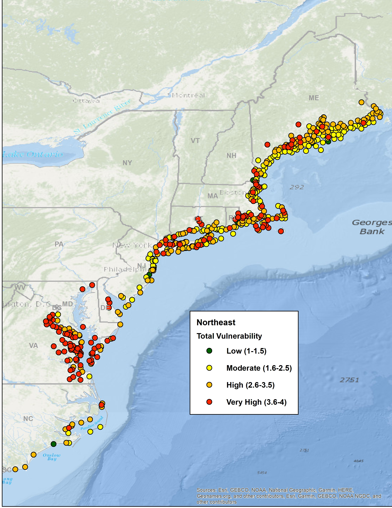

```{r setup, include=FALSE}

# library(tint)
# # invalidate cache when the package version changes
# knitr::opts_chunk$set(tidy = FALSE, cache.extra = packageVersion('tint'))
# options(htmltools.dir.version = FALSE)

#Default Rmd options
knitr::opts_chunk$set(echo = FALSE,
                      message = FALSE,
                      #dev = "cairo_pdf",
                      warning = FALSE,
                      fig.width = 6,
                      fig.asp = 0.45,
                      fig.align = 'center'
                      ) #allows for inserting R code into captions

#Plotting and data libraries
#remotes::install_github("noaa-edab/ecodata@0.1.0") #change to 2020 ecodata version for release
library(tidyverse)
library(tidyr)
library(ecodata)
library(here)
library(kableExtra)
library(patchwork)

```

\pagestyle{fancy}

# Risk Assessment

## Ecological Elements


### Food Web (2) - Predation Pressure

**Description:**

This element is applied at the species level.

Fish stocks and protected species stocks are managed using single species approaches, but fish and protected species stocks exist within a food web of predator and prey interactions. This element is one of two separating food web risks to achieving OY for Council managed species from two sources. This second food web risk element assesses predation pressure on each species, and the first element assesses prey availability for each species (see Food Web (1) Prey availability).

**Definition:**

Risk of not achieving OY for Council managed species due to predation
pressure.

**Indicators:**

First, the estimated predation mortality and major predators for each Council-managed species could be identified using food web models, empirical data, and/or literature review. 
A food web model can also determine whether predation mortality is a “low” proportion of overall mortality, with the EOP deciding on a threshold (for example, < 10%). 

For Council managed species with 10% or more of total mortality from predation, the EOP could decide on a threshold for identifying major predators, such as those contributing 5% or more of total mortality on average. Then, all predators contributing that amount to mortality would be considered together in the risk indicators to evaluate total predation pressure risk. 

Given that predation mortality exceeds the EOP threshold and major predators are identified, we envision four types of indicators that will provide insight into predation pressure trends across a variety of species data availability.

* Predator-prey spatial and temporal overlap. This can be calculated from survey data for many species and does not require detailed diet information. However, overlap alone may not be a complete indicator of mortality.

* Estimated consumption by fish predators. This requires detailed diet information and time series of biomass for predators, available for some Council-managed species (see https://fwdp.shinyapps.io/tm2020/#7_TOTAL_CONSUMPTION_AND_CB_RATIOS where these estimates are available for Atlantic mackerel, butterfish, and longfin squid). Estimates of total consumption are also available from literature. However, consumption alone may not be a complete indicator of mortality, and these estimates do not include consumption by HMS, mammals, and birds.

* Predation pressure index (PPI). This requires some diet information and time series of biomass for major predators. This method can include mammal and bird predators as well as fish, and is being proposed to be implemented for Atlantic mackerel. (Fig. \ref{fig:PPI}). 

```{r PPI, fig.cap="Draft Atlantic mackerel change in predation mortality from major predators; graph courtesy Laurel Smith, NEFSC."}
#download.file(url="https://raw.githubusercontent.com/NOAA-EDAB/presentations/master/docs/EDAB_images/WGSAM24_PPImackerel_Smith.png", destfile="PPIfig.png")


```


* Model-estimated time series of total predation mortality. Food web and multispecies models exist and are being updated for the Mid-Atlantic and full Northeast US shelf. These models can be fitted to available biomass, catch, and diet data. Food web models include predation from all sources (fish, birds, mammals) while multispecies models may estimate age- or size-specific predation mortality from a subset of predators. Model-estimated time series could be available in late 2025.

**Potential risk criteria:**

  -----------------------------------------------------------------------
  *Risk Level*    *Definition*
  --------------- -------------------------------------------------------
  Low             Predation pressure represents low proportion of overall
                  mortality

  Low-Moderate    Predation pressure moderate proportion of overall
                  mortality, decreasing overlap/consumption/PPI/mortality trend

  Moderate-High   Predation pressure moderate proportion of overall
                  mortality, increasing overlap/consumption/PPI/mortality trend

  High            Predation pressure represents high proportion of
                  overall mortality, increasing overlap/consumption/PPI/mortality trend
  -----------------------------------------------------------------------

**Risk Assessment**

To be developed later in year in collaboration with the EOP Committee and AP once indicators and risk criteria are developed.

**Questions for Committee and AP feedback**

* Do we want both the overall amount of predation mortality (low, moderate, high) and the trend in mortality included in the criteria as in the table above?

* What level of predation do we consider a “low” proportion of overall mortality for the low risk category?

* What level of predation do we consider a “high” proportion of overall mortality for the high risk category? (Moderate would be the range between low and high)

* How much mortality should a predator cause to be considered a “major” predator and tracked with indicators?

* Are we ok with treating trends from the different indicator types similarly in the risk criteria as drafted above?


### Offshore Habitat (new)

**Description:**

This element is applied at the species level.

Offshore habitat, defined here as all habitat outside of the estuary
and beyond the immediate coastal/nearshore areas, supports all life
stages of many Council managed species, and is changing in quality and
quantity due to multiple stressors from climate to other ocean uses such
as offshore wind development. This element evaluates risk of achieving
OY due to changes in offshore habitat quality and quantity.

**Definition:**

Risk of not achieving OY due to changing offshore habitat. The rationale
is that multiple drivers of offshore habitat change, including ocean
industrialization, are included in this definition.

**Indicators:**

Indicators of offshore habitat trends are available from
species-specific habitat modeling through the [[Northeast Regional
Habitat
Assessment]{.underline}](https://nrha.shinyapps.io/dataexplorer/#!/),
[[NEFSC]{.underline}](https://www.fisheries.noaa.gov/new-england-mid-atlantic/ecosystems/fisheries-habitat-northeast-us-shelf-ecosystem),
and multiple other efforts throughout the region.

Potential indicators include the amount of habitat, quality of habitat, or other
aspects of habitat important to support fish productivity. For example,
the cold pool is a seasonal habitat feature linked to several species in
the Mid-Atlantic with indicators for spatial extent, duration, and
temperature within the feature.

An integrated habitat model could be updated to evaluate trends in available or favorable habitat for each Council managed species. Random forest habitat models have been developed for many Council managed species to estimate spring and fall habitat use based on the NEFSC bottom trawl survey. The variables included in these models included station salinity, station temperature, benthic complexity, satellite derived chlorophyll concentration and sea surface temperature, the gradient magnitude (front structure) of the satellite data, and zooplankton bio-volume and taxa abundance with station depth included in all models. 

**Potential risk criteria:**

Criteria for using multiple habitat indicators

  -----------------------------------------------------------------------
  *Risk Level*    *Definition*
  --------------- -------------------------------------------------------
  Low             No trends in offshore habitat

  Low-Moderate    Trend in offshore habitat (1-2 measures, increase or
                  decrease)

  Moderate-High   Trend in offshore habitat (3+ measures, increase or
                  decrease)

  High            Decreasing trend in offshore habitat, 4+ measures
  -----------------------------------------------------------------------


Alternative for single integrated habitat indicator

  -----------------------------------------------------------------------
  *Risk Level*    *Definition*
  --------------- -------------------------------------------------------
  Low             No change in offshore habitat indicator

  Low-Moderate    Increasing variability in habitat quality or quantity

  Moderate-High   Significant long term decrease in habitat quality or quantity

  High            Significant recent decrease in habitat quality or quantity
  -----------------------------------------------------------------------

**Risk Assessment**

To be developed later in year in collaboration with the EOP Committee and AP once indicators and risk criteria are developed.

**Questions for Committee and AP feedback**

* Is an integrated habitat model preferred, or should each species have a set of habitat indicators specific to the species?

* What process should be used to identify important habitat indicators for each species? Is there a life stage that should be prioritized?


### Food Web (1) - Prey Availability

**Description:**

This element is applied at the species level.

Fish stocks and protected species stocks are managed using single species approaches, but fish and protected species stocks exist within a food web of predator and prey interactions. This element is one of two separating food web risks to achieving OY for Council managed species from two sources. This first element assesses prey availability for each species, and the second food web risk element assesses predation pressure on each species (see Food Web (2)- Predation Pressure).

**Definition:**

Risk of not achieving OY for Council managed species due to availability
of prey.

**Indicators:**

Indicators of prey availability for each Council managed species would
be based on food habits information for the Council managed species
combined with population trends for key prey species (if available). Major prey can be identified using food habits data and considered in aggregate.

Aggregate prey indices can be developed using survey data, stomach contents data, or a combination. For example, indicators of aggregated benthic invertebrates and aggregate forage fish were developed using stomach contents of multiple fish predators (Fig. \ref{fig:foragebio}, left column).

However, trends in prey alone may not indicate risk if the prey are fluctuating well above a threshold where Council managed species might experience scarcity. Body condition indicators can be used to suggest whether Council managed species are heavier or lighter than expected for their length (Fig. \ref{fig:foragebio}, right column). Low body condition combined with declining prey trends could indicate higher risk that prey availability might impact OY. 


```{r foragebio, fig.cap = "Example indicators for prey availability risk. Major prey in left column, managed species condition in right column. Top row: benthic invertebrate prey of black sea bass have been declining since the mid-2000s, as has body condition for black sea bass. Taken together these indicate higher risk. Bottom row: forage fish prey of bluefish show a long term decline, but bluefish body condition has been stable or increasing recently. Taken together these indicate lower risk due to prey availability.", out.width='100%'}
#, code=readLines("https://raw.githubusercontent.com/NOAA-EDAB/ecodata/master/chunk-scripts/macrofauna_MAB.Rmd-forage-index.R")

fallmacro <- readRDS(url("https://github.com/NOAA-EDAB/foodweb-risk/raw/main/preyindices/fallmacrobenthosindex.rds"))

fixmacro<- fallmacro |>
      dplyr::filter(Var %in% c("Fall Macrobenthos Biomass Index Estimate"),
                    EPU %in% c("MAB")) |>
      dplyr::group_by(EPU) |>
      dplyr::summarise(max = max(Value))

    pfallmac <- fallmacro |>
      dplyr::filter(Var %in% c("Fall Macrobenthos Biomass Index Estimate",
                               "Fall Macrobenthos Biomass Index Estimate SE"),
                    EPU %in% c("MAB")) |>
      dplyr::group_by(EPU) |>
      tidyr::separate(Var, into = c("Season", "A", "B", "C", "D", "Var")) |>
      dplyr::mutate(Var = tidyr::replace_na(Var, "Mean")) |> #,
      #max = as.numeric(Value)) |>
      tidyr::pivot_wider(names_from = Var, values_from = Value) |>
      dplyr::left_join(fixmacro) |>
      dplyr::mutate(#Value = Value/resca,
        Mean = as.numeric(Mean),
        #max = as.numeric(Value),
        Mean = Mean/max,
        SE = SE/max,
        Upper = Mean + SE,
        Lower = Mean - SE) |>
      ggplot2::ggplot(ggplot2::aes(x = Time, y = Mean, group = Season))+
      #ggplot2::annotate("rect", fill = setup$shade.fill, alpha = setup$shade.alpha,
      #                  xmin = setup$x.shade.min , xmax = setup$x.shade.max,
      #                  ymin = -Inf, ymax = Inf) +
      ggplot2::geom_ribbon(ggplot2::aes(ymin = Lower, ymax = Upper, fill = Season), alpha = 0.5)+
      ggplot2::geom_point()+
      ggplot2::geom_line()+
      ggplot2::ggtitle("Benthic invertebrate prey index")+
      ggplot2::ylab(expression("Relative macrofauna biomass"))+
      ggplot2::xlab(ggplot2::element_blank())+
      ggplot2::facet_wrap(.~EPU)+
      ecodata::geom_gls()+
      ecodata::theme_ts()+
      ecodata::theme_facet()+
      ecodata::theme_title()
    
  #p 
  


pforage  <-  ecodata::forage_index |>
      dplyr::filter(Var %in% c("Fall Forage Fish Biomass Estimate",
                               "Fall Forage Fish Biomass Estimate SE"),
                    EPU %in% c("MAB")) |>
      dplyr::group_by(EPU) |>
      tidyr::separate(Var, into = c("Season", "A", "B", "C", "D", "Var")) |>
      dplyr::mutate(Var = tidyr::replace_na(Var, "Mean")) |> #,
      #max = as.numeric(Value)) |>
      tidyr::pivot_wider(names_from = Var, values_from = Value) |>
      dplyr::left_join(fixmacro) |>
      dplyr::mutate(#Value = Value/resca,
        Mean = as.numeric(Mean),
        #max = as.numeric(Value),
        Mean = Mean/max,
        SE = SE/max,
        Upper = Mean + SE,
        Lower = Mean - SE) |>
      ggplot2::ggplot(ggplot2::aes(x = Time, y = Mean, group = Season))+
      #ggplot2::annotate("rect", fill = setup$shade.fill, alpha = setup$shade.alpha,
      #                  xmin = setup$x.shade.min , xmax = setup$x.shade.max,
      #                  ymin = -Inf, ymax = Inf) +
      ggplot2::geom_ribbon(ggplot2::aes(ymin = Lower, ymax = Upper, fill = Season), alpha = 0.5)+
      ggplot2::geom_point()+
      ggplot2::geom_line()+
      ggplot2::ggtitle("Forage fish prey index")+
      ggplot2::ylab(expression("Relative forage biomass"))+
      ggplot2::xlab(ggplot2::element_blank())+
      ggplot2::facet_wrap(.~EPU)+
      ecodata::geom_gls()+
      ecodata::theme_ts()+
      ecodata::theme_facet()+
      ecodata::theme_title()

#p

mafmc_cond <- c("Atlantic mackerel",
           "Black sea bass",
           "Bluefish",
           "Butterfish",
           "Goosefish",
           "Illex", #not in condition
           "Loligo",  #not in condition
           "Scup",
           "Spiny dogfish",
           "Summer flounder",
           "Surf clam",  #not in condition
           "Ocean quahog")  #not in condition
           #"Clams", # Atlantic surfclam and ocean quahog not separate groups
           #"Tilefish") # Blueline and golden tilefish not separate groups

AnnualRelCond2023_Fall <- readr::read_csv("https://raw.githubusercontent.com/NOAA-EDAB/foodweb-risk/main/condition/AnnualRelCond2023_Fall.csv")


survEPUcond <- AnnualRelCond2023_Fall |>
  dplyr::select(Time = YEAR,
                Var = Species,
                EPU,
                Value = MeanCond,
                nCond) |>
  dplyr::group_by(EPU, Var) |>
  dplyr::mutate(scaleCond = scale(Value,scale =T,center=T)) 

xs <- quantile(survEPUcond$scaleCond, seq(0,1, length.out = 6), na.rm = TRUE)

survEPUcond <- survEPUcond |>
  dplyr::mutate(category = cut(scaleCond,
                                  breaks = xs,
                                  labels = c( "Poor Condition",
                                              "Below Average",
                                              "Neutral",
                                              "Above Average",
                                              "Good Condition"),
                                  include.lowest = TRUE))

condquants <- data.frame(ymin = xs[1:5],
                         ymax = xs[2:6],
                         category = sort(unique(survEPUcond$category))
)

vir <- viridis::viridis_pal()(5)

mafmcsurvEPUcond <- survEPUcond |>
  dplyr::filter(Var %in% mafmc_cond[2], #BSB
                EPU %in% c("MAB"))

pbsbcond <-   ggplot2::ggplot() +
  ggplot2::theme_bw() +
  ggplot2::geom_rect(data = condquants,
                     aes(ymin = ymin, ymax = ymax, fill = category, xmin = -Inf, xmax = Inf),
                     alpha = .3) +
  ggplot2::scale_fill_manual(values=vir) +
  ggplot2::geom_point(data= mafmcsurvEPUcond, ggplot2::aes(x=Time, y=scaleCond[,1])) +
  #ggplot2::geom_hline(yintercept = xs[2:5]) +
  #ggplot2::geom_line() +
  ggplot2::facet_grid(Var~factor(EPU, levels = c("MAB", "GB", "GOM", "SS", "NA")), ) +
  ggplot2::ylab("Scaled condition") +
  ggplot2::ggtitle(paste(unique(mafmcsurvEPUcond$Var), "fall body condition")) +
  ggplot2::guides(fill = ggplot2::guide_legend(reverse = TRUE))

#p

mafmcsurvEPUcond <- survEPUcond |>
  dplyr::filter(Var %in% mafmc_cond[3], #Bluefish
                EPU %in% c("MAB"))

pbfcond <-   ggplot2::ggplot() +
  ggplot2::theme_bw() +
  ggplot2::geom_rect(data = condquants,
                     aes(ymin = ymin, ymax = ymax, fill = category, xmin = -Inf, xmax = Inf),
                     alpha = .3) +
  ggplot2::scale_fill_manual(values=vir) +
  ggplot2::geom_point(data= mafmcsurvEPUcond, ggplot2::aes(x=Time, y=scaleCond[,1])) +
  #ggplot2::geom_hline(yintercept = xs[2:5]) +
  #ggplot2::geom_line() +
  ggplot2::facet_grid(Var~factor(EPU, levels = c("MAB", "GB", "GOM", "SS", "NA")), ) +
  ggplot2::ylab("Scaled condition") +
  ggplot2::ggtitle(paste(unique(mafmcsurvEPUcond$Var), "fall body condition")) +
  ggplot2::guides(fill = ggplot2::guide_legend(reverse = TRUE))

#p

fig4 <- pfallmac + pbsbcond + pforage + pbfcond + plot_layout(nrow = 2)

ggsave("preyavriskex.png", fig4, device="png", width = 12, height = 8, units = "in")

knitr::include_graphics("preyavriskex.png")


```


**Potential risk criteria:**

Good body condition likely represents low risk of prey limitation, and body condition being uncorrelated with the major prey trend also likely represents low risk of prey limitation. Conversely, poor condition indicates elevated risk of prey limitation, and higher risk if poor condition coincides with decreasing trends in major prey. If declining body condition and declining major prey are correlated that may be highest risk. Correlation does not imply causation, but the predator condition and major prey index fluctuating together should warrant deeper investigation.

  -----------------------------------------------------------------------
  *Risk Level*    *Definition*
  --------------- -------------------------------------------------------
  Low             Fish condition good for most recent 5 years, no correlation 
                  with major prey trends

  Low-Moderate    Fish condition moderate for most recent 5 years, aggregate 
                  prey for this species has stable or increasing trend

  Moderate-High   Fish condition poor for most recent 5 years, aggregate prey 
                  for this species has significant decreasing trend

  High            Fish condition poor for most recent 5 years, species highly 
                  dependent on prey with limited and declining availability, or
                  prey trend and condition trend significantly correlated.
  -----------------------------------------------------------------------

**Risk Assessment**

To be developed later in year in collaboration with the EOP Committee and AP once indicators and risk criteria are developed.

**Questions for Committee and AP feedback**

* Should fish condition be the leading indicator of prey availability?  

* Is the most recent 5 years of condition appropriate for assessing risk?  

* What criteria should be applied to ensure all major prey are included? Aggregated prey representing >50% of identified diet? 

# Plots for other sections

Adding the new short term trend detection to the most recent 10 years of series

## Recreational Fleet Effort Diversity

```{r rec-div, fig.cap = "Recreational fleet effort diversity (black) in the Mid-Atlantic, with significant decrease (purple line)."}
#, code = readLines("https://raw.githubusercontent.com/NOAA-EDAB/ecodata/master/chunk-scripts/human_dimensions_MAB.Rmd-recdat-diversity.R")

ecodata::plot_recdat(report = "MidAtlantic", varName = "effortdiversity") + ecodata::geom_lm(ggplot2::aes(x=Time, y=Value, group = Var), n=10)
```

## Commercial Fishing Production

```{r, total-landings, fig.asp=.8, fig.cap = "Total commercial landings (black), total U.S. seafood landings (blue), and Mid-Atlantic managed U.S. seafood landings (red), with significant long term declines (purple) in total and U.S. seafood landings, and a significant short term decline (dark purple) in U.S. seafood landings."}
#code = readLines("https://raw.githubusercontent.com/NOAA-EDAB/ecodata/master/chunk-scripts/human_dimensions_MAB.Rmd-comdat-total-landings.R")
ecodata::plot_comdat(varName = "landings") + ecodata::geom_lm(ggplot2::aes(x=Time, y=Value, group = Var), n=10) #+
  #ggplot2::ylab("")
```


## Fishing Community Vulnerability

**Description:**

This element ranks the vulnerability of communities to events such as
regulatory changes to fisheries, wind farms, and other ocean-based
businesses, as well as to natural hazards, disasters, and climate
change. Vulnerability metrics can help assess the relative impact of
system changes on human communities dependent on and engaged in fishing
activities.

This element is applied at the ecosystem level.

**Definition:**

Risk of reduced community resilience (vulnerability, reliance,
engagement).

**Indicators:**

The NOAA Fisheries Community Social Vulnerability Indicators (CSVIs;
@jepson_development_2013) are statistical measures of the vulnerability
of communities to events such as regulatory changes to fisheries, wind
farms, and other ocean-based businesses, as well as to natural hazards,
disasters, and climate change. The CSVIs currently serve as indicators
of social vulnerability, gentrification pressure vulnerability,
commercial and recreational fishing dependence (with dependence being a
function of both reliance and engagement), sea level rise risk, species
vulnerability to climate change, and catch composition diversity [@colburn_indicators_2016; @jepson_development_2013, @hare_vulnerability_2016]. We use
a combination of these five indicators for the most fishery dependent
communities to evaluate overall social risk levels.

To estimate "high" vulnerability across all current indicators (which
are ranked on different scales), we tallied rankings  of
MedHigh or High for social vulnerability and gentrification pressure,
along with rankings of High risk from sea level rise, High/Very High
species vulnerability, and rankings of Low catch composition diversity.
We considered a majority (3 or more out 5) to represent high risk to a
community overall because with only 5 indicators, this means that a
majority (60-100%) of the individual indicators were high risk.

Newly available time series indicators (CCCVIs) can be added to evaluate change in climate-related risk to community commercial fishery revenue over time from temperature, ocean acidification, stock status, with overall rankings of sensitivity and vulnerability (Fig. \ref{fig.commvulex}).

```{r commvulex, fig.show="hold", fig.cap="Overall annual climate vulnerability for Mid-Atlantic communities (points), with US Northeast average vulnerability (blue line), and map of current vulnerability (map)."}
CCCVI <- readxl::read_excel("CCCVI-NE/CCCVI_NE - Tarsila Seara - NOAA Federal.xlsx", sheet = "CCCVI_NE_clean")

CCCVImid <- CCCVI |> 
  dplyr::filter(STATE_ABB %in% c("MD", "NJ", "VA","NY", "NC", "DE")) 

CCCVImid[CCCVImid == 0] <- NA

vulquants <- data.frame(ymin = c(1,1.6,2.6,3.6),
                        ymax = c(1.5,2.5,3.5,4),
                        category = c("Low",
                                     "Moderate",
                                     "High",
                                     "Very High"))

risk = c("darkgreen", "yellow", "orange", "red")
names(risk) <- c("Low","Moderate","High","Very High")

ggplot2::ggplot() + #, group=PORT_NAME
  #ggplot2::geom_line(aes(group = PORT_NAME), alpha = 0.05) +
  ggplot2::geom_rect(data = vulquants,
                     aes(ymin = ymin, ymax = ymax, fill = category, xmin = -Inf, xmax = Inf),
                     alpha = .3) +
  ggplot2::scale_fill_manual(values=risk) +
  ggplot2::geom_point(data = CCCVImid, ggplot2::aes(x=YEAR, y=vulnSum), alpha = 0.05) +
  ggplot2::geom_line(data = CCCVImid, ggplot2::aes(x=YEAR, y=vulnSum_region), color="blue") +
  #ggplot2::facet_wrap(~STATE_ABB) +
  ggplot2::ylim(1,4) +
  ggplot2::theme_bw() +  
  ggplot2::theme(legend.position = "blank")


  
```


**Potential risk criteria:**

Current risk criteria based on the CSVIs 

  -----------------------------------------------------------------------
  *Risk Level*    *Definition*
  --------------- -------------------------------------------------------
  Low             Few (\<10%) vulnerable fishery dependent communities

  Low-Moderate    10-25% of fishery dependent communities with \>3 high
                  vulnerability ratings

  Moderate-High   25-50% of fishery dependent communities with \>3 high
                  vulnerability ratings

  High            Majority (\>50%) of fishery dependent communities with
                  \>3 high vulnerability ratings
  -----------------------------------------------------------------------
  
  
Potential criteria based on CCCVIs

  -----------------------------------------------------------------------
  *Risk Level*    *Definition*
  --------------- -------------------------------------------------------
  Low             Community climate vulnerability low in the Mid-Atlantic

  Low-Moderate    Community climate vulnerability moderate in the Mid-Atlantic

  Moderate-High   Community climate vulnerability high in the Mid-Atlantic

  High            Community climate vulnerability very high in the Mid-Atlantic
  -----------------------------------------------------------------------


**Risk Assessment**

To be developed later in year in collaboration with the EOP Committee and AP once indicators and risk criteria are developed.

**Questions for Committee and AP feedback**

* Should we retain the previous method summing across multiple indices of social and climate vulnerability, combine with the newer time series indicators of climate vulnerability, or focus on climate vulnerability?

* How best to summarize across communities?

* Should we consider change over time in the criteria? Or just the most recent overall vulnerability rating? Should specific temperature, ocean acidification, or stock status vulnerability be included separately?

* Are there other indicators of community vulnerability to consider? 


\newpage
# References
