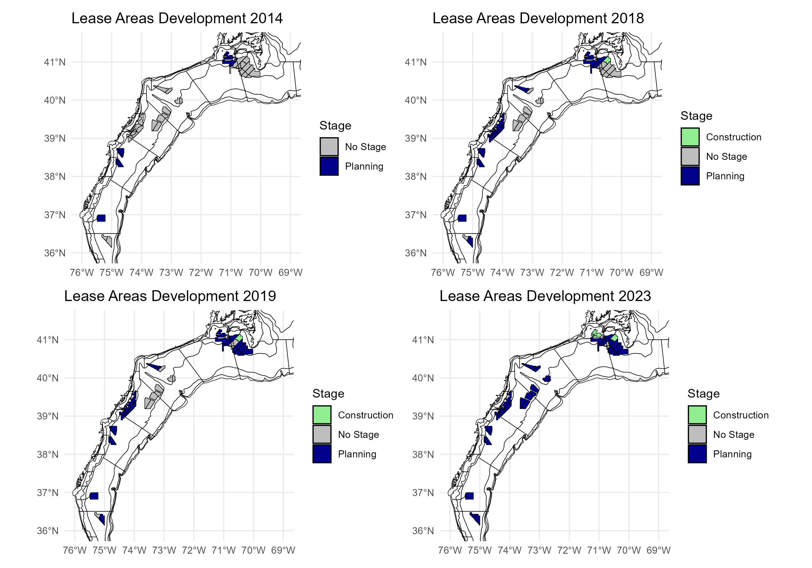
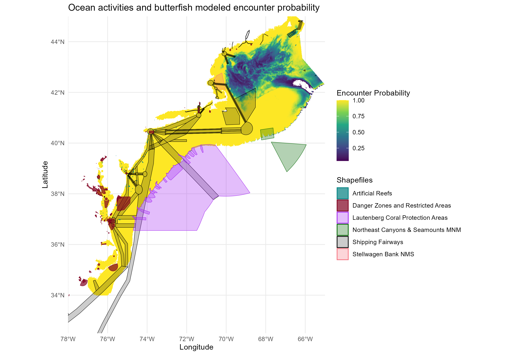

```{r setup, include=FALSE}

# library(tint)
# # invalidate cache when the package version changes
# knitr::opts_chunk$set(tidy = FALSE, cache.extra = packageVersion('tint'))
# options(htmltools.dir.version = FALSE)

#Default Rmd options
knitr::opts_chunk$set(echo = FALSE,
                      message = FALSE,
                      #dev = "cairo_pdf",
                      warning = FALSE,
                      fig.width = 4,
                      fig.asp = 0.45,
                      fig.align = 'center'
                      ) #allows for inserting R code into captions

#Plotting and data libraries
#remotes::install_github("noaa-edab/ecodata@0.1.0") #change to 2020 ecodata version for release
library(tidyverse)
library(tidyr)
library(ecodata)
library(here)
library(kableExtra)
library(patchwork)

```

# Introduction  

*Risk Element Information and Recommendations for Council Consideration*

The Council approved an Ecosystem Approach to Fisheries Management (EAFM) Guidance Document in 2016 which outlined a path forward to more fully incorporate ecosystem considerations into marine fisheries management^[http://www.mafmc.org/s/EAFM_Guidance-Doc_2017-02-07.pdf], and revised the document in February 2019^[http://www.mafmc.org/s/EAFM-Doc-Revised-2019-02-08.pdf]. The Council’s stated goal for EAFM is “to manage for ecologically sustainable utilization of living marine resources while maintaining ecosystem productivity, structure, and function.” Ecologically sustainable utilization is further defined as “utilization that accommodates the needs of present and future generations, while maintaining the integrity, health, and diversity of the marine ecosystem.” Of particular interest to the Council was the development of tools to incorporate the effects of species, fleet, habitat and climate interactions into its management and science programs. To accomplish this, the Council agreed to adopt a structured framework to first prioritize ecosystem interactions, second to specify key questions regarding high priority interactions and third tailor appropriate analyses to address them [@gaichas_framework_2016]. Because there are so many possible ecosystem interactions to consider, a risk assessment was adopted as the first step to identify a subset of high priority interactions and initially completed in 2017 [@gaichas_implementing_2018]. The Council conducted a comprehensive review of the risk assessment in 2023 to reflect the Council’s current priorities and ensure the risk assessment can be adaptive and responsive to new and changing conditions that can support a variety of Council management needs.  The revised risk assessment includes 28 risk elements that span biological, ecological, social, economic, and management issues (Table \ref{riskel}) and risk criteria for the assessment is based on a range of indicators and expert knowledge (Table \ref{allcriteria}).

The risk assessment is updated annually and was designed to help the Council decide where to focus limited resources to address ecosystem considerations by first clarifying priorities. Overall, the purpose of the EAFM risk assessment is to provide the Council with a proactive strategic planning tool for the sustainable management of marine resources under its jurisdiction, while taking interactions within the ecosystem into account. 

This document updates the Mid-Atlantic Council’s 2024 EAFM risk assessment that was approved by the Council in December^[https://www.mafmc.org/s/05_EAFM-Risk-Assessment.pdf]. The updated assessment includes indicators from the 2025 State of the Ecosystem report and new analyses by NEFSC and Council Staff for certain Ecological and Management elements to address feedback from the Council’s Ecosystem and Ocean Planning (EOP) Committee and Advisory Panel. 

Since the previous risk assessment was just completed in December 2024, many risk rankings are unchanged based on the updated indicators for 2025 and the Council’s risk criteria. Below, we highlight only the elements where information and/or analyses have changed (e.g., new/revised indicators or risk criteria) or where the perception of risk is different from 2024. 


```{r riskel, echo=FALSE, message=FALSE, warnings=FALSE, results='asis'}

#tab.cap="Risk Elements, Definitions, and Indicators Used\\label{riskel}",

elem <-read.table("riskelements2024.txt", sep="|", header=F, strip.white = T, stringsAsFactors = F)
elem <- elem[,2:4]
names(elem) <- c("Element", "Definition", "Indicator")

# elem$Element <- factor(all$Element, levels=c("Assessment performance", "F status", "B status", "Food web  (Council Predator)", "Food web  (Council Prey)", "Food web  (Protected Species Prey)",
#                                             "Ecosystem productivity", "Climate", "Distribution shifts", "Estuarine habitat", "Offshore habitat", "Commercial Revenue",
#                                             "Recreational Angler Days/Trips", "Commercial Fishery Resilience (Revenue Diversity)", "Commercial Fishery Resilience (Shoreside Support)",
#                                             "Fleet Resilience", "Social-Cultural", "Commercial", "Recreational", "Control", "Interactions", "Other ocean uses", "Regulatory complexity", 
#                                             "Discards", "Allocation"))

kable(elem, format = "latex", booktabs = T, longtable=T, caption="Risk Elements, Brief Definitions, and Indicators Used. Additional detail and information on each risk elements definition and indicator(s) can be found in the full risk assessment text.\\label{riskel}") %>%
  kable_styling(font_size=8, latex_options=c("repeat_header", "striped")) %>%
  column_spec(1, width="2.5cm") %>%
  column_spec(2:3, width="7cm") %>%
  group_rows("Ecological",1,11) %>%
  group_rows("Economic",12,15) %>%
  group_rows("Social",16,18) %>%
  group_rows("Food Production",19,20) %>%
  group_rows("Management",21,28)
  #landscape()


```
 

\newpage
\pagestyle{plain}
```{r allcriteria,  echo=FALSE, message=FALSE, warnings=FALSE, results='asis'}

#tab.cap="Risk Ranking Criteria used for each Risk Element\\label{allcriteria}",

all<-read.table("riskrankingcriteria2024.txt", sep="|", header=T, strip.white = T, stringsAsFactors = F)
names(all) <- c("Element", "Ranking", "Criteria")
all$Ranking <- factor(all$Ranking, levels=c("Low", "Low-Moderate",  "Moderate-High", "High"))
all$Element <- factor(all$Element, levels=c("Assessment performance", "F status", "B status", "Food web (Prey availability)", "Food web (Predation pressure)", "Food web  (Protected species prey)",
                                            "Ecosystem productivity", "Climate", "Distribution shifts", "Estuarine habitat", "Offshore habitat", "Commercial value",
                                            "Recreational angler days/trips", "Commercial fishery resilience (Revenue diversity)", "Commercial fishery resilience (Shoreside support)",
                                            "Commercial fishery resilience (Fleet diversity)", "Recreational fleet diversity", "Fishing community vulnerability", "Commercial fishing production", "Recreational fishing production", "F Control", "Tech Interactions", "Offshore wind (Bio/Ecosystem)", "Offshore wind (Science/Access)", "Other ocean activities", "Regulatory complexity", 
                                            "Discards", "Allocation"))

allwide <- all %>% 
  spread(Ranking, Criteria)

kable(allwide, format = "latex", booktabs = T, longtable=T, caption="Risk Ranking Criteria used for each Risk Element. Additional information on the risk ranking criteria can be found in the full risk assessment text.\\label{allcriteria}") %>%
  kable_styling(font_size=8, latex_options=c("repeat_header", "striped")) %>%
  column_spec(1, width="2cm") %>%
  column_spec(2:5, width="5cm") %>%
  landscape()


```
\clearpage
\pagestyle{fancy}

# Risk Assessment

## Changes from 2024: Ecological Elements

### Decreased Risk: 1

**F status:** Spiny dogfish $F$ has decreased below the $F_{msy}$ level in the current assessment. Now ranked low, formerly ranked high.

### Increased Risk: 2

**Assessment Performance:** The golden tilefish assessment passed peer review but with some data lacking and different model assumptions providing divergent results. Now ranked low-moderate, formerly ranked low.

**F status:** Golden tilefish $F$ has increased above the $F_{msy}$ level in the current assessment. Now ranked high, formerly ranked low.


## New or Updated Ecological Elements

### Offshore Habitat (new)

**Description:**

This element is applied at the species level.

Offshore habitat, defined here as all habitat outside of the estuary
and beyond the immediate coastal/nearshore areas, supports all life
stages of many Council managed species, and is changing in quality and
quantity due to multiple stressors from climate to other ocean uses such
as offshore wind development. This element evaluates risk of achieving
OY due to changes in offshore habitat quality and quantity.

**Definition:**

Risk of not achieving OY due to changing offshore habitat. 

**Indicators:**

Individual indicators were developed from existing [Ecosystem and Socioeconomic Profiles](https://www.fisheries.noaa.gov/new-england-mid-atlantic/science-data/ecosystem-and-socioeconomic-profiles-northeast-united-states) (ESPs, @shotwell_introducing_2023) for MAFMC stocks. 

**Bluefish Indicators:**

Numerous indicators were developed for the Bluefish ESP [@tyrell_bluefish_2022]. Some of those indicators are relevant to offshore habitat. The indicators pertain to Distribution, Climate, and Natural Mortality. 

Changes in Bluefish distribution could inform state quotas, impact location and timing of spawning, and impact the location of capture. Distribution indicators are generated by a VAST model from NMFS bottom trawl data to assess shifts in the center of gravity of three different size classes of Bluefish in Northings and Eastings. 

```{r bfcog, fig.width = 6, fig.asp = 1, fig.cap="Bluefish Center of Gravity by size class in Northings (km) and Eastings (km)", echo=FALSE}
source(here::here('offshore_habitat/R/plot_bf_cog.R'))
plot_bf_cog()
```

Climate indicators use identified thermal tolerance of Bluefish spawning activity to assess changes in the spatiotemporal availability of suitable spawning habitat. Upper and lower thermal thresholds for spawning have been identified as 25.6 and 18 C respectively [@norcross_development_1974]. Additional climate indicators were developed to assess the impact of wind on early life history. Along shore and cross-shore winds may help transport larvae and juveniles inshore impacting recruitment[@norcross_development_1974]. Temperature-related cliamte indicators are generated from OISST satellite data from the Physical Sciences Laboratory. Wind-related climate indicators were generated from monthly mean wind speed data downloaded from the Physical Sciences Laboratory. Climate indicators evaluate: the first and last day of the year when the mean temperature of the Central Atlantic Bluefish region is above 18 C, the number of days when >75% of the region is above 18 C, the mean proportion of the region below 18 C, between 18-25.6 C, and above 25.6 C in July, and the mean cross-shore and along shore wind speeds in the region in April and May.

```{r bf18, fig.width = 5, fig.asp = 1, fig.cap="First, last, and number of days when the mean temperature of the central Atlantic region is warmer than 18 C. Dashed lines depict the time series mean. Trend lines depict statistically significant trends.", echo=FALSE}
source(here::here('offshore_habitat/R/plot_bf_climate.R'))
plot_bf_climate()
```

```{r bfjp, fig.width = 5, fig.asp = 1, fig.cap="Proportion of the central Atlantic below, within, and above the thermal tolerance of Bluefish. Dashed lines depict time series means. Trend lines depict statistically significant trends", echo=FALSE}
source(here::here('offshore_habitat/R/plot_bf_july_proportion.R'))
plot_bf_july_proportion()
```

```{r bfw, fig.width = 5, fig.asp = .8, fig.cap="Mean cross and along shore wind in the central Atlantic in April and May. Dashed lines depict time series means", echo=FALSE}
source(here::here('offshore_habitat/R/plot_bf_wind_indicators.R'))
plot_bf_wind_indicators()
```


Natural mortality indicators consider changes in offshore habitat which may impact this management parameter and therefore OY. Large predators, including Mako sharks, are known to prey on Bluefish and impact natural mortality [@shepherd_essential_2006] [@wood_recalculated_2009]. Additionally, Bluefish with poor condition may be more susceptible to predation and disease, resulting in higher natural mortality. Natural mortality indicators assessed Mako shark B/Bmsy from the International Commission for the Conservation of Atlantic Tunas (ICCAT) stock assessment and the relative condition of three size classes of Bluefish aggregated from multiple state and federal surveys [@truesdell_wp_2022].

```{r mako, fig.asp = .4, fig.cap="Mako shark B/Bmsy. Dashed line depicts time series mean. Trend line depicts statistically significant trend", echo=FALSE}
source(here::here('offshore_habitat/R/plot_bf_mako.R'))
plot_bf_mako()
```

```{r bfcond, fig.width = 6, fig.asp = 1, fig.cap="Spring and Fall relative condition of three different size classes of Bluefish. Dashed lines depict time series means. Trend lines depict statistically significant trends.", echo=FALSE}
source(here::here('offshore_habitat/R/plot_bf_condition.R'))
plot_bf_condition()
```


**Black sea bass Indicators:**

Indicators were developed for the Black Sea Bass ESP [@tabandera_working_2024]. The developed indicators pertain to Offshore Habitat by evaluating overwinter survival of early life stages and mixing between sub regions.

Mean winter bottom temperature was explored as an indicator of overwinter survival. Recruitment of Black sea bass (BSB) has been shown to be higher than average in warm years and below average in cold years [@tabandera_working_2024]. Additionally, BSB have a preferred temperature of >8 C [@miller_offshore_2016]. A mean winter (February and March) bottom temperature indicator was developed using observed ocean temperature data from the Hydrographic Database maintained by the NEFSC Oceans and Climate Branch. These data are composed of CTD measurements concurrent with bottom trawl surveys and other deployed instruments. Quality assurance and control were performed on these sources to produce area weighted regional mean values [@fratantoni_description_2013]. Mean values were computed for each survey and a reference annual cycle (fit to observations from 1981-2010) was removed to produce anomalies. The values in the dataset are anomalies plus expected mean value for each location and time of year based on this reference period. To assess winter conditions, February and March data were averaged on the regional scale. January was excluded due to low in-situ data coverage.

```{r bsbwbt, fig.cap="Mean winter (February and March) bottom temperature. Dashed line depicts thermal preference of >8 C. Trend line depicts statistically significant trend.", echo=FALSE}
source(here::here('offshore_habitat/R/plot_winter_bottom_temp.R'))
plot_winter_bottom_temp()
```


High shelf water volume was explored as an indicator of overwinter mixing between the northern and southern sub regions. Overwinter mixing could lead to misallocation of removals and abundance indices between the northern and southern stock subunits leading to retrospective patterns present in previous assessments, particularly for the northern subunit. A threshold of 4000 km^3^ has been proposed, above which there is greater likelihood of mixing between sub regions [@miller_offshore_2016]. Southern MAB BSB have been shown to occupy a smaller portion of the available habitat in years with higher shelf water volume [@tabandera_working_2024]. No correlation was found between shelf water volume and the center of gravity for northern MAB [@tabandera_working_2024]. Still, it was suggested that future efforts to reallocate removals and abundance indices between the northern and southern stock subunits focus on years with high potential stock mixing. Furthermore, a negative impact on BSB catch has been identified when shelf water exceeded the proposed threshold [@miller_offshore_2016]. A high winter (February and March) shelf water volume indicator was developed using data from the Hydrographic Database maintained by the NEFSC Oceans and Climate Branch. Shelf water is defined as all water having salinity <34 PSU (the isohaline typically associated with the shelf-slope front in this region). The methods to compute this time series have been previously published [@fratantoni_description_2013]. 

```{r bsbwsvol, fig.cap="Annual mean winter (February and March) shelf water volume. Dashed line depicts the proposed threshold above which overwinter mixing is more likely.", echo=FALSE}
source(here::here('offshore_habitat/R/plot_winter_shw_vol.R'))
plot_winter_shw_vol()
```


**Golden tilefish Indicators:**

Numerous indicators were developed for the Golden Tilefish ESP [@salois_golden_2024]. Some of those indicators are also relevant to offshore habitat. The indicators pertain to habitat condition and physical oceanography.

Habitat condition indicators assessed the cold pool index, cold pool spatial extent index, cold pool persistence index, and the mean bottom temperature and salinity of the spatial extent in which Golden tilefish have been captured by the NMFS bottom trawl survey. Optimal bottom temperature for golden tilefish is between 9-14 °C [@grimes_tilefish_1986]. Temperatures outside this range may impact spawning location/success and recruitment success. Optimal bottom salinity for juvenile and adult golden tilefish is 33-36 PSU [@steimle_essential_1999]. Salinities outside this range may affect spawning and recruitment success. If the cold pool has a larger extent or persists for a longer time, environmental conditions are not optimal for early life history stages and recruitment success. The cold pool index indicators are generated from bias-corrected ROMS-NWA and GLORYS data. Bottom temperature and salinity indicators were generated using data from GLORYS12 [@eu_copernicus_marine_service_information_global_2023], a global eddy-resolving physical ocean and sea ice model (1993-2023) with high resolution (1/12°).

```{r gtfcp, fig.width = 9, fig.asp = .35, fig.cap="Cold pool index, cold pool persistence index, and cold pool spatial extent index based on bias-corrected ROMS-NWA (open circles) and GLORYS (closed circles)", echo=FALSE, results = 'hide'}
ecodata::plot_cold_pool()
```


```{r gtfbt, fig.cap="Annual average mean bottom temperature (at 78 m depth) of NMFS bottom trawl stat areas in which Golden tilefish has been captured.Dashed lines depict the upper and lower thermal tolerance of the species. Confidence interval shading represents +/- 2 standard deviations around the weighted mean", echo=FALSE}
source(here::here('offshore_habitat/R/plot_annual_avg_gtf_bottom_temp.R'))
plot_annual_avg_gtf_bottom_temp()
```

```{r gtfbs, fig.cap="Annual average bottom salinity (at 78 m depth) of NMFS bottom trawl stat areas in which Golden tilefish has been captured.Dashed lines depict the upper and lower thermal tolerance of the species. Confidence interval shading represents +/- 2 standard deviations around the average. Trend line represents statistically significant trend", echo=FALSE}
source(here::here('offshore_habitat/R/plot_annual_avg_gtf_bottom_sal.R'))
plot_annual_avg_gtf_bottom_sal()
```


Physical oceanography indicators assessed the sea surface temperature (SST), gulf stream index (GSI), and shelf water volume, temperature, and salinity. SST can be used as a proxy for water mass movement [@fisher_life_2014], which may cause displacement or mortality of eggs and larvae. SST was derived from the Advanced Clear Sky Processor for Ocean (ACSPO) system. A more northerly position of the Gulf Stream (positive GSI) pushes warm water onto the shelf, increasing the amount of suitable habitat for Golden tilefish. The GSI is the degrees latitude above the average Gulf Stream position based on ocean temperature at 200 m (15 C) depth between 55°W to 75°W. Further GSI calculation details are available on the ecodata repository^[https://noaa-edab.github.io/ecodata/reference/gsi.html]. Shelf water volume, temperature, and salinity were derived from the Hydrographic Database maintained by the NEFSC Oceans and Climate Branch [@fratantoni_description_2013]. Shelf water physical oceanography indicators were compare to tolerance thresholds from the literature to assess changes in habitat suitability.

```{r ltsst, fig.cap="Northeast US annual sea surface temperature (SST, black), with increasing trend (orange).", echo=FALSE}
ecodata::plot_long_term_sst()
```

```{r gsi, fig.cap="Gulf stream index. Dashed line depicts time series mean. Trend line depicts statistically significant trend.", echo=FALSE}

ecodata::plot_gsi()

```

```{r gtfshwvol, fig.cap="Annual mean shelf water volume. Dashed line depicts time series mean", echo=FALSE}
source(here::here('offshore_habitat/R/plot_shw_vol.R'))
plot_shw_vol()
```

```{r gtfshwt, fig.cap="Annual mean shelf water temperature. Dashed line depicts time series mean. Trend line depicts statistically significant trend.", echo=FALSE}
source(here::here('offshore_habitat/R/plot_shw_temp.R'))
plot_shw_temp()

```

```{r gtfshws, fig.cap="Annual mean shelf water salinity. Dashed line depicts time series mean.", echo=FALSE}
source(here::here('offshore_habitat/R/plot_shw_sal.R'))
plot_shw_sal()

```


**Risk criteria:**

  Bluefish
  
  -----------------------------------------------------------------------
  *Risk Level*    *Definition*
  --------------- -------------------------------------------------------
  Low             No indicators suggest negative impact to OY

  Low-Moderate    Either distribution indicators or natural mortality 
                  indicators suggest negative impact to OY but 
                  climate indicators suggest no impact.

  Moderate-High   Climate indicators suggest negative impacts 
                  to OY or Both distribution and natural mortality 
                  indicators suggest negative impacts to OY.

  High            Distribution, climate, and natural mortality 
                  indicators all suggest negative impacts to OY.
                  
  -----------------------------------------------------------------------
  
  Black sea bass
  
  -----------------------------------------------------------------------
  *Risk Level*    *Definition*
  --------------- -------------------------------------------------------
  Low             No indicators suggest negative impact to OY

  Low-Moderate    Indicators suggest increase in overwinter mixing
                  but no change or increase in overwinter survival

  Moderate-High   Indicators suggest decrease in overwinter survival
                  but no change or decrease in overwinter mixing

  High            Overwinter survival decreasing, overwinter mixing 
                  increasing
                  
  -----------------------------------------------------------------------
  
  Golden tilefish 
  
  -----------------------------------------------------------------------
  *Risk Level*    *Definition*
  --------------- -------------------------------------------------------
  Low             No indicators suggest negative impact to OY

  Low-Moderate    Physical oceanography indicators suggest negative
                  impacts to OY but Habitat condition indicators 
                  suggest no impact or positive impact

  Moderate-High   Habitat condition indicators suggest negative 
                  impacts to OY but Physical oceanography indicators
                  suggest no impact or positive impact

  High            Both Physical oceanography and Habitat condition 
                  indicators suggest negative impact to OY
                  
  -----------------------------------------------------------------------

**Risk Assessment**

Bluefish: A mix in indicator trends results in a moderate-high ranking for this element. Climate indicators show mixed signals. The proportion of the central Atlantic warmer than 25.6 C in July, which is negatively correlated with recruitment [@tyrell_bluefish_2022], is increasing. Other climate indicators suggest lengthening spawning season and potentially greater spawning success (increase in last day warmer than 18 C, increase in number of days warmer than 18 C, decrease in proportion of the central Atlantic colder than 18 C in July). Distribution indicators suggest a negative impact to OY as there are significant trends in Medium (30.3-50 cm) and Large (>50 cm) center of gravity both in Eastings and Northings. Natural mortality indicators suggest a positive impact on OY. Mako shark B/Bmsy has a negative trend, indicative of decreased predation and natural mortality of Bluefish. There is a positive trend in Large Bluefish relative condition in the spring which could have positive impacts on survival and reproductive success.

Black sea bass: No indicators suggest a negative impact on OY, resulting in a low ranking for this element. Mean winter bottom temperature is increasing away from the lower temperature threshold of the species which has a positive impact on recruitment. There is no trend in winter mean shelf volume and the majority of the time series is below the volume threshold for increased risk of overwinter mixing between sub regions.

Golden tilefish: No indicators suggest a negative impact on OY, resulting in a low ranking for this element. Trends in the cold pool index and spatial extent suggest warmer conditions and a smaller cold pool which will likely have positive impacts on Golden tilefish as the average cold pool temperature is below the lower thermal tolerance of the species. Increasing trends in SST, GSI, and mean shelf water temperature will similarly result in increases in thermal habitat and therefore survival rates.

## Changes from 2024: Economic, Social, and Food Production Elements

### Decreased Risk: 1

**Commercial fishery resilience (1)-Species Revenue Diversity** was ranked high risk due to a significant short term decline 2013-2022. This decline is no longer present, as species revenue diversity increased in 2023. Therefore this element now ranks low risk.


### Increased Risk: 1

**Commercial Fishery Resilience (3)– Fleet Diversity** was ranked low risk based on two indicators of fleet diversity. The Mid-Atlantic fleet count indicator has a significant 21 year downward trend, so the element is now ranked moderate-high risk. 


## New or Updated Economic Elements


### Commercial Value

**Description:**

This element is applied at the ecosystem level, and addresses the risk
of not maximizing fishery value. Revenue serves as a proxy for
commercial profits, which is the component of a fishery's value that
this element is ultimately attempting to assess risk towards. Lack of
cost information across all fleet segments precludes the assessment of
risk to profitability itself at the ecosystem level.

**Definition:**

Risk of not maximizing commercial fishery value.

**Indicators:**

Gross revenue is the current indicator for this element, and can be
developed for all fishing activity within the Mid-Atlantic and for all
Council managed species. Revenue serves as a proxy for commercial
profits, which is the component of a fishery's value that this element
is ultimately attempting to assess risk towards. Currently this
indicator is aggregated and presented at the ecosystem-level.

```{r comm-revenue, fig.width = 6, fig.asp = 0.45, fig.cap = "Revenue for the for the Mid-Atlantic region: total (black) and from MAFMC managed species (red), with a significant decrease (purple) for total revenue."}
#, code = readLines("https://raw.githubusercontent.com/NOAA-EDAB/ecodata/master/chunk-scripts/human_dimensions_MAB.Rmd-comdat-comm-revenue.R")

ecodata::plot_comdat(report="MidAtlantic", varName="revenue", n=10) + 
  ggplot2::theme(legend.position = "right",
                      legend.title = ggplot2::element_blank())

```

Net revenue (Gross revenue - trip costs) is a better proxy for trip
value, in an economic context. However, this metric can be calculated
only for trips by vessels holding federal licenses and submitting Vessel
Trip Reports. This indicator would thus not capture all fishing within
the region, and of potential interest to the Council. It underrepresents
the total revenue generated regionally by about ½, and does not present
the same trends as the subset for which net revenue can be generated.

Cost coverage was evaluated as gross revenue from federal trips, for which costs can be calculated, versus gross revenue for which trip costs cannot be computed. We found that the coverage varies substantially by ecological production unit, with Georges Bank having highest percentage of gross revenue covered (Fig. \ref{fig:coverage}). The Mid-Atlantic Bight shows substantial interannual variability in coverage, with costs covering between 50\% and 75\% of total gross revenue generated in most recent years. Second, and in particular for the Mid-Atlantic, the gross revenue for federally permitted trips presents different trends than the the gross revenue by non-federally permitted trip. This suggests different production functions between the two fleet segments, and thus inappropriateness of imputing costs from a model based on federally permitted trips onto non-federally permitted trips. 

```{r coverage, outwidth="80%", fig.cap="Gross revenue grouped by federally permitted and non-federally permitted trips, by region."}

magick::image_read_pdf("https://raw.githubusercontent.com/NOAA-EDAB/memos/master/SOE-response-memo/images/coverage-1.pdf")


```


Nevertheless, we provide an example of Net revenue for comparison. Figure \ref{fig:netrev} presents the summed net revenue estimates for federally permitted trips. Apart from a slight uptick between 2019 - 2020, there has been a steady decline in net revenue within the Mid-Atlantic since 2016, with 2023 representing the lowest net revenue estimate of the series. Of note is that the net revenue estimates, particularly in Georges Bank and Mid-Atlantic, follow the same trends as the gross revenue generated by federally permitted trips.

```{r netrev, out.width="80%", fig.cap="Net revenue generated by federally permitted trips."}

magick::image_read_pdf("https://raw.githubusercontent.com/NOAA-EDAB/memos/master/SOE-response-memo/images/netrev-1.pdf")

```


We also present a "Profitabilty Index", which in this case is a ratio of gross revenue to estimated costs. This indicator is common in the benchmarking literature [@balk_residual_2003], despite the ratio not being unique across combinations of revenue and costs. 

In this application, we generate three separate indexes of performance: Revenue, Cost, and Profit. The Revenue index is the sum of gross revenue from both federally permitted and non-federally permitted trips by region, normalized by the arithmetic mean gross revenue across regions in 2000, the first year of the series. The Cost index is the geometric mean of the normalized trip-level costs by region, with normalization based on the arithmetic average cost across all federally permitted trips. The trip level normalization ensures the index can be compared across regions, abstracting away from the issue of scale and downweighting outliers, as is standard in the literature [e.g. @walden_profits_2022]. The final Profitability index is the ratio of Revenue and Cost indices. The implicit assumption embedded in the Cost and Profitability indices is that average costs in the federally permitted fleet adequately proxies for non-permitted fleet costs, a tenuous assumption given the cost coverage.

Each of these indices are presented in Figure \ref{fig:Profitability}. For the Revenue index, all three regions present index numbers below 1 in 2023, indicating that revenue is below the 2000 base year. In the Mid-Atlantic, the revenue index is at a historical low, consistent with the gross numbers presented in Figure \ref{fig:coverage}. The cost index for all three regions measure between 1.5 (50\% higher than 2000) in the Gulf of Maine to 2.25 (125\% higher than 2000) in Georges Bank. Overall, we see costs have been consistently higher than the 2000 benchmark since 2021.

The Profit index across all three regions is near historic lows, driven by both historic low revenue in the Gulf of Maine and Mid-Atlantic, coupled by relatively high costs across all three regions.

```{r Profitability, out.width="80%", fig.cap="Revenue, Cost, and Profitability Indices by region."}

magick::image_read_pdf("https://raw.githubusercontent.com/NOAA-EDAB/memos/master/SOE-response-memo/images/Profitability-1.pdf")

```


**Risk criteria:**

  -----------------------------------------------------------------------
  *Risk Level*    *Definition*
  --------------- -------------------------------------------------------
  Low             No trend and low variability in revenue

  Low-Moderate    Increasing or high variability in revenue

  Moderate-High   Significant long term revenue decrease

  High            Significant recent decrease in revenue
  -----------------------------------------------------------------------

**Risk Assessment**

Due to changes in trend assessment methods, there is no longer a long term significant decrease in gross revenue. Although there is a visually obvious recent decrease in revenue, this decrease is not significant for the most recent 10 years of the time series. We note that the both total and Council managed gross revenue reached a time series low in 2023, as did the other new indicators presented above. Therefore, we retain the previous ranking of moderate-high risk to commercial fishery value.  

Investigation of the net revenue indicator for the subset of the fleet with information available, or the  
Revenue, Cost, and Profitability Indices described above may provide further insight into risks to commercial value in future assessments. 

## Changes from 2024: Management Elements

### Decreased Risk: 1

The **Fishing Mortality Control** risk ranking for commercial Summer Flounder decreased from low-moderate risk to low risk.

*  The 2024 risk assessment considered information from 2018-2022 to evaluate this risk element and there was an 8\% commercial ACL overage in 2018 resulting in a low-moderate ranking (defined as small recent overages, but infrequent). The 2025 risk assessment utilized information from 2019-2023 and there have been no ACL overages for the commercial Summer Flounder sector during this time.

### Increased Risk: 7

The **Fishing Mortality Control** risk ranking for commercial Scup, Bluefish, and Spiny Dogfish and the recreational Blueline Tilefish and Spiny Dogfish increased from low risk to low-moderate risk; while the commercial Blueline Tilefish increased from low-moderate risk to moderate-high risk. 

*  From 2019-2023, the commercial Scup fishery has been below the ACL by approximately 28%, on average, but the 2023 ACL was exceeded by nearly 4%. Commercial Bluefish overages are rare, particularly with quota transfers, but some small recent overages have been observed. There have been two (2019 and 2023) small ACL overages in the commercial Spiny Dogfish fishery over the last five years, but measures are in place to avoid overages and/or adjust if they occur. Recreational Blueline Tilefish catch exceeded the ACL in 2019 (3% overage) and in 2023 (12% overage); while one recreational Spiny Dogfish overage was observed during the last five years.

*  Commercial ACL overages have become increasingly more common in the commercial Blueline Tilefish fishery with overages occurring in 2020, 2021, and 2023, necessitating the moderate-high risk ranking. 

*  It was noted there was an ACL overage in 2024 for the commercial Atlantic mackerel fishery, but that was not considered for this report. The 2024 data will be included in the 2026 report and the risk level for commercial Atlantic mackerel may change in the future.

The **Discards** risk ranking for commercial Blueline Tilefish increased from low risk to low-moderate risk.

*  While commercial Blueline Tilefish discards are generally low, recent (since 2000)
information suggests incidental catch and discards from the trawl fishery can be highly
variable and uncertain and range from 1,000 to 10,000 pounds.

## New or Updated Management Elements

### Offshore Wind -- Biological/Ecosystem (new)

**Description:**

This element would be applied at the species level and considers the biological and ecosystem
risks of offshore wind development on Council-managed fishery resources and/or the supporting
habitat. Offshore wind development is expected to cover 2.4 million acres of ocean space by 2030
in the Greater Atlantic region (ME through NC). Within these lease areas, there are 3,200
foundations (i.e., wind turbines) with over 9,000 miles of interconnecting cable proposed for
construction. Offshore wind siting, construction, and operation has the potential for a variety of
biological impacts and associated risks for fisheries resources. Habitat alteration, local
hydrodynamic changes, underwater noise, and electromagnetic fields (EMF) can affect stock
productivity, food availability and migration patterns. However, these risks are likely different
across species and habitat types and more research is needed to fully understand these impacts.

**Definition:**

Risk of not achieving OY due to biological impacts to stock productivity, distribution, and
ecosystem structure and function.

**Indicators:**

In order to determine the changes in species stock and/or habitat distribution and the overlap with
wind \textcolor{red}{lease} areas (\textcolor{red}{WLAs})^[The Bureau of Ocean Energy and Management (BOEM) uses specific terminology to specify the wind energy development process. Planning Areas are large areas that get narrowed down to Call Areas. Call Areas get narrowed down to Wind Energy Areas. Wind Energy Areas get narrowed down to Lease Areas. Development occurs at the scale of the Lease Area. Some parts of the Wind Energy Areas, Call Areas, and Planning Areas will not be developed as they are deemed less suitable for wind energy development through the winnowing process. It was determined that the offshore wind areas used in these analyses were at the scale of wind lease areas, not wind energy areas. Language in the report has been updated to reflect the appropriate development scale.], the spatial distribution of species-specific catches for Mid-Atlantic managed fisheries from the NEFSC bottom trawl survey, \textcolor{red}{and the NEFSC clam dredge survey for ocean quahog and Atlantic surfclam}, from two different time periods (2014-2018 and 2019-2023) were used. These time periods were selected based on feedback by the Committee and AP that recommended using shorter time blocks and the most recent data available. GIS mapping layers/shape files for all active (as of October 2024) commercial and research offshore wind energy leases along the Atlantic coast were used to determine the spatial coverage of each \textcolor{red}{WLA} lease. Spatial overlap was then estimated by determining the proportion of \textcolor{red}{total abundance}^[The 2024 risk assessment calculated the species-specific spatial overlap using the proportion of positive catches (presence/absence data) from the NEFSC bottom trawl survey within and outside the wind lease areas. For the 2025 risk assessment, total abundance from the NEFSC bottom trawl and clam dredge surveys were used to calculate the species-species spatial overlap and is likely a better and more robust indicator of actual spatial overlap.]  for each species inside each \textcolor{red}{WLA} during the two time blocks. A weighted spatial overlap was also calculated based on the current development stage of each \textcolor{red}{WLA} - planning, construction, or operational. As suggested by the EOP Committee and AP, \textcolor{red}{WLAs} that are currently in a planning phase (e.g., proposed, obtaining permits) were weighted by a factor of \textcolor{red}{0.3}^[Wind lease areas in the planning phase had a weighting factor of 0.1 used in the calculations for the 2024 risk assessment.] with the assumption those \textcolor{red}{WLAs} would have a \textcolor{red}{range of effects (limited to moderate)} on species/habitat distribution. \textcolor{red}{WLAs} in the construction phase were weighted by a factor of 0.5 with the assumption those \textcolor{red}{WLAs} were having some effect (positive or negative) on the species/habitat distribution within the \textcolor{red}{WLA}. Finally, those \textcolor{red}{WLAs} in the operational phase were weighted by a factor of 1.0 with the assumption those \textcolor{red}{WLAs} would have the greatest effect (positive or negative) on the species/habitat distribution within the \textcolor{red}{WLA}. (Fig. \ref{fig:oswdevstage}). 


```{r oswdevstage, out.width='100%', fig.cap="Offshore wind lease area development stages (no activity, planning, construction, operational) during different time periods from 2014-2023. The development stages were used as weighting factors assigned to each wind energy area to determine the potential effect on fisheries and habitat distribution (No stage - no effect; Planning stage - some effect; Construction stage - greater effect; Operational - most effect)."}


```


**Risk criteria:**

```{r riskcfood, echo=FALSE, message=FALSE, warnings=FALSE, results='asis'}
tabl <- "
| Risk Level         | Definition                                                          |  
|:-------------------|:--------------------------------------------------------------------|
| Low  | No observed stock or habitat distribution overlap within WLAs 
| Low-Moderate | Decreasing or similar observed stock or habitat distribution overlap within WLAs 
| Moderate-High | Moderate increases in stock or habitat distribution overlap within WLAs 
| High | Large increases in stock or habitat distribution overlap within WLAs
"
cat(tabl) # output the table in a format good for HTML/PDF/docx conversion
```

Since the stock/habitat distribution indicator is developed at the stock level, the same risk level is assigned to both the commercial and recreational sectors.

**Risk Assessment**

Golden tilefish, blueline tilefish, and chub mackerel were assigned low risk because there were \textcolor{red}{very low} catches of these species on the NEFSC bottom trawl \textcolor{red}{in general and no catches} within any of the \textcolor{red}{WLAs}. This low risk ranking might be artificially low because the NEFSC trawl survey does not sample these species particularly well. In the future, a model-based approach using the Northeast Regional Habitat Assessment (NRHA) habitat distribution model will be used to calculate spatial overlap and should be more comprehensive indicator, particularly for these species.

Using the risk criteria, summer flounder, scup, Atlantic mackerel, longfin squid, bluefish, and \textcolor{red}{ocean quahog} were assigned low-moderate risk. \textcolor{red}{Summer flounder spatial overlap declined by 39\% from 14-18 to 19-23 and there was a similar weighted overlap between two time periods. Scup spatial overlap declined over 60\% during 14-18 and 19-23 time periods and the weighted overlap declined by nearly 32\% between the two time periods. Atlantic mackerel spatial overlap declined by over 94\% during 14-18 and 19-23 time periods but the weighted spatial overlap only declined by 17\% between two time periods. Longfin squid had a slight decline in the spatial overlap during 14-18 and 19-23 time periods but a slight increase in weighted spatial overlap between two time periods. Similarly, ocean quahog had a 30\% decline in the spatial overlap from 14-18 and 19-24 but had a nearly 200\% increase in the weighted overlap. Bluefish had moderate decreases in the unweighted (63\%) and weighted (58\%) spatial overlap between 14-18 and 19-23 time periods.}

\textcolor{red}{Black sea bass, butterfish, \emph{Illex} squid, spiny dogfish, and Atlantic surfclam all had moderate-high risk. Using total abundance, instead of presence/absence, to calculate spatial overlap resulted in increasing overlap within the WLAs between 2014-2018 and 2019-2023 across both unweighted and weighted calculations. During this time period, increases in black sea bass spatial overlap were estimated to be about 32\% for both unweighted calculations. The estimated unweighted spatial overlap for butterfish increased 300\% and by 360\% for the weighted spatial overlap. For \emph{Illex} squid, spatial overlap increased about 22\% for the unweighted calculation and by over 1,000\% for the weighted spatial overlap calculation. Spiny dogfish saw large increases in both the unweighted (175\%) and weighted (390\%) spatial overlap estimates. Finally, Atlantic surfclam spatial overlap estimates increased during this time period by 79\% (unweighted) and 286\% (weighted).} 

The risk criteria were not applied to unmanaged forage given the use of NEFSC trawl survey information which is not used for these species. This risk factor is not relevant for deep sea corals. 


### Offshore Wind -- Fishery Science and Access (new)

**Description:**

This element would be applied at the species and sector (commercial and
recreational) level and considers the risks of offshore wind development
on data and science quality and to fishery/fleet access for
Council-managed fishery resources. Given the anticipated overlap between
offshore wind lease areas and spatial coverage of many fishery-dependent
survey strata, there are anticipated survey impacts through "preclusion,
habitat change, changes in statistical design, and reduced sampling
productivity" [@hogan_fisheries_2023]. These impacts to the quality and
quantity of the data could have implications for stock assessments,
scientific uncertainty, and catch levels. As wind turbine construction
and operation continues and expands, fishing fleet access, fishing
operations, and revenue are anticipated to change.

**Definition:**

Risk of not achieving OY due to fishery impacts due to access and
scientific uncertainty.

**Indicators:**

A combination of two indicators are used to assess the risk of offshore wind development of fishery science and access. One indicator was developed to evaluate the potential impacts of offshore wind to the science information that supports Mid-Atlantic stock assessments. Catch by species and strata from the NEFSC bottom trawl survey \textcolor{red}{and clam dredge survey were} used in the development of the indicator. Strata in which a species was never caught were removed and the total survey area was calculated using those strata in which the species was caught at any time during. The spatial foodprint of each \textcolor{red}{wind lease area (WLA)}, as of October 2024, was used to estimate the spatial overlap associated with each survey strata in which a species was caught. Similar to the approach taken with the Offshore Wind (1) – Biological/Ecosystem risk element, a weighed spatial overlap^[The updated weighting of 0.3 was applied to the planning development stage.] was estimated based on the current development stage of each \textcolor{red}{WLA} – planning, construction, or operational.

The second indicator was developed to evaluate the potential loss of fishing access within the \textcolor{red}{WLAs}. Commercial landings and revenue data within the \textcolor{red}{WLAs} are estimated for each species by the NEFSC and GARFO (https://www.greateratlantic.fisheries.noaa.gov/ro/fso/reports/WIND/ALL_WEA_BY_AREA_DATA.html). This information has been included in recent Mid-Atlantic and New England State of the Ecosystem reports (Fig. \ref{fig:wea-spp-rev}). The most recent five years (2019-2023) were used to estimate the average proportion of revenue within the \textcolor{red}{WLA} relative to the total fishery revenue by species. 

```{r wea-spp-rev, fig.cap="Fishery revenue in wind energy lease areas in the Mid-Atlantic.",  fig.width=5, fig.asp=.4}
#code=readLines("https://raw.githubusercontent.com/NOAA-EDAB/ecodata/master/chunk-scripts/human_dimensions_MAB.Rmd-wea-spp-rev.R"),

ecodata::plot_wind_revenue(report = "MidAtlantic", varName = "value", plottype = "nofacets")

```


FishRules and FishBrain apps for recreational fishing spatial overlap
information may provide information for recreational fishery overlap indicator in the future (work is still under review).

**Risk criteria:**

  -----------------------------------------------------------------------
  *Risk Level*    *Definition*
  --------------- -------------------------------------------------------
  Low             No revenue in WLA; no survey overlap with WLAs

  Low-Moderate    Low revenue in WLA; low survey overlap with WLAs

  Moderate-High   Moderate revenue in WLAs; moderate survey overlap with WLAs

  High            Significant revenue in WLAs; significant survey overlap with WLA

  -----------------------------------------------------------------------
  
Low revenue within a \textcolor{red}{WLA} was defined as </=5% and low survey overlap was defined as </= 10%.  Moderate revenue was defined as 6-20% and moderate survey overlap was defined as 11-30%. Significant revenue was defined as >20% and significant survey overlap was defined as >30%. \textcolor{red}{The EOP Committee and AP did not specify a preference for applying the standard survey spatial overlap or the weighted spatial overlap. Depending on preference and how used, the survey overlap thresholds associated with each risk level may need to be modified.}

As mentioned in the Indicator section above, we currently do not have an indicator to evaluate recreational fishing access within the \textcolor{red}{WLAs}; therefore, a risk assessment ranking was not developed for the recreational sector. 
  

**Risk Assessment**

Using the two indicators and risk criteria defined above, \textcolor{red}{ocean quahog was assigned low risk. Commercial ocean quahog revenue from wind lease areas has been highly sporadic since 2012 and accounted for 0.1\% in 2023 and spatial overlap with survey by wind lease area phase was 6.53\%.} 

The commercial summer flounder, scup, Atlantic mackerel, butterfish, longfin squid, \textcolor{red}{\emph{Illex} squid}, bluefish, spiny dogfish, and chub mackerel have low-moderate risk. For summer flounder, the average (2019-2023) commercial revenue from \textcolor{red}{WLAs} was 4.2% and the spatial overlap with the survey by \textcolor{red}{WLA} phase was \textcolor{red}{5.92\%}. For scup, the average commercial revenue from \textcolor{red}{WLAs} was 5.7% and the spatial overlap with the survey by \textcolor{red}{WLA} phase was \textcolor{red}{5.71\%}. Atlantic mackerel had an average commercial revenue from the \textcolor{red}{WLAs} of 2.1% and spatial overlap with survey by \textcolor{red}{WLA} phase of \textcolor{red}{4.07\%}. Butterfish had an average commercial revenue from \textcolor{red}{WLAs} of 3.7% and spatial overlap with survey by \textcolor{red}{WLA} phase of 3.92%. For longfin squid, the average commercial revenue from \textcolor{red}{WLAs} was 4.2% (note: there was an increasing trend and was almost 6% in 2023) and the spatial overlap with survey by \textcolor{red}{WLA} phase was 3.92%. A similar trend was observed chub mackerel where the average commercial revenue from \textcolor{red}{WLAs} was 2.9% but had an increasing trend and was over 7% in 2023. The spatial overlap with the chub mackerel survey strata by \textcolor{red}{WLA} phase was \textcolor{red}{6.38\%. For \emph{Illex} squid, the average commercial revenue from WLAs was 1.1\% and spatial overlap with the survey by wind lease area phase was 3.65\%.} Bluefish had an average commercial revenue from \textcolor{red}{WLAs} of 2.7% and had \textcolor{red}{the highest spatial overlap with the survey by WLA phase of 7.93\%.} Finally, spiny dogfish had an average commercial revenue from the \textcolor{red}{WLAs} of 0.5%, the smallest of all calculated, and a spatial overlap with the survey by \textcolor{red}{WLA} phase of 3.91%.

Commercial black sea bass \textcolor{red}{and Atlantic surfclam were the only two assigned the} moderate-high risk ranking. The average (2019-2023) commercial black sea bass revenue from \textcolor{red}{WLAs} was 6.1%, in the moderate range, and spatial overlap with survey by \textcolor{red}{WLA} phase was 5.27%. \textcolor{red}{For Atlantic surfclam, the average commercial revenue from wind lease areas was 9.4\%, with a high of 12.8\% in 2020, the highest for any Mid-Atlantic species. The spatial overlap with clam dredge survey by wind lease area phase was 7.33\%, second highest behind the trawl survey for bluefish.}


### Other Ocean Activities

**Description:**

This element is applied at the species and sector (commercial and recreational) level, and
addresses the risk of fishery displacement or damage of a fishery resource and/or supporting
habitat as a result of non-fishing activities in the ocean (e.g., energy
development/aquaculture/shipping/other industrial uses, etc.). Many of these activities are in
planning stages but not yet implemented in the region. It also includes evaluation of risk to
Council fisheries from area-based measures outside of the control of the Council, including area
closures implemented by other Councils to protect sensitive habitats, spawning areas, etc. and/or
through marine monument/sanctuaries or other types of area-based management designations.

**Definition:**

Risk of not achieving OY due to fishery displacement from non-fishing
ocean activities and/or area designations.

**Indicators:**

A quantitative approach was applied with GIS mapping to determine the spatial footprint of
current and future planned non-fishing activities (if available) and to quantify the spatial overlap
with existing habitat and/or fishing ground locations. The Northeast Regional Habitat Assessment
(NRHA) habitat distribution model^[For more information on NRHA and the habitat distribution model, please see the NRHA webpage at: https://www.mafmc.org/nrha.] was used to determine the encounter probability or spatial
distribution of adult habitat in the Northeast (Cape Hatteras, NC to US/Canadian border) for
available stocks. For the development of this indicator, the estimated habitat distribution for a
particular species/stock was used as a proxy for potential fishery displacement. It was assumed,
where habitat is found, the species is likely to be found, and some level of fishing activity is likely
to occur; however, recognizing that not all habitat quality/quantity and fishing effort is equally
distributed. The NRHA habitat model is not yet available for all Mid-Atlantic stocks but is
currently being developed and updated to include more stocks in the near future. GIS mapping
layers/shape files available for designated shipping fairways^[New and updated shipping channel information and shape files compared to the 2024 risk assessment were used to estimate the total shipping fairway spatial overlap.], the boundary of the Stellwagen Bank National Marine Sanctuary, the boundary of the Northeast Canyons and Seamounts Marine National Monument, the boundary of the Frank R. Lautenberg Deep-Sea Coral Protection Areas, \textcolor{red}{artificial reef locations, and danger zones and restricted military areas} were used to determine the potential non-fishing activity areas that might restrict or displace fishing activities (see Fig. \ref{fig:overlap} for butterfish). \textcolor{red}{The recreational sector continues to have access to artificial reefs; therefore, the spatial overlap with the artificial reef locations were not included in the recreational sector calculations.}

```{r overlap, out.width='100%', fig.cap="Spatial overlap of estimated butterfish habitat and non-fishing activities along the northeast Atlantic. Butterfish habitat is estimated by the NRHA habitat distribution model and non-fishing activities include shipping fairways, the Frank R. Lautenberg Deep Sea Coral Protection Area, the Stellwagen Bank National Marine Sanctuary, and the Northeast Canyons and Seamounts Marine National Monument, artificial reef locations, and danger zones and military restricted areas."}



```

The spatial overlap was then calculated by taking the total area of the non-fishing activities and amount of estimated habitat within the non-fishing areas. 

**Risk criteria:**

  -----------------------------------------------------------------------
  *Risk Level*    *Definition*
  --------------- -------------------------------------------------------
  Low             No or low spatial overlap with fisheries; no or very limited impact on
                  fishery prosecution 

  Low-Moderate    Low to moderate overlap with fisheries; some impact on fishery
                  prosecution

  Moderate-High   Moderate to high overlap with fisheries; large disruptions to fishery
                  prosecution

  High            High overlap with fisheries; serious disruptions to fishery prosecution
  -----------------------------------------------------------------------

With a quantitative evaluation available for this indicator, there is the potential to use a range/binned approach to specify risk level (e.g., 0-10% overlap, low risk; 11-25% overlap, low-moderate risk; 26-50% overlap, moderate-high risk; >50% overlap, high risk), but the bins associated with the risk level would likely be arbitrary. \textcolor{red}{For now, the EOP Committee and AP recommended applying a qualitative assessment to the risk criteria.} 

**Risk Assessment**

Summer flounder, butterfish, Illex squid, and bluefish were all ranked as \textcolor{red}{low} risk. The spatial overlap of habitat distribution and the \textcolor{red}{six} non-fishing activities ranged from 0%-\textcolor{red}{41}% with shipping fairways comprising the highest spatial overlap across all four stocks. The highest average overlap across all four non-fishing activities was \textcolor{red}{8.9\%} for recreational bluefish.

The spatial overlap indicator and risk criteria can only be applied to those stocks which have the NRHA habitat distribution model results available (summer flounder, bluefish, butterfish, and *Illex* squid). The model is currently being developed for all Mid-Atlantic stocks and, once available, the risk criteria can be applied to the remaining species.


\newpage 
# Summary

*Species level risk elements*
```{r sptable}
#tab.cap="Species level risk analysis results; l=low risk (green), lm= low-moderate risk (yellow), mh=moderate to high risk (orange), h=high risk (red)\\label{sptable}",

# spplist     oc,  sc,  flk, scp, bsb, mack, but, lsq, ssq, gtile,  btile,  blu, dog, monk
risk.species<-data.frame(
  Species = c("Ocean Quahog", "Surfclam", "Summer flounder", "Scup", "Black sea bass", "Atl. mackerel", "Chub mackerel", "Butterfish", "Longfin squid", "Shortfin squid", "Golden tilefish", "Blueline tilefish", "Bluefish", "Spiny dogfish", "Monkfish", "Unmanaged forage", "Deepsea corals"),
  Assess  = c("l", "l", "l",  "l", "l", "l", "h", "l", "lm", "h", "lm", "h", "l", "l", "h", "na", "na"),
  Fstatus = c("l", "l", "h", "l", "l", "l", "lm", "l", "lm", "lm", "h", "h", "l", "l", "lm", "na", "na"),
  Bstatus = c("l", "l", "lm", "l", "l", "h", "lm", "lm", "lm", "lm", "lm", "mh", "lm", "l", "lm", "na", "na"),
  #FW1Pred = c("l", "l", "l", "l", "l", "l", "l", "l", "l", "l", "l", "l", "l", "l", "l", "l", "l"),
  #FW1Prey = c("l", "l", "l", "l", "l", "l", "l", "l", "l", "l", "l", "l", "l", "l", "l", "lm", "l"),
  PreyA = c("tbd", "tbd", "tbd", "tbd", "h", "lm", "tbd", "tbd", "tbd", "tbd", "tbd", "tbd", "lm", "tbd", "tbd", "tbd", "tbd"),
  PredP = c("l", "l", "tbd", "tbd", "tbd", "mh", "tbd", "mh", "lm", "tbd", "tbd", "tbd", "tbd", "tbd", "tbd", "tbd", "tbd"),
  FW2Prey = c("l", "l", "l", "l", "l", "l", "l", "l", "lm", "lm", "l", "l", "l", "l", "l", "lm", "l"),
  Climate = c("h", "mh", "lm", "lm", "mh", "lm", "na", "l", "l", "l", "mh", "mh","l", "l", "l", "na", "na"),
  DistShift = c("mh", "mh", "mh", "mh", "mh", "mh", "na", "h", "mh", "h", "l", "l", "mh", "h", "mh", "na", "na"),
  EstHabitat = c("l", "l", "h", "h", "h", "l", "l", "l", "l", "l", "l", "l", "h", "l", "l", "na", "na"),
  OffHab = c("tbd", "tbd", "tbd", "tbd", "l", "tbd", "tbd", "tbd", "tbd", "tbd", "l", "tbd", "mh", "tbd", "tbd", "tbd", "tbd")#,
)


# these elements were removed by the council
#  PopDiv = c("na", "na", "na", "na", "na", "na", "na", "na", "na", "na", "na", "na", "na", "na"),
#  FoodSafe = c(),

# one column test
# risk.species %>%
#   mutate(Fstatus = 
#     cell_spec(Fstatus, format="latex", color = "black", align = "c", background =factor(Fstatus, c("na", "l", "lm", "mh", "h"),c("white", "green", "yellow", "orange", "red")))) %>%
#   kable(risk.species, format="latex", escape = F, booktabs = T, linesep = "")

#convert to longer text for consistency and display in html table
risk.species <- risk.species %>%
     mutate_at(vars(-Species), function(x){
       recode(x,'tbd' = "tbd", 'l'="low",'lm'="lowmod",'mh'="modhigh",'h'="high")}) %>%
     as.data.frame()

#generalize to all
risk.species %>%
  mutate_at(vars(-Species), function(x){ 
    cell_spec(x, format="latex", color = factor(x, c("tbd", "na", "low", "lowmod", "modhigh", "high"),c("gray","black", "black", "black", "black", "white")), align = "c", background =factor(x, c("tbd","na", "low", "lowmod", "modhigh", "high"),c("gray","white", "green", "yellow", "orange", "red")), background_as_tile=F)}) %>%
  kable(format = "latex", escape = F, booktabs = T, linesep = "",
        caption="Species level risk analysis results; l=low risk (green), lm= low-moderate risk (yellow), mh=moderate to high risk (orange), h=high risk (red). Greyed out risk elements to be completed later in 2024.\\label{sptable}") %>%
  kable_styling(latex_options = "scale_down")
  #kable_styling(font_size = 10) 
```


*Ecosystem level risk elements*
```{r ecotable}
#tab.cap="Ecosystem level risk analysis results; l=low risk (green), lm= low-moderate risk (yellow), mh=moderate to high risk (orange), h=high risk (red)\\label{sptable}",

risk.eco<-data.frame(
  System = c("Mid-Atlantic"),
  EcoProd = c("lm"),
  #EcoDiv = c("lm"),
  CommVal = c("mh"),
  RecVal = c("lm"),
  FishRes1 = c("l"),
  FishRes2 = c("lm"),
  #CommJobs = c("mh"),
  #RecJobs = c("l"),
  ComDiv = c("mh"),
  RecDiv = c("h"),
  Social = c("mh"),
  ComFood = c("mh"),
  RecFood = c("mh")
)

#convert to longer text for consistency and display in html table
risk.eco <- risk.eco %>%
     mutate_at(vars(-System), function(x){
       recode(x,'tbd' = "tbd", 'l'="low",'lm'="lowmod",'mh'="modhigh",'h'="high")}) %>%
     as.data.frame()

#make table
risk.eco %>%
  mutate_at(vars(-System), function(x){ 
    cell_spec(x, format="latex", color = factor(x, c("tbd", "na", "low", "lowmod", "modhigh", "high"),c("gray","black", "black", "black", "black", "white")), align = "c", background =factor(x, c("tbd","na", "low", "lowmod", "modhigh", "high"),c("gray","white", "green", "yellow", "orange", "red")), background_as_tile=F)}) %>%
  kable(risk.eco, format="latex", escape = F, booktabs = T, linesep = "",
        caption="Ecosystem level risk analysis results; l=low risk (green), lm= low-moderate risk (yellow), mh=moderate to high risk (orange), h=high risk (red). Greyed out risk elements to be completed later in 2024.\\label{ecotable}") %>%
  kable_styling(latex_options = "scale_down") 

```

\newpage
*Species and Sector level risk elements*
```{r mgttable,  echo=FALSE, message=FALSE, warnings=FALSE}
#tab.cap="Species and sector level risk analysis results; l=low risk (green), lm= low-moderate risk (yellow), mh=moderate to high risk (orange), h=high risk (red)\\label{sptable}",

risk.sppsector<-data.frame(
  Species = c("Ocean Quahog-C", "Surfclam-C", "Summer flounder-R", "Summer flounder-C","Scup-R", "Scup-C","Black sea bass-R", "Black sea bass-C","Atl. mackerel-R", "Atl. mackerel-C","Butterfish-C", "Longfin squid-C", "Shortfin squid-C", "Golden tilefish-R", "Golden tilefish-C","Blueline tilefish-R","Blueline tilefish-C", "Bluefish-R", "Bluefish-C","Spiny dogfish-R", "Spiny dogfish-C", "Chub mackerel-C", "Unmanaged forage", "Deepsea corals"),
  FControl =  c(1,1,2,1,4,2,4,2,2,1,1,1,2,9,1,2,3,2,2,2,2,1,1,9),
  Interact = c(1,1,1,2,1,2,1,2,1,2,2,3,2,1,1,1,1,1,1,1,3,2,1,9),
  #OceanUse =    c(2,2,2,2,2,3,3,4,1,3,3,4,2,1,1,1,1,1,2,1,3,2,3,3),
  OSW1 =    c(2,3,2,2,2,2,3,3,2,2,3,2,3,1,1,1,1,2,2,3,3,1,6,9),
  OSW2 =    c(1,3,6,2,6,2,6,3,6,2,2,2,2,6,6,6,6,6,2,6,2,2,6,6),
  OtherUse =    c(6,6,1,1,6,6,6,6,6,6,1,6,1,6,6,6,6,1,1,6,6,6,6,9),
  RegComplex =  c(1,1,4,2,4,2,4,2,2,4,3,3,3,1,1,2,1,3,2,1,4,1,1,9),
  Discards =    c(3,3,3,3,3,3,3,3,2,2,3,3,1,1,1,1,2,2,2,2,2,1,1,9),
  Allocation =  c(1,1,4,1,4,1,4,1,1,1,1,1,1,1,1,1,1,4,1,1,1,1,1,9) 
)


#convert to text for consistency
risk.sppsector <- risk.sppsector %>%
     mutate_at(vars(-Species), function(x){
       recode(x,'1'="low",'2'="lowmod",'3'="modhigh",'4'="high",'9'="na",
              '6' = 'tbd')}) %>%
     as.data.frame()

#make table
risk.sppsector %>%
  mutate_at(vars(-Species), function(x){ 
    cell_spec(x, format="latex", color = factor(x, c("tbd", "na", "low", "lowmod", "modhigh", "high"),c("gray", "black", "black", "black", "black", "white")), align = "c", background =factor(x, c("tbd","na", "low", "lowmod", "modhigh", "high"),c("gray","white", "green", "yellow", "orange", "red")), background_as_tile=F)}) %>%
  kable(risk.sppsector, format="latex", escape = F, booktabs = T, linesep = "",
        caption="Species and sector level risk analysis results; l=low risk (green), lm= low-moderate risk (yellow), mh=moderate to high risk (orange), h=high risk (red). Greyed out risk elements to be completed later in 2024.\\label{spsectable}")
  #kable_styling(font_size = 10) 

```

\newpage
# References
