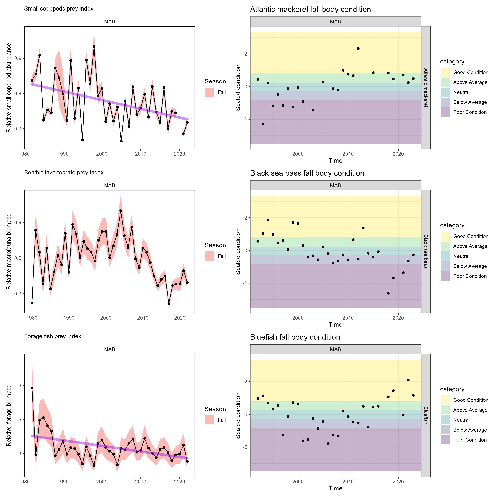

```{r setup, include=FALSE}

# library(tint)
# # invalidate cache when the package version changes
# knitr::opts_chunk$set(tidy = FALSE, cache.extra = packageVersion('tint'))
# options(htmltools.dir.version = FALSE)

#Default Rmd options
knitr::opts_chunk$set(echo = FALSE,
                      message = FALSE,
                      #dev = "cairo_pdf",
                      warning = FALSE,
                      fig.width = 4,
                      fig.asp = 0.45,
                      fig.align = 'center'
                      ) #allows for inserting R code into captions

#Plotting and data libraries
#remotes::install_github("noaa-edab/ecodata@0.1.0") #change to 2020 ecodata version for release
library(tidyverse)
library(tidyr)
library(ecodata)
library(here)
library(kableExtra)
library(patchwork)

```

# Introduction  

*Risk Element Information and Recommendations for Council Consideration*

The Council approved an Ecosystem Approach to Fisheries Management (EAFM) Guidance Document in 2016 which outlined a path forward to more fully incorporate ecosystem considerations into marine fisheries management^[http://www.mafmc.org/s/EAFM_Guidance-Doc_2017-02-07.pdf], and revised the document in February 2019^[http://www.mafmc.org/s/EAFM-Doc-Revised-2019-02-08.pdf]. The Council’s stated goal for EAFM is “to manage for ecologically sustainable utilization of living marine resources while maintaining ecosystem productivity, structure, and function.” Ecologically sustainable utilization is further defined as “utilization that accommodates the needs of present and future generations, while maintaining the integrity, health, and diversity of the marine ecosystem.” Of particular interest to the Council was the development of tools to incorporate the effects of species, fleet, habitat and climate interactions into its management and science programs. To accomplish this, the Council agreed to adopt a structured framework to first prioritize ecosystem interactions, second to specify key questions regarding high priority interactions and third tailor appropriate analyses to address them [@gaichas_framework_2016]. Because there are so many possible ecosystem interactions to consider, a risk assessment was adopted as the first step to identify a subset of high priority interactions and initially completed in 2017 [@gaichas_implementing_2018]. The Council conducted a comprehensive review of the risk assessment in 2023 to reflect the Council’s current priorities and ensure the risk assessment can be adaptive and responsive to new and changing conditions that can support a variety of Council management needs.  The revised risk assessment includes 28 risk elements that span biological, ecological, social, economic, and management issues (Table \ref{riskel}) and risk criteria for the assessment is based on a range of indicators and expert knowledge (Table \ref{allcriteria}).

The risk assessment is updated annually and was designed to help the Council decide where to focus limited resources to address ecosystem considerations by first clarifying priorities. Overall, the purpose of the EAFM risk assessment is to provide the Council with a proactive strategic planning tool for the sustainable management of marine resources under its jurisdiction, while taking interactions within the ecosystem into account. 

This document updates the Mid-Atlantic Council’s 2024 EAFM risk assessment that was approved by the Council in December^[https://www.mafmc.org/s/05_EAFM-Risk-Assessment.pdf]. The updated assessment includes indicators from the 2025 State of the Ecosystem report and new analyses by NEFSC and Council Staff for certain Ecological and Management elements to address feedback from the Council’s Ecosystem and Ocean Planning (EOP) Committee and Advisory Panel. 

Since the previous risk assessment was just completed in December 2024, many risk rankings are unchanged based on the updated indicators for 2025 and the Council’s risk criteria. Below, we highlight only the elements where information and/or analyses have changed (e.g., new/revised indicators or risk criteria) or where the perception of risk is different from 2024. 

\newpage

```{r riskel, echo=FALSE, message=FALSE, warnings=FALSE, results='asis'}

#tab.cap="Risk Elements, Definitions, and Indicators Used\\label{riskel}",

elem <-read.table("riskelements2024.txt", sep="|", header=F, strip.white = T, stringsAsFactors = F)
elem <- elem[,2:4]
names(elem) <- c("Element", "Definition", "Indicator")

# elem$Element <- factor(all$Element, levels=c("Assessment performance", "F status", "B status", "Food web  (Council Predator)", "Food web  (Council Prey)", "Food web  (Protected Species Prey)",
#                                             "Ecosystem productivity", "Climate", "Distribution shifts", "Estuarine habitat", "Offshore habitat", "Commercial Revenue",
#                                             "Recreational Angler Days/Trips", "Commercial Fishery Resilience (Revenue Diversity)", "Commercial Fishery Resilience (Shoreside Support)",
#                                             "Fleet Resilience", "Social-Cultural", "Commercial", "Recreational", "Control", "Interactions", "Other ocean uses", "Regulatory complexity", 
#                                             "Discards", "Allocation"))

kable(elem, format = "latex", booktabs = T, longtable=T, caption="Risk Elements, Brief Definitions, and Indicators Used. Additional detail and information on each risk elements definition and indicator(s) can be found in the full risk assessment text.\\label{riskel}") %>%
  kable_styling(font_size=8, latex_options=c("repeat_header", "striped")) %>%
  column_spec(1, width="2.5cm") %>%
  column_spec(2:3, width="7cm") %>%
  group_rows("Ecological",1,11) %>%
  group_rows("Economic",12,15) %>%
  group_rows("Social",16,18) %>%
  group_rows("Food Production",19,20) %>%
  group_rows("Management",21,28)
  #landscape()


```
 

\newpage
\pagestyle{plain}
```{r allcriteria,  echo=FALSE, message=FALSE, warnings=FALSE, results='asis'}

#tab.cap="Risk Ranking Criteria used for each Risk Element\\label{allcriteria}",

all<-read.table("riskrankingcriteria2024.txt", sep="|", header=T, strip.white = T, stringsAsFactors = F)
names(all) <- c("Element", "Ranking", "Criteria")
all$Ranking <- factor(all$Ranking, levels=c("Low", "Low-Moderate",  "Moderate-High", "High"))
all$Element <- factor(all$Element, levels=c("Assessment performance", "F status", "B status", "Food web (Prey availability)", "Food web (Predation pressure)", "Food web  (Protected species prey)",
                                            "Ecosystem productivity", "Climate", "Distribution shifts", "Estuarine habitat", "Offshore habitat", "Commercial value",
                                            "Recreational angler days/trips", "Commercial fishery resilience (Revenue diversity)", "Commercial fishery resilience (Shoreside support)",
                                            "Commercial fishery resilience (Fleet diversity)", "Recreational fleet diversity", "Fishing community vulnerability", "Commercial fishing production", "Recreational fishing production", "F Control", "Tech Interactions", "Offshore wind (Bio/Ecosystem)", "Offshore wind (Science/Access)", "Other ocean activities", "Regulatory complexity", 
                                            "Discards", "Allocation"))

allwide <- all %>% 
  spread(Ranking, Criteria)

kable(allwide, format = "latex", booktabs = T, longtable=T, caption="Risk Ranking Criteria used for each Risk Element. Additional information on the risk ranking criteria can be found in the full risk assessment text.\\label{allcriteria}") %>%
  kable_styling(font_size=8, latex_options=c("repeat_header", "striped")) %>%
  column_spec(1, width="2cm") %>%
  column_spec(2:5, width="5cm") %>%
  landscape()


```
\clearpage
\pagestyle{fancy}

# Risk Assessment

## Ecological Elements

### Stock Assessment Performance

**Description:**

Stock assessments provide the scientific basis for sustainable fishery
management in this region. This risk element is applied at the species
level, and addresses risk to achieving OY due to scientific uncertainty
based on analytical and data limitations. The Council risk policy
accounts for scientific uncertainty in assessments, with methods for
determining scientific uncertainty currently being refined by the
Council's Scientific and Statistical Committee (SSC).

Other assessment-related risk elements (F status and B status) describe
risks according to our best understanding of stock status, but
assessment methods and data quality shape that understanding.

**Definition:**

Risk of not achieving OY due to analytical limitations

**Indicators:**

Stock assessment review and general assessment data quality contribute to assessment of assessment performance risk. The EOP and
Council can continue to use pass/fail criteria from independent stock
assessment reviews while more formally incorporating data quality
indicators (including data quality impacts from any source of scientific
survey constraint), assessment retrospective performance indicators, or
other indicators of analytical limitations. The SSC OFL CV process
already reviews many aspects of analytical assessment uncertainty,
including data quality and retrospective performance, which may further refine criteria used in this EAFM risk assessment.

**Risk criteria:**

  -----------------------------------------------------------------------
  *Risk Level*    *Definition*
  --------------- -------------------------------------------------------
  Low             Assessment model(s) passed peer review, high data
                  quality, small retrospective pattern

  Low-Moderate    Assessment passed peer review but some data and/or
                  reference points may be lacking

  Moderate-High   Assessment passed peer review but with major data
                  quality issue or large retrospective pattern

  High            Assessment failed peer review or no assessment,
                  data-limited tools applied
  -----------------------------------------------------------------------
  
An alternative set of criteria could apply OFL CVs used by the SSC for
establishing ABC, which represent overall assessment uncertainty. An OFL
CV of 60% could represent the low risk category, 100% the low-moderate
risk category, 150% the moderate-high risk category, and stocks without
an assessment (where OFL CV is usually not applied) remaining in the
high risk category. If applying these criteria, we could change the name
of this to "Assessment uncertainty" to match what the SSC is evaluating.

**Risk Assessment**

Stocks with low risk due to assessment performance include ocean quahog, surf clam, summer flounder, scup, black sea bass, Atlantic mackerel, butterfish, golden tilefish, bluefish, and spiny dogfish. Longfin squid are assessed with index-based assessment methods which rank low-moderate risk due to incomplete survey coverage in some years, and reference points for longfin squid are lacking. Shortfin squid also lack reference points, and the 2022 Research Track assessment was unable to put any analytical method forward to evaluate stock status or trends, so assessment performance risk increased to high. The monkfish 2016 operational assessment was unable to model growth or population status due to innaccurate ageing methods, so both northern and southern stocks rank high risk for this element. Blueline tilefish ranks as high risk for assessment type because it is assessed with the data limited methods (DLM) toolbox, and chub mackerel rank high risk due to no assessment.

### Fishing Mortality Status and Stock Biomass Status

**Description:**

Managed fisheries are required to be prosecuted within fishing mortality
limits and managed stocks are required to be maintained above minimum
threshold biomass levels to preserve sustainable yield. These elements
are applied at the species level. Because OY is the objective, and OY is
at most MSY under U.S. law, fishing mortality ($F$) limit reference
points are based on $F_{MSY}$, while the stock biomass ($B$) target is
biomass at MSY ($B_{MSY}$). $F$ and $B$ status relative to established
MSY-based target and limit reference points or proxies [@gabriel_review_1999] from stock assessments therefore indicate the level of risk
to achieving OY from either overfishing or stock depletion,
respectively.

**Definitions:**

Fishing Mortality -- F Status: Risk of not achieving OY due to
overfishing

Stock Biomass -- B Status: Risk of not achieving OY due to depleted
stock

**Indicators:**

Stock assessments estimate both current F relative to the F reference
point and current B relative to the B reference point and these
indicators are used directly. When these quantities are not estimated
due to analytical limitations, the SSC can evaluate the weight of
evidence for risk of overfishing and overfished status based on evidence
outside the stock assessment, and this evaluation is used in the EAFM
risk assessment.

```{r stock-status, fig.width = 7.5, fig.asp = 0.6, fig.cap = "Summary of single species status for MAFMC and jointly federally managed stocks (Spiny dogfish and both Goosefish). The dotted vertical line is the target biomass reference point of $B_{MSY}$. The dashed lines are the management thresholds of one half $B_{MSY}$ (vertical) or $F_{MSY}$. (horizontal). Stocks in orange are below the biomass threshold (overfished) or have fishing mortality above the limit (subject to overfishing), so are not meeting objectives. Stocks in purple  are above the biomass threshold but below the biomass target with fishing mortality within the limit. Stocks in green are above the biomass target, with fishing mortality within the limit."}

# code = readLines("https://raw.githubusercontent.com/NOAA-EDAB/ecodata/master/chunk-scripts/human_dimensions_MAB.Rmd-stock-status.R"), 

a <- ecodata::plot_stock_status(report = "MidAtlantic")

a$p + ggplot2::coord_cartesian(xlim=c(0,2), ylim=c(0,2)) + ggplot2::annotation_custom(gridExtra::tableGrob(a$unknown,
                            theme = gridExtra::ttheme_default(base_size = 7),
                            rows=NULL),
                            xmin=0.8, xmax=1.8, ymin=1.5, ymax=2)

```

```{r unkstocks}

# flextable::flextable(a$unknown) |>
#   flextable::set_header_labels(F.Fmsy = "F/Fmsy",
#                                B.Bmsy = "B/Bmsy") |>
#   flextable::colformat_num(na_str = "-") |>
#   flextable::set_caption("Unknown or partially known stock status for MAFMC and jointly managed species.") |>
#   flextable::autofit() 


```

**Risk criteria:**

We applied low and high risk criteria for these elements as defined in
U.S. law. Low risk criteria are $F$ \< $F_{MSY}$ and $B$ \> $B_{MSY}$
for an individual stock. High risk criteria are $F$ \> $F_{MSY}$ and $B$
\< 0.5 $B_{MSY}$ for an individual stock. The Council established the
intermediate risk categories to address stocks with unknown status.
Moderate-high risk was defined as unknown status in the absence of other
information for both $F$ and $B$. Low-moderate risk was defined as
unknown status, but with a weight of evidence indicating low overfishing
risk for $F$. Similarly, low-moderate risk for $B$ was either 0.5
$B_{MSY}$ \< $B$ \< $B_{MSY}$ or unknown status, but with a weight of
evidence indicating low risk that the population is depleted.

  -----------------------------------------------------------------------
  *Risk Level*    *Definition*
  --------------- -------------------------------------------------------
  Low             F \< Fmsy

  Low-Moderate    Unknown, but weight of evidence indicates low
                  overfishing risk

  Moderate-High   Unknown status

  High            F \> Fmsy
  -----------------------------------------------------------------------

  -----------------------------------------------------------------------
  *Risk Level*    *Definition*
  --------------- -------------------------------------------------------
  Low             B \> Bmsy

  Low-Moderate    Bmsy \> B \> 0.5 Bmsy, or unknown, but weight of
                  evidence indicates low risk

  Moderate-High   Unknown status

  High            B \< 0.5 Bmsy
  -----------------------------------------------------------------------
  
**Risk Assessment**

Single species management objectives (1. maintaining biomass above minimum thresholds and 2. maintaining fishing mortality below overfishing limits) are being met for all but two MAFMC-managed species (Fig. \ref{fig:stock-status}), though the status of six stocks is unknown (Table \ref{tab:unkstocks}).  Based on current assessment results, F and B status are both in the low risk category for surfclams, ocean quahogs, scup, and black sea bass. Butterfish, bluefish, and golden tilefish F status is in the low risk category, and B risk is in the low-moderate risk category. Spiny dogfish F status is in the high risk category, and B status is in the low risk category. Summer flounder F status is in the high risk category and B status is in the low-moderate risk category. Atlantic mackerel F status is in the low risk category and B status is in the high risk category. 

Stocks with unknown status have a range of rankings. F and B status for chub mackerel and northern and southern monkfish stocks are ranked low-moderate risk (unknown but weight of evidence supports lower risk). Longfin squid B is above the established B threshold, and both squid stocks have unknown F status, but F is difficult to estimate because it is very low relative to natural mortality, so they were also ranked low-moderate risk. Blueline tilefish are high risk for F status and have unknown B status and little auxiliary information in the Mid-Atlantic region, and so rank moderate-high risk for B status. 

### Food Web (1) - Prey Availability

**Description:**

This element is applied at the species level.

Fish stocks and protected species stocks are managed using single species approaches, but fish and protected species stocks exist within a food web of predator and prey interactions. This element is one of two separating food web risks to achieving OY for Council managed species from two sources. This first element assesses prey availability for each species, and the second food web risk element assesses predation pressure on each species (see Food Web (2)- Predation Pressure).

**Definition:**

Risk of not achieving OY for Council managed species due to availability
of prey.

**Indicators:**

Indicators of prey availability for each Council managed species would
be based on food habits information for the Council managed species
combined with population trends for key prey species (if available). Major prey can be identified using food habits data and considered in aggregate.

Aggregate prey indices can be developed using survey data, stomach contents data, or a combination. For example, indicators of aggregated benthic invertebrates and aggregate forage fish were developed using stomach contents of multiple fish predators (Fig. \ref{fig:foragebio}, left column).

However, trends in prey alone may not indicate risk if the prey are fluctuating well above a threshold where Council managed species might experience scarcity. Body condition indicators can be used to suggest whether Council managed species are heavier or lighter than expected for their length (Fig. \ref{fig:foragebio}, right column). Low body condition combined with declining prey trends could indicate higher risk that prey availability might impact OY. 


```{r foragebio, fig.cap = "Example indicators for prey availability risk. Major prey in left column, managed species condition in right column. Top row: benthic invertebrate prey of black sea bass have been declining since the mid-2000s, as has body condition for black sea bass. Taken together these indicate higher risk. Bottom row: forage fish prey of bluefish show a long term decline, but bluefish body condition has been stable or increasing recently. Taken together these indicate lower risk due to prey availability.", out.width='100%'}
#, code=readLines("https://raw.githubusercontent.com/NOAA-EDAB/ecodata/master/chunk-scripts/macrofauna_MAB.Rmd-forage-index.R")


fallsmcope <- readRDS(url("https://github.com/NOAA-EDAB/foodweb-risk/raw/main/preyindices/fallsmcopepodALLindex.rds"))

fixsmcope<- fallsmcope |>
      dplyr::filter(Var %in% c("Fall Small copepods ALL Abundance Index Estimate"),
                    EPU %in% c("MAB")) |>
      dplyr::group_by(EPU) |>
      dplyr::summarise(max = max(Value, na.rm=T))

    pfallsmcope <- fallsmcope |>
      dplyr::filter(Var %in% c("Fall Small copepods ALL Abundance Index Estimate",
                               "Fall Small copepods ALL Abundance Index Estimate SE"),
                    EPU %in% c("MAB")) |>
      dplyr::mutate(Value = ifelse(Value == 0, NA, Value)) |>
      dplyr::group_by(EPU) |>
      tidyr::separate(Var, into = c("Season", "A", "B", "C", "D", "E", "F", "Var")) |>
      dplyr::mutate(Var = tidyr::replace_na(Var, "Mean")) |> #,
      #max = as.numeric(Value)) |>
      tidyr::pivot_wider(names_from = Var, values_from = Value) |>
      dplyr::left_join(fixsmcope) |>
      dplyr::mutate(#Value = Value/resca,
        Mean = as.numeric(Mean),
        #max = as.numeric(Value),
        Mean = Mean/max,
        SE = SE/max,
        Upper = Mean + SE,
        Lower = Mean - SE) |>
      ggplot2::ggplot(ggplot2::aes(x = Time, y = Mean, group = Season))+
      #ggplot2::annotate("rect", fill = setup$shade.fill, alpha = setup$shade.alpha,
      #                  xmin = setup$x.shade.min , xmax = setup$x.shade.max,
      #                  ymin = -Inf, ymax = Inf) +
      ggplot2::geom_ribbon(ggplot2::aes(ymin = Lower, ymax = Upper, fill = Season), alpha = 0.5)+
      ggplot2::geom_point()+
      ggplot2::geom_line()+
      ggplot2::ggtitle("Small copepods prey index")+
      ggplot2::ylab(expression("Relative small copepod abundance"))+
      ggplot2::xlab(ggplot2::element_blank())+
      ggplot2::facet_wrap(.~EPU)+
      ecodata::geom_gls()+
      ecodata::geom_lm(n=10) +
      ecodata::theme_ts()+
      ecodata::theme_facet()+
      ecodata::theme_title()
    
  #p 


fallmacro <- readRDS(url("https://github.com/NOAA-EDAB/foodweb-risk/raw/main/preyindices/fallmacrobenthosindex.rds"))

fixmacro<- fallmacro |>
      dplyr::filter(Var %in% c("Fall Macrobenthos Biomass Index Estimate"),
                    EPU %in% c("MAB")) |>
      dplyr::group_by(EPU) |>
      dplyr::summarise(max = max(Value))

    pfallmac <- fallmacro |>
      dplyr::filter(Var %in% c("Fall Macrobenthos Biomass Index Estimate",
                               "Fall Macrobenthos Biomass Index Estimate SE"),
                    EPU %in% c("MAB")) |>
      dplyr::group_by(EPU) |>
      tidyr::separate(Var, into = c("Season", "A", "B", "C", "D", "Var")) |>
      dplyr::mutate(Var = tidyr::replace_na(Var, "Mean")) |> #,
      #max = as.numeric(Value)) |>
      tidyr::pivot_wider(names_from = Var, values_from = Value) |>
      dplyr::left_join(fixmacro) |>
      dplyr::mutate(#Value = Value/resca,
        Mean = as.numeric(Mean),
        #max = as.numeric(Value),
        Mean = Mean/max,
        SE = SE/max,
        Upper = Mean + SE,
        Lower = Mean - SE) |>
      ggplot2::ggplot(ggplot2::aes(x = Time, y = Mean, group = Season))+
      #ggplot2::annotate("rect", fill = setup$shade.fill, alpha = setup$shade.alpha,
      #                  xmin = setup$x.shade.min , xmax = setup$x.shade.max,
      #                  ymin = -Inf, ymax = Inf) +
      ggplot2::geom_ribbon(ggplot2::aes(ymin = Lower, ymax = Upper, fill = Season), alpha = 0.5)+
      ggplot2::geom_point()+
      ggplot2::geom_line()+
      ggplot2::ggtitle("Benthic invertebrate prey index")+
      ggplot2::ylab(expression("Relative macrofauna biomass"))+
      ggplot2::xlab(ggplot2::element_blank())+
      ggplot2::facet_wrap(.~EPU)+
      ecodata::geom_gls()+
      ecodata::geom_lm(n=10) +
      ecodata::theme_ts()+
      ecodata::theme_facet()+
      ecodata::theme_title()
    
  #p 
  


pforage  <-  ecodata::forage_index |>
      dplyr::filter(Var %in% c("Fall Forage Fish Biomass Estimate",
                               "Fall Forage Fish Biomass Estimate SE"),
                    EPU %in% c("MAB")) |>
      dplyr::group_by(EPU) |>
      tidyr::separate(Var, into = c("Season", "A", "B", "C", "D", "Var")) |>
      dplyr::mutate(Var = tidyr::replace_na(Var, "Mean")) |> #,
      #max = as.numeric(Value)) |>
      tidyr::pivot_wider(names_from = Var, values_from = Value) |>
      dplyr::left_join(fixmacro) |>
      dplyr::mutate(#Value = Value/resca,
        Mean = as.numeric(Mean),
        #max = as.numeric(Value),
        Mean = Mean/max,
        SE = SE/max,
        Upper = Mean + SE,
        Lower = Mean - SE) |>
      ggplot2::ggplot(ggplot2::aes(x = Time, y = Mean, group = Season))+
      #ggplot2::annotate("rect", fill = setup$shade.fill, alpha = setup$shade.alpha,
      #                  xmin = setup$x.shade.min , xmax = setup$x.shade.max,
      #                  ymin = -Inf, ymax = Inf) +
      ggplot2::geom_ribbon(ggplot2::aes(ymin = Lower, ymax = Upper, fill = Season), alpha = 0.5)+
      ggplot2::geom_point()+
      ggplot2::geom_line()+
      ggplot2::ggtitle("Forage fish prey index")+
      ggplot2::ylab(expression("Relative forage biomass"))+
      ggplot2::xlab(ggplot2::element_blank())+
      ggplot2::facet_wrap(.~EPU)+
      ecodata::geom_gls()+
      ecodata::geom_lm(n=10) +
      ecodata::theme_ts()+
      ecodata::theme_facet()+
      ecodata::theme_title()

#p

mafmc_cond <- c("Atlantic mackerel",
           "Black sea bass",
           "Bluefish",
           "Butterfish",
           "Goosefish",
           "Illex", #not in condition
           "Loligo",  #not in condition
           "Scup",
           "Spiny dogfish",
           "Summer flounder",
           "Surf clam",  #not in condition
           "Ocean quahog")  #not in condition
           #"Clams", # Atlantic surfclam and ocean quahog not separate groups
           #"Tilefish") # Blueline and golden tilefish not separate groups

AnnualRelCond2023_Fall <- readr::read_csv("https://raw.githubusercontent.com/NOAA-EDAB/foodweb-risk/main/condition/AnnualRelCond2023_Fall.csv")


survEPUcond <- AnnualRelCond2023_Fall |>
  dplyr::select(Time = YEAR,
                Var = Species,
                EPU,
                Value = MeanCond,
                nCond) |>
  dplyr::group_by(EPU, Var) |>
  dplyr::mutate(scaleCond = scale(Value,scale =T,center=T)) 

xs <- quantile(survEPUcond$scaleCond, seq(0,1, length.out = 6), na.rm = TRUE)

survEPUcond <- survEPUcond |>
  dplyr::mutate(category = cut(scaleCond,
                                  breaks = xs,
                                  labels = c( "Poor Condition",
                                              "Below Average",
                                              "Neutral",
                                              "Above Average",
                                              "Good Condition"),
                                  include.lowest = TRUE))

condquants <- data.frame(ymin = xs[1:5],
                         ymax = xs[2:6],
                         category = sort(unique(survEPUcond$category))
)

vir <- viridis::viridis_pal()(5)

mafmcsurvEPUcond <- survEPUcond |>
  dplyr::filter(Var %in% mafmc_cond[1], #At mackerel
                EPU %in% c("MAB"))

pmackcond <-   ggplot2::ggplot() +
  ggplot2::theme_bw() +
  ggplot2::geom_rect(data = condquants,
                     aes(ymin = ymin, ymax = ymax, fill = category, xmin = -Inf, xmax = Inf),
                     alpha = .3) +
  ggplot2::scale_fill_manual(values=vir) +
  ggplot2::geom_point(data= mafmcsurvEPUcond, ggplot2::aes(x=Time, y=scaleCond[,1])) +
  #ggplot2::geom_hline(yintercept = xs[2:5]) +
  #ggplot2::geom_line() +
  ggplot2::facet_grid(Var~factor(EPU, levels = c("MAB", "GB", "GOM", "SS", "NA")), ) +
  ggplot2::ylab("Scaled condition") +
  ggplot2::ggtitle(paste(unique(mafmcsurvEPUcond$Var), "fall body condition")) +
  ggplot2::guides(fill = ggplot2::guide_legend(reverse = TRUE))


mafmcsurvEPUcond <- survEPUcond |>
  dplyr::filter(Var %in% mafmc_cond[2], #BSB
                EPU %in% c("MAB"))

pbsbcond <-   ggplot2::ggplot() +
  ggplot2::theme_bw() +
  ggplot2::geom_rect(data = condquants,
                     aes(ymin = ymin, ymax = ymax, fill = category, xmin = -Inf, xmax = Inf),
                     alpha = .3) +
  ggplot2::scale_fill_manual(values=vir) +
  ggplot2::geom_point(data= mafmcsurvEPUcond, ggplot2::aes(x=Time, y=scaleCond[,1])) +
  #ggplot2::geom_hline(yintercept = xs[2:5]) +
  #ggplot2::geom_line() +
  ggplot2::facet_grid(Var~factor(EPU, levels = c("MAB", "GB", "GOM", "SS", "NA")), ) +
  ggplot2::ylab("Scaled condition") +
  ggplot2::ggtitle(paste(unique(mafmcsurvEPUcond$Var), "fall body condition")) +
  ggplot2::guides(fill = ggplot2::guide_legend(reverse = TRUE))

#p

mafmcsurvEPUcond <- survEPUcond |>
  dplyr::filter(Var %in% mafmc_cond[3], #Bluefish
                EPU %in% c("MAB"))

pbfcond <-   ggplot2::ggplot() +
  ggplot2::theme_bw() +
  ggplot2::geom_rect(data = condquants,
                     aes(ymin = ymin, ymax = ymax, fill = category, xmin = -Inf, xmax = Inf),
                     alpha = .3) +
  ggplot2::scale_fill_manual(values=vir) +
  ggplot2::geom_point(data= mafmcsurvEPUcond, ggplot2::aes(x=Time, y=scaleCond[,1])) +
  #ggplot2::geom_hline(yintercept = xs[2:5]) +
  #ggplot2::geom_line() +
  ggplot2::facet_grid(Var~factor(EPU, levels = c("MAB", "GB", "GOM", "SS", "NA")), ) +
  ggplot2::ylab("Scaled condition") +
  ggplot2::ggtitle(paste(unique(mafmcsurvEPUcond$Var), "fall body condition")) +
  ggplot2::guides(fill = ggplot2::guide_legend(reverse = TRUE))

#p

fig4 <- pfallsmcope + pmackcond + pfallmac + pbsbcond + pforage + pbfcond + plot_layout(nrow = 3)

ggsave("preyavriskex.png", fig4, device="png", width = 12, height = 12, units = "in")




```

```{r, eval=FALSE}
mafmcsurvEPUcond <- survEPUcond |>
  dplyr::filter(Var %in% mafmc_cond[1:3], #BSB
                EPU %in% c("MAB"))

raw <- ggplot2::ggplot(mafmcsurvEPUcond, ggplot2::aes(x = Time, y = Value)) +
  ggplot2::geom_point() +
  ggplot2::geom_line() +
  ggplot2::facet_grid(~Var)


scaled <- ggplot2::ggplot() +
  ggplot2::theme_bw() +
  ggplot2::geom_rect(data = condquants,
                     aes(ymin = ymin, ymax = ymax, fill = category, xmin = -Inf, xmax = Inf),
                     alpha = .3) +
  ggplot2::scale_fill_manual(values=vir) +
  ggplot2::geom_point(data= mafmcsurvEPUcond, ggplot2::aes(x=Time, y=scaleCond[,1])) +
  #ggplot2::geom_hline(yintercept = xs[2:5]) +
  #ggplot2::geom_line() +
  ggplot2::facet_grid(~Var) +
  ggplot2::ylab("Scaled condition") +
  #ggplot2::ggtitle(paste(unique(mafmcsurvEPUcond$Var), "fall body condition")) +
  ggplot2::guides(fill = ggplot2::guide_legend(reverse = TRUE))

maxyr <- max(mafmcsurvEPUcond$Time)
tenyr <- maxyr-10

meancond <- mafmcsurvEPUcond |>
  dplyr::filter(Time>tenyr) |>
  dplyr::group_by(Var) |>
  dplyr::summarise(meanraw = mean(Value),
                   meanscale = mean(scaleCond))

condquants

meancond

```


**Risk criteria:**

Good body condition likely represents low risk of prey limitation, and body condition being uncorrelated with the major prey trend also likely represents low risk of prey limitation. Conversely, poor condition indicates elevated risk of prey limitation, and higher risk if poor condition coincides with decreasing trends in major prey. If declining body condition and declining major prey are correlated that may be highest risk. Correlation does not imply causation, but the predator condition and major prey index fluctuating together should warrant deeper investigation.

The criteria evaluate condition status and major prey trends over the most recent 10 years. \textcolor{red}{The EOP and AP recommended evaluating an alternative calculation using the full time series with a decay factor to emphasize the most recent 10 years. This second alternative will be presented in April 2025 along with the approach presented here.} 


  -----------------------------------------------------------------------
  *Risk Level*    *Definition*
  --------------- -------------------------------------------------------
  Low             Fish condition good, no correlation with major prey trends

  Low-Moderate    Fish condition above average or neutral, aggregate prey for this species 
                  has stable or increasing trend

  Moderate-High   Fish condition below average or neutral, aggregate prey for this species 
                  has significant decreasing trend

  High            Fish condition poor, species highly dependent on prey with 
                  limited and declining availability, or prey and condition 
                  trends significantly correlated
  -----------------------------------------------------------------------

**Risk Assessment**

We demonstrate applying the criteria to three Council managed species to date with preliminary data for the Mid Atlantic Bight: Atlantic mackerel, black sea bass, and bluefish. \textcolor{red}{Other species will be added as diet compositions are analyzed and prey indices are developed.} We use the summaries from the [NEFSC food habits database](https://fwdp.shinyapps.io/tm2020/) and forage fish, benthic invertebrate, and zooplankton indicators submitted to the 2025 State of the Ecosystem report in these examples. 

Fish condition calculated as the mean over the past decade (2014-2023) results in Atlantic mackerel and bluefish having above average condition and black sea bass having poor condition. Preliminary prey indices for each species show a 10 year declining trend in small copepods and long term declining trends for both small copepods and forage fish, but no 10 year or long term trends for benthic macroinvertebrates. Condition and prey index trends are uncorrelated for Atlantic mackerel and bluefish. The black sea bass condition time series and the benthic macroinvertebrate time series are correlated, but this prey group represents ~25% of black sea bass diet.

Therefore, bluefish ranks low-moderate risk for prey availability with above average condition and no 10 year trend in prey. Black sea bass would rank high risk for prey availability based on poor condition and correlation with one major prey group (<50% of diet).  Atlantic mackerel would also rank low-moderate risk based on above average condition, but has a declining 10 year trend in prey. 

### Food Web (2) - Predation Pressure

**Description:**

This element is applied at the species level.

Fish stocks and protected species stocks are managed using single species approaches, but fish and protected species stocks exist within a food web of predator and prey interactions. This element is one of two separating food web risks to achieving OY for Council managed species from two sources. This second food web risk element assesses predation pressure on each species, and the first element assesses prey availability for each species (see Food Web (1) Prey availability).

**Definition:**

Risk of not achieving OY for Council managed species due to predation
pressure.

**Indicators:**

First, the estimated predation mortality and major predators for each Council-managed species could be identified using food web models, empirical data, and/or literature review. 
A food web model can also determine whether predation mortality is a “low” proportion of overall mortality, with the EOP deciding on a threshold (for example, < 10%). 

For Council managed species with 10% or more of total mortality from predation, the EOP could decide on a threshold for identifying major predators, such as those contributing 5% or more of total mortality on average. Then, all predators contributing that amount to mortality would be considered together in the risk indicators to evaluate total predation pressure risk. 

Given that predation mortality exceeds the EOP threshold and major predators are identified, we envision four types of indicators that will provide insight into predation pressure trends across a variety of species data availability.

* Predator-prey spatial and temporal overlap. This can be calculated from survey data for many species and does not require detailed diet information. However, overlap alone may not be a complete indicator of mortality.

* Estimated consumption by fish predators. This requires detailed diet information and time series of biomass for predators, available for some Council-managed species (see https://fwdp.shinyapps.io/tm2020/#7_TOTAL_CONSUMPTION_AND_CB_RATIOS where these estimates are available for Atlantic mackerel, butterfish, and longfin squid). Estimates of total consumption are also available from literature. However, consumption alone may not be a complete indicator of mortality, and these estimates do not include consumption by HMS, mammals, and birds.

```{r mackcons, fig.width = 8, fig.asp = 0.3, fig.cap="Atlantic mackerel, butterfish, and longfin squid estimated total consumption by major fish predators, NEFSC." }

mackcons <- read.csv("consumption/C.CB.All predators.Atlantic mackerel (Scomber scombrus).2024-11-19.csv")
buttcons <- read.csv("consumption/C.CB.All predators.Butterfish (Peprilus triacanthus).2024-11-19.csv")
lolcons <- read.csv("consumption/C.CB.All predators.Loligo squid (Loligo sp.).2024-11-19.csv")

mackbuttlolcons <- dplyr::bind_rows(mackcons, buttcons, lolcons) |>
  dplyr::select(Var = Prey, Time = Year, Value = Mean.consump, UCI, LCI) |>
  dplyr::mutate(Value = ifelse(Value == 0, NA, Value)) 

  setup <- ecodata::plot_setup(shadedRegion = NULL,
                               report="MidAtlantic")
  
  cons_agg <- mackbuttlolcons |>
      dplyr::group_by(Var) |>
      dplyr::mutate(hline = mean(Value))
  
  cons_agg |>
      ggplot2::ggplot()+

      #Highlight last ten years
      ggplot2::annotate("rect", fill = setup$shade.fill, alpha = setup$shade.alpha,
                        xmin = setup$x.shade.min , xmax = setup$x.shade.max,
                        ymin = -Inf, ymax = Inf) +
      ecodata::geom_gls(ggplot2::aes(x = Time, y = Value,
                                     group = Var),
                        alpha = setup$trend.alpha, size = setup$trend.size) +
      ecodata::geom_lm(n=10, ggplot2::aes(x = Time, y = Value,
                                        group = Var),
                       alpha = setup$trend.alpha, size = setup$trend.size) +
      #ecodata::geom_lm(aes(x = Time, y = Value))+
      ggplot2::geom_line(ggplot2::aes(x = Time, y = Value,), linewidth = setup$lwd) +
      ggplot2::geom_point(ggplot2::aes(x = Time, y = Value), size = setup$pcex) +
      ggplot2::scale_x_continuous(breaks = seq(1980, 2020, by = 10), expand = c(0.01, 0.01)) +
      #ggplot2::scale_color_manual(values = series.col2, aesthetics = "color")+
      ggplot2::facet_wrap(~Var, scales = "free", ncol = 3)+
      #ggplot2::guides(color = "none") +
      #ggplot2::ylab(ylabdat) +
      ggplot2::xlab(ggplot2::element_blank())+
      ggplot2::theme(legend.position = "none",
                     legend.title = ggplot2::element_blank())+
      ggplot2::geom_hline(ggplot2::aes(yintercept = hline,
                                       color = Var),
                          linewidth = setup$hline.size,
                          alpha = setup$hline.alpha,
                          linetype = setup$hline.lty) +
      ecodata::theme_ts() +
      ggplot2::ggtitle(setup$region)+
      ecodata::theme_title() +
      ecodata::theme_facet()


#
```


* Predation pressure index (PPI). This requires some diet information and time series of biomass for major predators. This method can include mammal and bird predators as well as fish, and is being proposed to be implemented for Atlantic mackerel. (Fig. \ref{fig:PPI}). 

```{r PPI, fig.cap="Draft Atlantic mackerel change in predation mortality from major predators; graph courtesy Laurel Smith, NEFSC."}
#download.file(url="https://raw.githubusercontent.com/NOAA-EDAB/presentations/master/docs/EDAB_images/WGSAM24_PPImackerel_Smith.png", destfile="PPIfig.png")

knitr::include_graphics("images/PPIfig.png")
```

* Model-estimated time series of total predation mortality. Food web and multispecies models exist and are being updated for the Mid-Atlantic and full Northeast US shelf. These models can be fitted to available biomass, catch, and diet data. Food web models include predation from all sources (fish, birds, mammals) while multispecies models may estimate age- or size-specific predation mortality from a subset of predators. Model-estimated time series could be available in late 2025.

The EOP and AP agreed to a threshold value for low predation of 10%. In addition, at least 50% of predation mortality should be accounted for in selected indicators by combining the most important predators.


**Risk criteria:**

  -----------------------------------------------------------------------
  *Risk Level*    *Definition*
  --------------- -------------------------------------------------------
  Low             Predation represents a low proportion of overall
                  mortality

  Low-Moderate    Decreasing or no overlap/consumption/PPI/mortality trend, 
                  predation represents a moderate proportion of overall mortality 
                  
  Moderate-High   Increasing overlap/consumption/PPI/mortality trend, 
                  predation represents a moderate proportion of overall mortality
                  
  High            Increasing overlap/consumption/PPI/mortality trend,
                  predation represents a high proportion of overall mortality 
                  
  -----------------------------------------------------------------------

**Risk Assessment**

According to preliminary food web models of the Mid Atlantic Bight, surf clams and ocean quahogs have <10% of overall mortality attributed to predation, so these species have low predation risk according to the criteria.

Available fish consumption indicators show a recent increasing trend for Atlantic mackerel, a long term increasing trend for butterfish, and no trend for longfin squid (Loligo sp. in the figure.) The PPI trend for Atlantic mackerel, which includes predation from a seabird and seals, is also increasing. Therefore, based on available trends, longfin squid would be in the low-moderate risk category, and Atlantic mackerel and butterfish could be either in the moderate-high or high risk categories depending on the level of predation mortality relative to overall mortality. 

Atlantic mackerel and butterfish have at least 30% of overall mortality attributed to fish predation in preliminary food web models. The EOP and AP did not decide on a threshold for moderate or high proportions of overall mortality. We currently assume that this level of mortality from fish predators is moderate, therefore both are assigned moderate-high predation risk. 

\textcolor{red}{Indicators for the remaining species will be developed further for the 2025 Risk Assessment.}


### Food Web (3) - Protected Species Prey

**Description:**

This element is applied at the species level.

Fish stocks and protected species stocks are managed using single
species approaches, but fish and protected species stocks exist within a
food web of predator and prey interactions. The previous two elements
focus on Council managed species OY, while this element focuses on
protected species objectives (maintain or recover populations and
minimize bycatch).

This element ranks the risks of not achieving protected species
objectives due to species interactions with Council managed species. In
the US, protected species include marine mammals (under the Marine
Mammal Protection Act), Endangered and Threatened species (under the
Endangered Species Act), and migratory birds (under the Migratory Bird
Treaty Act). In the Northeast US, endangered/threatened species include
Atlantic salmon, Atlantic and shortnose sturgeon, all sea turtle
species, and five whales.

**Definition:**

Risk of not achieving protected species objectives due to interactions
with Council-managed species

**Indicators:**

Food web models and diet information can be used to establish thresholds
of "importance" for predators and prey. Although monkfish occasionally
ingest seabirds [@perry_predation_2013], there are no Council-managed
species that are important predators of protected species  [@smith_trophic_2010], so here we rank only risks where Council managed species
represent prey of protected species. An important prey of protected
species is defined here as individually comprising \>30% of the
predator's diet by weight. Critical prey warranting a high risk ranking
would be a majority (\>50%) of diet for an individual protected species.

**Risk criteria:**

  -----------------------------------------------------------------------
  *Risk Level*    *Definition*
  --------------- -------------------------------------------------------
  Low             Few interactions with any protected species

  Low-Moderate    Important prey of 1-2 protected species, or important
                  prey of 3 or more protected species with management
                  consideration of interaction

  Moderate-High   Important prey of 3 or more protected species

  High            Managed species is sole prey for a protected species
  -----------------------------------------------------------------------

**Risk Assessment**

Protected species include marine mammals (under the Marine Mammal Protection Act), Endangered and Threatened species (under the Endangered Species Act), and migratory birds (under the Migratory Bird Treaty Act). In the Northeast US, endangered/threatened species include Atlantic salmon, Atlantic and shortnose sturgeon, all sea turtle species, and 5 baleen whales. MAFMC managed species are not important predators of protected species [@smith_trophic_2010], even though monkfish occasionally ingest seabirds [@perry_predation_2013]. Atlantic salmon, both species of sturgeon, and sea turtles are not major predators of MAFMC managed species, as reviewed in the MAFMC Forage Fish white paper [@savoy_prey_2007; @johnson_food_1997; @burke_diet_1993; @burke_diet_1994; @mcclellan_complexity_2007; @seney_historical_2007; @shoop_seasonal_1992]. Information sources for marine mammal diets in the Northeast US [@smith_consumption_2015], and seabird diets [@powers_pelagic_1983; @powers_energy_1987; @powers_seabirds_1987; @schneider_state_1996; @barrett_diet_2007; @bowser_puffins_2013] were reviewed. 

Diet information for protected species tends to be more uncertain than for fished species, so we consider diet at the family level for these rankings because diet compositions are not reported to the species level. Longfin squids are estimated to comprise >30% of diet for one protectes species, pilot whale, in the Northeast US [@smith_consumption_2015; @gannon_stomach_1997], therefore we rank this species low-moderate risk for this element. Shortfin squid were identified as important prey for two pelagic seabirds in the Northeast US [@powers_energy_1987], and therefore ranked low-moderate risk. Unmanaged forage fish such as sand lance and saury were identified as important prey for >3 seabird species in the Northeast US [@powers_energy_1987], as well as grey seals [@smith_consumption_2015]. MAFMC has enacted measures to restrict fishing on these species, such that they rank low-moderate risk for this element. Other MAFMC managed species do not meet the threshold of important prey of protected species based on available information, so they rank low risk for this element.

### Ecosystem Productivity

**Description:**

This element is applied at the ecosystem level (the Mid-Atlantic
Ecosystem Production Unit).

Productivity at the base of the food web supports and ultimately limits
the amount of managed species production in an ecosystem.

**Definition:**

Risk of not achieving OY due to changing system productivity at the base
of the food web.

**Indicators:**

A combination of five indicators will be used to assess the risk of
changing ecosystem productivity. We examine trends in total primary
production, zooplankton abundance for a key Mid-Atlantic species,
aggregate forage fish (new), and two aggregate fish productivity
measures: condition factor (weight divided by length of individual fish)
and a survey based "recruitment" (small fish to large fish) index. An
assessment-based recruitment index was recently added to the State of
the Ecosystem report as well. Because benthic crustaceans are important
prey for many Council-managed species, we note a benthic production
indicator is desirable but not yet available.

These indicators evaluate ecosystem productivity in aggregate, which may
change due to drivers such as decreasing primary productivity, changes
in spatial/temporal overlap at the base of the food web, or other
factors.

For primary production and fish productivity, the spatial scale of
analysis is the Mid-Atlantic Ecosystem Production Unit.

#### Primary production

Primary production has fluctuated recently with current conditions near
average. The observed stability in system productivity is in contrast to
an apparent shift in the timing of the bloom cycle in the Mid-Atlantic.
Comparing remote sensing information from the 1970-80s to 1997-2015
information suggests that winter productivity was historically higher in
the MAB and that the spring bloom we see today was less prominent.
Shifts in timing of low trophic level production (Fig. \ref{fig:monthlypp}) can affect Council
managed fish species through early life history stages that feed on
zooplankton.

```{r monthlypp, fig.cap="Monthly primary production trends show the annual cycle (i.e. the peak during the summer months) and the changes over time for each month.", fig.width=9, fig.asp=.8}
ecodata::plot_chl_pp(varName = "pp", plottype = "monthly")
```

#### Zooplankton abundance

Zooplankton provide a critical link between phytoplankton at the base of
the food web, and higher trophic organisms such as fish, mammals, and
birds. Changes in the species composition and biomass of the zooplankton
community have a great potential to affect recruitment success and
fisheries productivity, and climate change may be the most important
pathway for these changes to manifest. Therefore these indices are
relevant to both productivity and trophic structure objectives.

The time series of zooplankton biovolume suggest that overall
zooplankton production has not changed over time. However, increasing zooplankton diversity and increasing small copepods and cnidarians in the Mid-Atlantic (Fig. \ref{fig:zoopanom}) suggest a change in zooplankton community composition which may affect fish species such as mackerel.

```{r zoopanom, fig.cap="Changes in zooplankton abundance in the MAB for large (top left) and small (top right) copepods, Cnidarians (bottom left), and Euphausiids (bottom right), with significant increases (orange) in small copeods and Cnidarians.", fig.width=5, fig.asp=.8}
a <- ecodata::plot_zoo_abundance_anom(report = "MidAtlantic", varName = "copepod") + 
  ggplot2::facet_wrap(~EPU~Var, labeller = labeller(EPU = function(x) {rep("", length(x))}))
b <- ecodata::plot_zoo_abundance_anom(report = "MidAtlantic", varName = "euphausid") + 
  ggplot2::facet_wrap(~EPU~Var, labeller = labeller(EPU = function(x) {rep("", length(x))}))

a/b

```

#### Forage Fish - new indicator

The amount of forage available is one important driver of fish
productivity. Indicators of aggregate pelagic forage fish biomass and
forage fish energy content are presented in the State of the Ecosystem
report (Fig. \ref{fig:foragebio}) and were shown in the Food Web 1 - Prey availability risk element. 

Aggregate forage fish show a long term decline in the Mid-Atlantic.


#### Fish condition

Fish condition is measured as the weight per length--a measure of
"fatness". This information is from NEFSC bottom trawl surveys and shows
a change in condition across all species at around 2000 (Fig. \ref{fig:mab-cf}). Around
2010-2013 some species started to have better condition. In 2023, condition was mixed, with general improvement since a relatively low condition year in 2021. Preliminary analyses show that changes in temperature, zooplankton, fishing pressure, and population size influence the condition of different fish species.

```{r mab-cf, fig.cap = "Condition factor for fish species in the MAB based on fall NEFSC bottom trawl survey data. MAB data are missing for 2017 due to survey delays, and no survey was conducted in 2020.", fig.width=9}

ecodata::plot_condition() +
  theme(#legend.position = 'bottom',
        legend.text = element_text(size = 10),
        legend.title = element_text(size = 11),
        axis.text.x = element_text(size = 12),
        axis.text.y = element_text(size = 10),
        plot.title = element_text(size = 12))
```

#### Fish productivity

The number of small fish relative to the biomass of larger fish of the
same species, as derived from the NEFSC survey, is a simple measure of
productivity intended to complement model-based stock assessment
estimates of recruitment. Fish productivity has been declining in the Mid-Atlantic since the early 2000s, as described by the small-fish-per-large-fish anomaly indicator (Fig. \ref{fig:productivity-anomaly}). This decline in fish productivity is also shown by a similar analysis based on stock assessment model outputs (recruitment per spawning stock biomass anomaly).

```{r productivity-anomaly, fig.cap = "Fish productivity measures. Left: Small fish per large fish survey biomass anomaly in the Mid-Atlantic Bight. Right: assessment recruitment per spawning stock biomass anomaly for stocks mainly in the Mid-Atlantic. The summed anomaly across species is shown by the black line, drawn across all years with the same number of stocks analyzed.", fig.width=8, fig.asp=0.6}
#out.width='49%', fig.show='hold',
a <- ecodata::plot_productivity_anomaly(report = "MidAtlantic") + 
  ggplot2::guides(fill=guide_legend(ncol=2)) + 
  ggplot2::theme(legend.position = "bottom",
                      legend.title = ggplot2::element_blank(),
                 plot.title =element_text(size = 11))

b <- ecodata::plot_productivity_anomaly(report = "MidAtlantic", varName = "assessment")+ 
  ggplot2::guides(fill=guide_legend(ncol=2)) +
  ggplot2::theme(legend.position = "bottom",
                      legend.title = ggplot2::element_blank(),
                 plot.title =element_text(size = 11))

a + b

```


**Risk criteria:**

Low risk for this element was defined as no trends in ecosystem
productivity across all five indicators. The Low-Moderate risk criterion
was trend(s) in ecosystem productivity for 1-2 indicators, whether
increasing or decreasing. The Moderate-High risk criterion was trends in
ecosystem productivity (3+ measures, increase or decrease). The High
risk criterion was decreasing trends across 4 or more indicators.

  -----------------------------------------------------------------------
  *Risk Level*    *Definition*
  --------------- -------------------------------------------------------
  Low             No trends in ecosystem productivity

  Low-Moderate    Trend in ecosystem productivity (1-2 measures, increase
                  or decrease)

  Moderate-High   Trend in ecosystem productivity (3+ measures, increase
                  or decrease)

  High            Decreasing trend in ecosystem productivity, 4+ measures
  -----------------------------------------------------------------------

**Risk Assessment**

Two measures of ecosystem productivity have significant trends, so the ranking for this element is low-moderate risk.  The forage index shows a significant decrease in fall, and zooplankton indicators show significant increasing trends.  However, the potential for changing seasonality of primary production warrants further attention, as do patterns in condition and productivity across multiple stocks. 

### Climate

**Description:**

Climate change is expected to alter environmental conditions for managed
fish in the Northeast US. This element is applied at the species level,
and evaluates risks to species productivity (and therefore to achieving
OY) due to projected climate change factors in the region using a
comprehensive assessment [@hare_vulnerability_2016] and other climate
indicators (e.g., Mid-Atlantic ocean acidification).

**Definition:**

Risk of not achieving OY due to projected climate change or ocean
acidification impacts on species productivity.

**Indicators:**

Indicators for climate productivity risk were taken from a climate
vulnerability assessment [@hare_vulnerability_2016] that evaluated exposure of
each species to multiple climate threats, including ocean and air
temperature, ocean acidification, ocean salinity, ocean currents,
precipitation, and sea level rise. The assessment also evaluated the
sensitivity (*not extinction risk*) of each species based on habitat and
prey specificity, sensitivity to temperature and ocean acidification,
multiple life history factors, and number of non-climate stressors (Fig. \ref{fig:NEVAvul}).


```{r NEVAvul, out.width = '75%', fig.cap="Hare et al., 2016 Climate vulnerability by species, Northeast US"}
magick::image_read("https://raw.githubusercontent.com/NOAA-EDAB/presentations/master/docs/EDAB_images/NEVAvulmid.png")
```

Additional indicators linking temperature and ocean acidification (Fig. \ref{fig:mab-oa}) to
individual stocks are presented in the State of the Ecosystem reports, and will be expanded in the future as more temperature sensitivity information for each managed species becomes available.

```{r mab-oa, out.width = '100%', fig.cap = "Locations where bottom aragonite saturation state ($\\Omega_{Arag}$; summer only: June-August) were at or below the laboratory-derived sensitivity level for Atlantic sea scallop (left panel) and longfin squid (right panel) for the time periods 2007-2022 (dark cyan) and 2023 only (magenta). Gray circles indicate locations where bottom $\\Omega_{Arag}$ values were above the species specific sensitivity values."}


#knitr::include_graphics("https://github.com/NOAA-EDAB/ecodata/raw/master/docs/images/Saba_Fig_SOE_MAFMC-GraceSaba.jpg")

magick::image_read("https://github.com/NOAA-EDAB/ecodata/raw/master/workshop/images/Figure6_GraceSaba_2024.png")

#magick::image_read("https://github.com/NOAA-EDAB/ecodata/raw/master/docs/images/Saba_Fig_SOE_MAFMC - Grace Saba.jpg")

```

**Risk criteria:**

  -----------------------------------------------------------------------
  *Risk Level*    *Definition*
  --------------- -------------------------------------------------------
  Low             Low climate vulnerability ranking

  Low-Moderate    Moderate climate vulnerability ranking

  Moderate-High   High climate vulnerability ranking, climate indicators
                  impacting the stock increasing (worsening)

  High            Very high climate vulnerability ranking, climate
                  indicators impacting the stock increasing (worsening)
  -----------------------------------------------------------------------

Low risk ranking was defined as a low climate vulnerability ranking.
Low-Moderate risk was a moderate climate vulnerability ranking.
Moderate-High risk was a high climate vulnerability ranking. High risk
was a very high climate vulnerability ranking.

**Risk Assessment**

Mid-Atlantic species were all either highly or very highly exposed to climate risk in this region, and ranged from low to very high sensitivity to expected climate change in the Northeast US. The combination of exposure and sensitivity results in the overall vulnerability ranking. We applied those climate vulnerability rankings directly here (Fig. \ref{fig:NEVAvul}). 

As noted in the SOE, ocean quahog have highest climate vulnerability among Mid-Atlantic managed species. Surfclams, black sea bass, and both species of tilefish ranked moderate-high risk. Summer flounder, scup, and Atlantic mackerel ranked moderate-high risk. The remaining species ranked low risk. Chub mackerel, unmanaged forage, and deep sea corals were not ranked in the CVA.


### Distribution Shifts

**Description:**

Climate change is expected to drive changes in spatial distribution for
managed fish in the Northeast US as environmental conditions become more
or less favorable for each stock throughout its range. Species
distribution shifts in turn can increase risks of ineffective spatial
catch allocation; if catch allocation is greatly mismatched with species
distribution OY may not be achieved. This element is applied at the
species level, and evaluates risks of species distribution shifts due to
projected climate change in the Northeast US.

**Definition:**

Risk of not achieving OY due to spatial mismatch of stocks and
management as a result of climate-driven distribution shifts.

**Indicators:**

Risks of species distribution shifts due to projected climate change in
the Northeast US were assessed in a comprehensive assessment [@hare_vulnerability_2016]. We applied those distribution shift risk rankings directly
in the risk assessment (Fig. \ref{fig:NEVAshift}).

```{r NEVAshift, out.width = '75%', fig.cap="Hare et al., 2016 Distribution shift risk by species, Northeast US"}
magick::image_read("https://raw.githubusercontent.com/NOAA-EDAB/presentations/master/docs/EDAB_images/NEVAshiftmid.png")

```

In addition, changes in species distribution are monitored using
fisheries independent bottom trawl surveys. Two distribution shift
indicators are derived from these surveys: species distribution models, and time series of
the along shelf position of the center of distribution.

*Historical vs.current distribution*

Species distribution models incorporating habitat variables show where
distributions have increased or decreased over time:
[[https://www.fisheries.noaa.gov/new-england-mid-atlantic/ecosystems/fisheries-habitat-northeast-us-shelf-ecosystem]{.underline}](https://www.fisheries.noaa.gov/new-england-mid-atlantic/ecosystems/fisheries-habitat-northeast-us-shelf-ecosystem#atlantic-mackerel)

*Changes in along shelf position*

The annual centroid of a species' distribution can be characterized by
the position in the ecosystem along an axis oriented from the southwest
to the northeast, referred to as the along shelf distance, and by depth.
Along shelf distances range from 0 to 1360 km, which relates to
positions along the axis from the origin in the southwest to the
northeast. All species combined show a shift to the northeast and into
deeper water (Fig. \ref{fig:species-dist}). Individual Council managed species distribution
centroids, aside from squids, also showed this trend to the northeast
along the shelf in previous analysis.

```{r species-dist, fig.cap = "Aggregate species distribution metrics for species in the Northeast Large Marine Ecosystem: along shelf distance with increasing trend (orange), and depth with decreasing trend indicating deeper water (purple).", fig.width = 8, fig.asp=0.3}

#, code = readLines("https://raw.githubusercontent.com/NOAA-EDAB/ecodata/master/chunk-scripts/macrofauna_MAB.Rmd-species-dist.R")

a <- ecodata::plot_species_dist(varName = "along") + ggplot2::coord_cartesian(xlim = c(1969,2021))
b <- ecodata::plot_species_dist(varName = "depth") + ggplot2::coord_cartesian(xlim = c(1969,2021)) 

a+b
``` 

**Risk criteria:**

  -----------------------------------------------------------------------
  *Risk Level*    *Definition*
  --------------- -------------------------------------------------------
  Low             Low potential for distribution shifts

  Low-Moderate    Moderate potential for distribution shifts

  Moderate-High   High potential for distribution shifts, observed
                  distribution shifts

  High            Very high potential for distribution shifts, observed
                  distribution shifts
  -----------------------------------------------------------------------

**Risk Assessment**

All Mid-Atlantic species with the exception of golden and blueline tilefish had either high or very high risk of distribution shifts in the Northeast US. Chub mackerel, unmanaged forage, and deepsea corals distribution shift risks were not ranked in the CVA.

### Estuarine and Coastal Habitat

**Description:**

Estuarine and coastal habitat provides important nursery grounds for
Council managed species, and is changing in quality and quantity due to
multiple stressors from climate, land use, and coastal development. This
element is applied at the species level, and evaluates risk of not
achieving OY due to threats to estuarine and nearshore coastal
habitat/nursery grounds.

**Definition:**

Risk of not achieving OY due to threats to estuarine/nursery habitat.

**Indicators:**

Risk was determined by first evaluating the estuarine dependence of
species, and then by enumerating threats to the estuarine habitat
required by these species. An assessment of national coastal and
estuarine condition was used in this assessment. Water and habitat
quality assessments produced for Chesapeake Bay, Delaware Bay, Long
Island Sound, and other coastal estuaries have been developed and can be
considered in the future. The National Coastal Condition Assessment for
the Northeast US [@us_epa_national_2012] was used to evaluate estuarine and
coastal condition. This report lists water, sediment, benthic, and
coastal habitat quality as well as fish contamination. State of the
Ecosystem reports now include up to date indicators of Chesapeake Bay
habitat conditions which could be included as indicators (Fig. \ref{fig:cheswq}).

```{r cheswq, fig.cap="Chesapeake Bay water quality trend, 3 year running mean proportion of areas meeting or exceeding quality thresholds based on dissolved oxygen, chlorophyll, water clarity, and submerged aquatic vegetation."}
ecodata::plot_ches_bay_wq(n=10)
```

Species specific habitat use indicators for Chesapeake Bay are in
development. As reported in the 2023 SOE, Chesapeake Bay suitable
habitat for juvenile summer flounder growth has declined by 50% or more.
Climate change is expected to continue impacting habitat function and
use for multiple species. Habitat is improving in some areas (tidal
fresh SAV, oyster reefs), but eelgrass is declining. Similar information
from multiple East Coast estuaries could be integrated into the risk
assessment as it becomes available.

**Risk criteria:**

  -----------------------------------------------------------------------
  *Risk Level*    *Definition*
  --------------- -------------------------------------------------------
  Low             Not dependent on nearshore coastal or estuarine habitat

  Low-Moderate    Estuarine dependent, estuarine condition stable

  Moderate-High   Estuarine dependent, estuarine condition fair

  High            Estuarine dependent, estuarine condition poor
  -----------------------------------------------------------------------

Species were defined as low risk if not dependent on nearshore coastal
or estuarine habitat. Low-Moderate risk were estuarine dependent species
with a stable estuarine condition. Moderate-High risk were estuarine
dependent species with a fair estuarine condition. High risk were
estuarine dependent species with a poor estuarine condition.

**Risk Assessment**

Northeast US coastal waters in the Mid-Atlantic region rated fair to poor for water quality, fair for sediment quality, poor for benthic quality, good to fair for coastal habitat, and fair to poor for fish contamination. These ratings were based on nearshore and estuarine summer sampling 2003-2006 [@us_epa_national_2012]. The overall coastal condition was rated fair for the entire region, but this includes offshore conditions which we address in the next element. Therefore, estuarine and nearshore coastal habitat dependent species (summer flounder, scup, black sea bass, and bluefish, [@able_re-examination_2005]) were ranked high risk based on overall poor estuarine condition for this element, and all others were ranked low risk due to lower dependence on this habitat type. 

### Offshore Habitat (new)

**Description:**

This element is applied at the species level.

Offshore habitat, defined here as all habitat outside of the estuary
and beyond the immediate coastal/nearshore areas, supports all life
stages of many Council managed species, and is changing in quality and
quantity due to multiple stressors from climate to other ocean uses such
as offshore wind development. This element evaluates risk of achieving
OY due to changes in offshore habitat quality and quantity.

**Definition:**

Risk of not achieving OY due to changing offshore habitat. The rationale
is that multiple drivers of offshore habitat change, including ocean
industrialization, are included in this definition.

**Indicators:**

Indicators of offshore habitat trends are available from
species-specific habitat modeling through the [[Northeast Regional
Habitat
Assessment]{.underline}](https://nrha.shinyapps.io/dataexplorer/#!/),
[[NEFSC]{.underline}](https://www.fisheries.noaa.gov/new-england-mid-atlantic/ecosystems/fisheries-habitat-northeast-us-shelf-ecosystem),
and multiple other efforts throughout the region.

Potential indicators include the amount of habitat, quality of habitat, or other
aspects of habitat important to support fish productivity. For example,
the cold pool is a seasonal habitat feature linked to several species in
the Mid-Atlantic with indicators for spatial extent, duration, and
temperature within the feature.

An integrated habitat model could be updated to evaluate trends in available or favorable habitat for each Council managed species. Random forest habitat models have been developed for many Council managed species to estimate spring and fall habitat use based on the NEFSC bottom trawl survey. The variables included in these models included station salinity, station temperature, benthic complexity, satellite derived chlorophyll concentration and sea surface temperature, the gradient magnitude (front structure) of the satellite data, and zooplankton bio-volume and taxa abundance with station depth included in all models. 

\textcolor{red}{The EOP prefers to use species specific habitat indicators from ESPs to start.} 

**Risk criteria:**

Criteria for using multiple habitat indicators

  -----------------------------------------------------------------------
  *Risk Level*    *Definition*
  --------------- -------------------------------------------------------
  Low             No trends in offshore habitat measures

  Low-Moderate    Trend in offshore habitat (1-2 measures, increase or
                  decrease)

  Moderate-High   Trend in offshore habitat (3+ measures, increase or
                  decrease)

  High            Decreasing trend in offshore habitat, 4+ measures
  -----------------------------------------------------------------------

**Risk Assessment**

\textcolor{red}{To be developed for each species as ESPs come online.}

## Economic Elements

### Commercial Value

**Description:**

This element is applied at the ecosystem level, and addresses the risk
of not maximizing fishery value. Revenue serves as a proxy for
commercial profits, which is the component of a fishery's value that
this element is ultimately attempting to assess risk towards. Lack of
cost information across all fleet segments precludes the assessment of
risk to profitability itself at the ecosystem level.

**Definition:**

Risk of not maximizing commercial fishery value.

**Indicators:**

Gross revenue is the current indicator for this element, and can be
developed for all fishing activity within the Mid-Atlantic and for all
Council managed species. Revenue serves as a proxy for commercial
profits, which is the component of a fishery's value that this element
is ultimately attempting to assess risk towards. Currently this
indicator is aggregated and presented at the ecosystem-level.

```{r comm-revenue, fig.width = 6, fig.asp = 0.45, fig.cap = "Revenue for the for the Mid-Atlantic region: total (black) and from MAFMC managed species (red), with a significant decrease (purple) for total revenue."}
#, code = readLines("https://raw.githubusercontent.com/NOAA-EDAB/ecodata/master/chunk-scripts/human_dimensions_MAB.Rmd-comdat-comm-revenue.R")

ecodata::plot_comdat(report="MidAtlantic", varName="revenue", n=10) + 
  ggplot2::theme(legend.position = "right",
                      legend.title = ggplot2::element_blank())

```

Net revenue (Gross revenue - trip costs) is a better proxy for trip
value, in an economic context. However, this metric can be calculated
only for trips by vessels holding federal licenses and submitting Vessel
Trip Reports. This indicator would thus not capture all fishing within
the region, and of potential interest to the Council. It underrepresents
the total revenue generated regionally by about ½, and does not present
the same trends as the subset for which net revenue can be generated.
See Fig. \ref{fig:costcov} for the comparison of all revenue from Hatteras to the
Canadian border versus what net revenue can be calculated for. The
Ecosystem and Ocean Planning Committee and Advisory Panel recommended
continued development of this indicator.

```{r costcov, out.width = '50%', fig.cap="Cost coverage"}
magick::image_read("https://github.com/NOAA-EDAB/presentations/raw/master/docs/EDAB_images/Cost_Coverage.png")
```

**Risk criteria:**

  -----------------------------------------------------------------------
  *Risk Level*    *Definition*
  --------------- -------------------------------------------------------
  Low             No trend and low variability in revenue

  Low-Moderate    Increasing or high variability in revenue

  Moderate-High   Significant long term revenue decrease

  High            Significant recent decrease in revenue
  -----------------------------------------------------------------------

**Risk Assessment**

There is a long term significant decrease in gross revenue, indicating moderate-high risk to commercial fishery value.  

### Marine Recreational Angler Days/Trips

**Description:**

Providing recreational opportunities is a stated goal of optimal fishery
management under the legal definition of "benefits to the nation".
Recreational fishing is important in the Mid-Atlantic region with the
economic and social aspects of many coastal communities being highly
dependent on recreational fishing.

This element is assessed at the ecosystem level where it applies equally
to all recreationally fished species. 

**Definition:**

Risk of not maximizing recreational fishery value and opportunities.

**Indicators:**

Currently, angler trips is the proxy indicator for the value
generated from recreational fishing (Fig. \ref{fig:rec-op}). Although willingness to pay would
better capture the economic concept of recreational value, this
information is not gathered systematically in the region. Potentially,
multiple indicators could be used to better proxy for recreational
fishery value.

```{r rec-op, fig.cap = "Recreational effort (number of trips, black) in the Mid-Atlantic, with significant increase (orange line)."}
# code = readLines("https://raw.githubusercontent.com/NOAA-EDAB/ecodata/master/chunk-scripts/human_dimensions_MAB.Rmd-recdat-effort.R")

ecodata::plot_recdat(report = "MidAtlantic", varName = "effort", n=10)
```


**Risk criteria:**

  -----------------------------------------------------------------------
  *Risk Level*    *Definition*
  --------------- -------------------------------------------------------
  Low             No trends in angler trips

  Low-Moderate    Increasing or high variability in angler trips

  Moderate-High   Significant long term decreases in angler trips

  High            Significant recent decreases in angler trips
  -----------------------------------------------------------------------

**Risk Assessment**

There is a long term significant increase in angler trips, indicating low-moderate risk to recreational fishery value. In addition, the indicator has shown high interannal variation since 2017.

### Commercial Fishery Resilience (1) - Revenue Diversity

**Description:**

This element is applied at the ecosystem level, and addresses the
potential risk of reduced commercial fishery business resilience by
evaluating species diversity of revenue at the permit level.

**Definition:**

Commercial Fishery Resilience (Species Revenue Diversity) - Risk of
reduced commercial fishery business resilience (at permit level).

**Indicators:**

Currently the average effective Shannon index for species revenue at the
permit level (Fig. \ref{fig:commercial-div-species-div}) is used to calculate diversity for all permits landing any
amount of Council-managed species within a year (including both monkfish
and spiny dogfish). Although the exact value of the effective Shannon
index is relatively uninformative in this context, the relative value
identifies changes in diversity.

```{r commercial-div-species-div,  fig.cap = paste0("Species revenue diversity in the Mid Atlantic.")}
#, code = readLines("https://raw.githubusercontent.com/NOAA-EDAB/ecodata/master/chunk-scripts/human_dimensions_MAB.Rmd-commercial-div-species-div.R")

ecodata::plot_commercial_div(report = "MidAtlantic", varName = "Permit revenue species diversity") + ecodata::geom_lm(ggplot2::aes(x=Time, y=Value, group = Var), n=10)


```


**Risk criteria:**

  -----------------------------------------------------------------------
  *Risk Level*    *Definition*
  --------------- -------------------------------------------------------
  Low             No trend in diversity measure

  Low-Moderate    Increasing trend or high variance in diversity measure

  Moderate-High   Significant long term downward trend in diversity
                  measure

  High            Significant recent downward trend in diversity measure
  -----------------------------------------------------------------------


**Risk Assessment**

Permit revenue species diversity has less than 30 years in the time series, therefore long term trend was not assessed. However, a significant recent downward trend was detected, so this element ranks high risk.

### Commercial Fishery Resilience (2) - Shoreside Support

**Description:**

This element is applied at the ecosystem level, and ranks the risk of
reduced commercial fishery business resilience due to shoreside support
infrastructure by examining the number of shoreside support businesses.

**Definition:**

Risk of reduced commercial fishery business resilience due to loss of
shoreside support infrastructure.

**Indicators:**

Indicators include the number of shoreside support businesses. The
number of shoreside support businesses were tallied for all Mid-Atlantic
states in two categories: number of companies (Quarterly Census of
Employment and Wages. Obtained September 27, 2017. US Department of
Labor, Bureau of Labor Statistics. <https://www.bls.gov/cew/home.htm>)
and number of non-employer entities Non-employer Statistics." Obtained
November 19, 2024. U.S. Census Bureau.
<https://www.census.gov/programs-surveys/nonemployer-statistics.html>),
which we consider separately. Non-employer entities are businesses that
have no paid employees (i.e. entrepreneurs, or the owner is the
workforce), while the shoreside support companies include all businesses
with paid employees. Some state level data was not included due to
confidentiality.

The number of shoreside support companies include seafood merchant
wholesalers, seafood product preparation and packaging, and seafood
markets across all Mid-Atlantic states. 

```{r, fig.width = 8, fig.asp = 0.3, fig.cap="Shoreside support businesses: number of companies and non-employer entities"}

shoreside <- read.csv("shoresideetc/Shoreside_Support_2025 - Geret DePiper - NOAA Federal.csv")

shoreside <- shoreside |>
  dplyr::select(Time, Value, Var, Region, Units) #|>
  #dplyr::filter(Time < 2017) #check--gets same trends as in 2018 paper

  setup <- ecodata::plot_setup(shadedRegion = NULL,
                               report="MidAtlantic")
  
  shore_agg <- shoreside |>
      dplyr::group_by(Var, Region) |>
      dplyr::mutate(hline = mean(Value))
  
  shore_agg |>
      ggplot2::ggplot()+

      #Highlight last ten years
      ggplot2::annotate("rect", fill = setup$shade.fill, alpha = setup$shade.alpha,
                        xmin = setup$x.shade.min , xmax = setup$x.shade.max,
                        ymin = -Inf, ymax = Inf) +
      ecodata::geom_gls(ggplot2::aes(x = Time, y = Value,
                                     group = Var),
                        alpha = setup$trend.alpha, size = setup$trend.size) +
      ecodata::geom_lm(n=10, ggplot2::aes(x = Time, y = Value,
                                        group = Var),
                       alpha = setup$trend.alpha, size = setup$trend.size) +
      #ecodata::geom_lm(aes(x = Time, y = Value))+
      ggplot2::geom_line(ggplot2::aes(x = Time, y = Value, color = Var), linewidth = setup$lwd) +
      ggplot2::geom_point(ggplot2::aes(x = Time, y = Value, color = Var), size = setup$pcex) +
      ggplot2::scale_x_continuous(breaks = seq(1980, 2020, by = 5), expand = c(0.01, 0.01)) +
      #ggplot2::scale_color_manual(values = series.col2, aesthetics = "color")+
      ggplot2::facet_wrap(~Var, scales = "free", ncol = 2)+
      #ggplot2::guides(color = "none") +
      #ggplot2::ylab(ylabdat) +
      ggplot2::xlab(ggplot2::element_blank())+
      ggplot2::theme(legend.position = "none",
                     legend.title = ggplot2::element_blank())+
      ggplot2::geom_hline(ggplot2::aes(yintercept = hline,
                                       color = Var),
                          linewidth = setup$hline.size,
                          alpha = setup$hline.alpha,
                          linetype = setup$hline.lty) +
      ecodata::theme_ts() +
      ggplot2::ggtitle(setup$region)+
      ecodata::theme_title() +
      ecodata::theme_facet()


```


**Risk criteria:**

  -----------------------------------------------------------------------
  *Risk Level*    *Definition*
  --------------- -------------------------------------------------------
  Low             No trend in shoreside support businesses

  Low-Moderate    Increasing or high variability in shoreside support
                  businesses

  Moderate-High   Significant recent decrease in one measure of shoreside
                  support businesses

  High            Significant recent decrease in multiple measures of
                  shoreside support businesses
  -----------------------------------------------------------------------

**Risk Assessment**

The indicator shows a significant long-term decrease, and the number of non-employer
entities, including seafood preparation and packaging and seafood
markets, shows a long-term increase. Taken together, these trends represent a low-moderate risk to commercial fishery resilience via shoreside support (no significant short term trends were identified). 
Data from other shoreside fishery
supporting businesses, such as gear manufacturers and welding companies,
are not included here due to aggregation of the statistics across
non-fishing industries (e.g. net manufacturers combined with all other
businesses).


## Social-Cultural Elements

### Commercial Fishery Resilience (3) -- Fleet Diversity

**Description:**

This element is applied at the ecosystem level, and ranks the risk to
maintaining equity in access to fishery resources. Beyond equity
concerns, maintaining diversity can provide the capacity to adapt to
change at the ecosystem level for dependent fishing communities, and can
address objectives related to stability.

**Definition:**

Risk of reduced fishery resilience (number and diversity of fleets).

**Indicators:**

Currently the diversity in revenue generated by different fleet
segments, as well as a count of the number of active fleets, at the
ecosystem level (Fig. \ref{fig:commercial-div}). A fleet is defined here as the combination of gear
(Scallop Dredge, Other Dredge, Gillnet, Hand Gear, Longline, Bottom
Trawl, Midwater Trawl, Pot, Purse Seine, or Clam Dredge) and vessel
length category (Less than 30 ft, 30 to 50 ft, 50 to 75 feet, 75 ft and
above). The effective Shannon index is used to calculate the diversity
of revenue across these fleets. Although the exact value of the
effective Shannon index is relatively uninformative in this context, the
relative value identifies changes in diversity.

```{r commercial-div, fig.width = 8, fig.asp = 0.3, fig.cap = "Commercial fleet count and revenue diversity in the Mid Atlantic."}
#, code = readLines("https://raw.githubusercontent.com/NOAA-EDAB/ecodata/master/chunk-scripts/human_dimensions_MAB.Rmd-commercial-div-species-div.R")

a <- ecodata::plot_commercial_div(report = "MidAtlantic", varName = "Fleet count") + ecodata::geom_lm(ggplot2::aes(x=Time, y=Value, group = Var), n=10)

b <- ecodata::plot_commercial_div(report = "MidAtlantic", varName = "Fleet diversity in revenue") + ecodata::geom_lm(ggplot2::aes(x=Time, y=Value, group = Var), n=10)

a + b
```

Other metrics for diversity exist. The Simpson index is a common measure
of biodiversity, but has the undesirable attribute of being asymmetric
and weighing more common types more heavily than the less common types.
Although the Shannon index provides a measure proportional to each
type's relative frequency, the effective Shannon index has the added
benefit of converting diversity measures onto a common scale. As such,
the effective Shannon index was selected as the preferred index of
fishing diversity, consistent with the literature and ensuring no
differential treatment between large and small fleets [@thunberg_measures_2015].

**Risk criteria:**

  -----------------------------------------------------------------------
  *Risk Level*    *Definition*
  --------------- -------------------------------------------------------
  Low             No trend in diversity measure

  Low-Moderate    Increasing or high variability in diversity measure

  Moderate-High   Significant long term downward trend in diversity
                  measure

  High            Significant recent downward trend in diversity measure
  -----------------------------------------------------------------------

**Risk Assessment**

The commercial fleet count and revenue diversity have less than 30 years in the time series, therefore long term trend was not assessed. Short term trends were assessed but no significant 10 year trends were detected. With no trend, this element ranks low risk. 

### Recreational Fleet Diversity (new)

**Description:**

This element is applied at the ecosystem level, and ranks the risk to
maintaining equity in recreational access to fishery resources. Beyond
equity concerns, maintaining diversity can provide the capacity to adapt
to change at the ecosystem level for dependent fishing communities, and
can address objectives related to stability.

**Definition:**

Risk of reduced recreational fishery business resilience (diversity of
modes).

**Indicators:**

Recreational fleet effort diversity has been presented in the
Mid-Atlantic State of the Ecosystem Report for several years. This indicator is an
effective Shannon estimate of diversity of effort across mode
(i.e. effort by shoreside, private boat, and for-hire anglers; Fig. \ref{fig:rec-div}). The downward effort diversity trend is driven by party/charter contraction (down from 2% in 2021 to 1.4% in 2023), and a shift toward shorebased angling, which currently makes up 59% of angler trips. Effort in private boats has increased slightly to 40% of trips from 37% in 2021.

```{r rec-div, fig.cap = "Recreational fleet effort diversity (black) in the Mid-Atlantic, with significant decrease (purple line)."}
#, code = readLines("https://raw.githubusercontent.com/NOAA-EDAB/ecodata/master/chunk-scripts/human_dimensions_MAB.Rmd-recdat-diversity.R")

ecodata::plot_recdat(report = "MidAtlantic", varName = "effortdiversity", n=10)
```

The Ecosystem and Ocean Planning Committee and AP also recommended a
harvest:catch ratio by mode indicator be examined (Fig. \ref{fig:discratio}), but not included in the risk criteria. 
The intent of this indicator would be to evaluate if recreational fishing behavior/preferences are
changing (i.e., harvest versus catch and release) within the different
recreational modes/sectors. 


```{r discratio, fig.cap="Discards as a proportion of catch by recreational mode."}


# see also Geret's code here::here("shoresideetc/Discard_ratio_code_2024.R") and associateddatasets in the same folder to remake this figure
```


\textcolor{red}{At present, the EOP recommends that criteria are based only on the existing diversity indicator.}

**Risk criteria:**

  -----------------------------------------------------------------------
  *Risk Level*    *Definition*
  --------------- -------------------------------------------------------
  Low             No trend in diversity measure

  Low-Moderate    Increasing or high variability in diversity measure

  Moderate-High   Significant long term downward trend in diversity
                  measure

  High            Significant recent downward trend in diversity measure
  -----------------------------------------------------------------------

**Risk Assessment**

There is a significant long term and recent decrease in recreational fleet effort diversity, indicating high risk.

## Fishing Community Vulnerability

**Description:**

This element ranks the potential vulnerability of communities to events such as
regulatory changes to fisheries, wind farms, and other ocean-based
businesses, as well as to natural hazards, disasters, and climate
change. Vulnerability metrics can help assess the relative impact of
system changes on human communities dependent on and engaged in fishing
activities.

This element is applied at the ecosystem level.

**Definition:**

Risk of reduced community resilience (vulnerability, reliance,
engagement).

**Indicators:**

The NOAA Fisheries Community Social Vulnerability Indicators (CSVIs;
@jepson_development_2013) are statistical measures of the potential vulnerability
of communities to events such as regulatory changes to fisheries, wind
farms, and other ocean-based businesses, as well as to natural hazards,
disasters, and climate change. The CSVIs currently serve as indicators
of environmental justice (poverty, population composition, and personal disruption), gentrification pressure (housing disruption, retiree migration, and urban sprawl), and economic (labor force structure and housing characteristics) vulnerability, along with commercial and recreational fishing engagement and relative engagement. Fishing communities were defined as those with medium high or high engagement or relative engagement. High vulnerability within each category was defined as a medium high or high score on at least one of the indicators within each category.

In past assessments we used static indicators of sea level rise risk, species
vulnerability to climate change, and catch composition diversity [@colburn_indicators_2016; @jepson_development_2013, @hare_vulnerability_2016]. In the current assessment we have time series indicators of community climate change risk.

To estimate "high" vulnerability across current indicators (which
are ranked on different scales), we tallied rankings  of
MedHigh or High for social and economic vulnerability and gentrification pressure.
We considered a majority (2 or more out of 3) to represent high risk to a
community overall.

```{r commtab}
commsocvul <- read.csv("CSVI-2022/fishdata_2022_CSVI_final.csv")

# logic: category gets the max indicator rank, I think this is how EJ works

commsocvulMID <- commsocvul |>
  dplyr::filter(REGION=="Northeast",
                STATEABBR %in% c("DE", "MD", "NJ", "NY", "NC", "PA", "VA")) |>
  dplyr::mutate(across(27:34, ~ case_when(   #stringr::str_detect("_rank")
                  . == "low" ~ "1",
                  . == "med" ~ "2",
                  . == "med high" ~ "3",
                  . == "high" ~ "4",
                  TRUE ~ NA_character_
                ))) |>
  dplyr::rowwise() |>
  dplyr::mutate(EJrank = max(as.numeric(personal_disruption_rank), 
                             as.numeric(pop_composition_rank), 
                             as.numeric(poverty_rank)),
                Econrank = max(as.numeric(labor_force_str_rank),
                               as.numeric(housing_characteristics_rank)),
                Gentrank = max(as.numeric(housing_disrupt_rank),
                               as.numeric(retiree_migration_rank),
                               as.numeric(urban_sprawl_index_rank)))

# low = rank 1, high = rank 4
# too much detail
comranksumm <- commsocvulMID |>
  dplyr::group_by(ComEng_ct, ComRel_ct) |>
  dplyr::count(personal_disruption_rank,
               pop_composition_rank,
               poverty_rank,
               labor_force_str_rank,
               housing_characteristics_rank,
               housing_disrupt_rank,
               retiree_migration_rank,
               urban_sprawl_index_rank)

recranksumm <- commsocvulMID |>
  dplyr::group_by(RecEng_ct, RecRel_ct) |>
  dplyr::count(personal_disruption_rank,
               pop_composition_rank,
               poverty_rank,
               labor_force_str_rank,
               housing_characteristics_rank,
               housing_disrupt_rank,
               retiree_migration_rank,
               urban_sprawl_index_rank)

commall <- commsocvulMID |>
  dplyr::group_by(ComEng_ct, ComRel_ct) |>
  dplyr::count()

comranksumm2 <- commsocvulMID |>
  dplyr::group_by(ComEng_ct, ComRel_ct) |>
  dplyr::count(EJrank, 
               Econrank,
               Gentrank)

recall <- commsocvulMID |>
  dplyr::group_by(RecEng_ct, RecRel_ct) |>
  dplyr::count()

recranksumm2 <- commsocvulMID |>
  dplyr::group_by(RecEng_ct, RecRel_ct) |>
  dplyr::count(EJrank, 
               Econrank,
               Gentrank)

# now use high or med-high in either Eng or Rel to define fishery dependent communities

comdep <- comranksumm2 |> 
  dplyr::filter(ComEng_ct %in% c("high", "med high") | ComRel_ct %in% c("high", "med high"))

ncomdep <- sum(comdep$n)
EJcom <- comdep |>
  dplyr::filter(EJrank > 2) |>
  dplyr::summarise(high=sum(n))

Econcom <- comdep |>
  dplyr::filter(Econrank > 2) |>
  dplyr::summarise(high=sum(n))

Gentcom <- comdep |>
  dplyr::filter(Gentrank > 2) |>
  dplyr::summarise(high=sum(n))

twocom <- comdep |>
  dplyr::filter(Econrank > 2 & Gentrank > 2 |
                EJrank > 2 & Gentrank > 2 |
                EJrank > 2 & Econrank > 2 ) |>
  dplyr::summarise(high=sum(n))
  
threecom <- comdep |>
  dplyr::filter(Econrank > 2 & Gentrank > 2 & EJrank > 2) |>
  dplyr::summarise(high=sum(n))

recdep <- recranksumm2 |> 
  dplyr::filter(RecEng_ct %in% c("high", "med high") | RecRel_ct %in% c("high", "med high"))

nrecdep <- sum(recdep$n)
EJrec <- recdep |>
  dplyr::filter(EJrank > 2) |>
  dplyr::summarise(high=sum(n))

Econrec <- recdep |>
  dplyr::filter(Econrank > 2) |>
  dplyr::summarise(high=sum(n))

Gentrec <- recdep |>
  dplyr::filter(Gentrank > 2) |>
  dplyr::summarise(high=sum(n))

tworec <- recdep |>
  dplyr::filter(Econrank > 2 & Gentrank > 2 |
                EJrank > 2 & Gentrank > 2 |
                EJrank > 2 & Econrank > 2 ) |>
  dplyr::summarise(high=sum(n))
  
threerec <- recdep |>
  dplyr::filter(Econrank > 2 & Gentrank > 2 & EJrank > 2) |>
  dplyr::summarise(high=sum(n))


socrisk <- data.frame(Community = c("Commercial Fishing", "Recreational Fishing"),
                      Number = c(ncomdep, nrecdep),
                      EJvul = round(c(sum(EJcom$high)/ncomdep*100, sum(EJrec$high)/nrecdep*100), 1),
                      Econvul = round(c(sum(Econcom$high)/ncomdep*100, sum(Econrec$high)/nrecdep*100), 1),
                      Gentvul = round(c(sum(Gentcom$high)/ncomdep*100, sum(Gentrec$high)/nrecdep*100), 1),
                      Twovul = round(c(sum(twocom$high)/ncomdep*100, sum(tworec$high)/nrecdep*100), 1),
                      Threevul = round(c(sum(threecom$high)/ncomdep*100, sum(threerec$high)/nrecdep*100), 1))

flextable::flextable(socrisk) |>
  flextable::set_header_labels(EJvul = "High EJ vulnerability (%)",
                               Econvul = "High Economic vulnerability (%)",
                               Gentvul = "High Gentrification vulnerability (%)",
                               Twovul = "Two or more high vulnerabilities (%)",
                               Threevul = "All three vulnerabilities high (%)") |>
  flextable::set_caption("Mid Atlantic community type, number of communities of each type, and percent of those communities with high scores for at least one indicator in each of three social vulnerability categories, 2022. EJ = Environmental Justice") |>
  flextable::set_table_properties(width = 1)
```


Newly available time series indicators can be added to evaluate change in climate-related risk to community commercial fishery revenue over time from temperature, ocean acidification, and stock status, with overall rankings of sensitivity and vulnerability (Figs. \ref{fig:commvulmap}, \ref{fig:commvulex}). Based on these indicators, a majority of Mid-Atlantic communities face high or very high climate-related vulnerability. These indicators are not currently included in the risk assessment criteria.


```{r commvulmap, out.width='60%', fig.cap="Current (2018-2022) 5 year average climate vulnerability for Mid-Atlantic community revenue."}
knitr::include_graphics("CCCVI-NE/NE_Total_Vulnerability_092624 - Tarsila Seara - NOAA Federal.jpg")
```

```{r commvulex, fig.width = 6, fig.asp=.5, fig.cap="Proportion of Mid-Atlantic communities at each revenue climate vulnerability level over time."}

CCCVI <- readxl::read_excel("CCCVI-NE/NE_CCCVI_00_22.xlsx", sheet = "NE_CCCVI_Final00_22")

CCCVImid <- CCCVI |> 
  dplyr::filter(STATE_ABB %in% c("MD", "NJ", "VA","NY", "NC", "DE")) 

CCCVImid[CCCVImid == 0] <- NA

vulquants <- data.frame(ymin = c(1,1.6,2.6,3.6),
                        ymax = c(1.5,2.5,3.5,4),
                        category = c("Low",
                                     "Moderate",
                                     "High",
                                     "Very High"))

risk = c("darkgreen", "yellow", "orange", "red")
names(risk) <- c("Low","Moderate","High","Very High")


props <- CCCVImid |>
  dplyr::filter(!is.na(vulnSum)) |> #remove communities with no ranking in a given year
  dplyr::select(YEAR, PORT_NAME, STATE_ABB, class_val_percent, vulnSum, RegionalQuotientVal, vulnSum_region) |>
  dplyr::group_by(YEAR) |>
  dplyr::mutate(commn = n(),
                vulCat = dplyr::case_when(vulnSum <= 1.5 ~ "Low",
                                          vulnSum > 3.5 ~ "Very High",
                                          vulnSum > 1.5 & vulnSum <= 2.5 ~ "Moderate",
                                          vulnSum > 2.5 & vulnSum <= 3.5 ~ "High")) |>
  dplyr::group_by(YEAR, vulCat) |>
  dplyr::mutate(catn = n(),
                propcat = catn/commn)

propsonly <- props |>
  dplyr::select(YEAR, vulCat, propcat) |>
  dplyr::distinct()

ggplot2::ggplot() + #, group=PORT_NAME
  #ggplot2::geom_line(aes(group = PORT_NAME), alpha = 0.05) +
  # ggplot2::geom_rect(data = vulquants,
  #                    aes(ymin = ymin, ymax = ymax, fill = category, xmin = -Inf, xmax = Inf),
  #                    alpha = .3) +
  ggplot2::scale_fill_manual(values=risk) +
  ggplot2::geom_point(data = propsonly, ggplot2::aes(x=YEAR, y=propcat, color=vulCat)) +
  ggplot2::geom_line(data = propsonly, ggplot2::aes(x=YEAR, y=propcat, color=vulCat)) +
  ggplot2::scale_color_manual(values=risk, 
                              breaks=c('Low', 'Moderate', 'High', 'Very High'),
                              name="Climate Vulnerability") +
  #ggplot2::facet_wrap(~STATE_ABB) +
  #ggplot2::ylim(1,4) +
  ggplot2::theme_bw() + 
  ggplot2::ggtitle("Mid-Atlantic") +
  #ggplot2::theme(legend.position = "blank")
  ggplot2::ylab("Proportion communities")
  
```


**Risk criteria:**

  -----------------------------------------------------------------------
  *Risk Level*    *Definition*
  --------------- -------------------------------------------------------
  Low             Few (\<10%) vulnerable fishery dependent communities

  Low-Moderate    10-25% of fishery dependent communities with 2 or more high
                  vulnerability ratings

  Moderate-High   25-50% of fishery dependent communities with 2 or more high
                  vulnerability ratings

  High            Majority (\>50%) of fishery dependent communities with
                  2 or more high vulnerability ratings
  -----------------------------------------------------------------------


**Risk Assessment**

In past risk assessments based on 2016 data, four of the top communities (20%) had three or more high risk rankings out of five indicators, so we ranked overall social-cultural risk as low-moderate for these Mid-Atlantic communities. 

The current risk assessment uses 2022 data, modified criteria for fewer indicator categories and a different set of social indicators. Over 48% of commercial fishing dependent communities and 34% of recreational fishing dependent communities had two or more high social vulnerability ratings. This would rank communities moderate-high for social vulnerability for either sector. Therefore, social vulnerability risk is ranked moderate-high. 

In addition, there is evidence that a majority of Mid-Atlantic communities have high to very high revenue climate vulnerability. \textcolor{red}{This information can be specifically included in future assessments with additional criteria.} However, it reinforces at least a moderate-high risk ranking for social vulnerability. 


## Food Production Elements

### Commercial Fishing Production

**Description:**

This element is applied at the ecosystem level, and describes the risk
of not optimizing domestic seafood production from
Council-managed species and total commercial fishing production in the
Mid-Atlantic. Commercial seafood landings, as well as total landings
which include bait, are used to assess fishing production.

**Definition:**

Risk of not optimizing total commercial fishing production.

**Indicators:**

Commercial seafood landings from Council managed species (in red, Fig. \ref{fig:total-landings})
and total landings (in black) which include bait and industrial uses managed by all entities
were used to assess fishing production. 

```{r total-landings, fig.width=6, fig.asp=.8, fig.cap = "Total commercial landings (black), total U.S. seafood landings (blue), and Mid-Atlantic managed U.S. seafood landings (red), with significant declines (purple) in total and U.S. seafood landings."}
#code = readLines("https://raw.githubusercontent.com/NOAA-EDAB/ecodata/master/chunk-scripts/human_dimensions_MAB.Rmd-comdat-total-landings.R")
#ecodata::plot_comdat(report = "MidAtlantic", varName = "landings", n=10) #+
  #ggplot2::ylab("")

# get rid of blue line
setup <- ecodata::plot_setup(shadedRegion = NULL,
                               report="MidAtlantic")

  # which report? this may be bypassed for some figures
#  if (report == "MidAtlantic") {
    filterEPUs <- c("MAB")
#  } else {
#    filterEPUs <- c("GB", "GOM")
#  }

  # optional code to wrangle ecodata object prior to plotting
  # e.g., calculate mean, max or other needed values to join below
  #
  series.col2 <- c("indianred",  "black") #, "steelblue4") # total landings


  #if(varName == "landings") {
    managed_landings <- ecodata::comdat  |>
      dplyr::filter(Var %in% c("Planktivore MAFMC managed species - Seafood Landings",
                               "Piscivore MAFMC managed species - Seafood Landings",
                               "Benthivore MAFMC managed species - Seafood Landings",
                               "Apex Predator MAFMC managed species - Seafood Landings",
                               "Benthos MAFMC managed species - Seafood Landings",
                               "Planktivore NEFMC managed species - Seafood Landings",
                               "Piscivore NEFMC managed species - Seafood Landings",
                               "Benthivore NEFMC managed species - Seafood Landings",
                               "Apex Predator NEFMC managed species - Seafood Landings",
                               "Benthos NEFMC managed species - Seafood Landings",
                               "Planktivore JOINT managed species - Seafood Landings",
                               "Piscivore JOINT managed species - Seafood Landings",
                               "Benthivore JOINT managed species - Seafood Landings",
                               "Apex Predator JOINT managed species - Seafood Landings",
                               "Benthos JOINT managed species - Seafood Landings"),
                    Time >= 1982) |>
      dplyr::filter(stringr::str_detect(Var, paste0("JOINT|", setup$council_abbr)))


    US_landings <- ecodata::comdat  |>
      dplyr::filter(Var == "Seafood Landings", # There may be US landings that aren't seafood
                    Time >= 1982)

    # Dec 2023:
    # Total is not total for 2019 on due to missing NAFO data
    # NAFO total dataset under construction will need to be added
    # NAFO_landings <- ecodata::NAFO |>
    #   dplyr::filter(Time >= NAFOyear)

    total_landings <- ecodata::comdat  |>
      dplyr::filter(Var %in% c("Planktivore Landings",
                               "Piscivore Landings",
                               "Benthivore Landings",
                               "Apex Predator Landings",
                               "Benthos Landings",
                               "Other Landings"),
                    Time >= 1982) |>
      dplyr::mutate(grouping = c("Total")) |>
      tidyr::separate(Var, into = c("feeding.guild"), sep = " ") #|>
      #dplyr::bind_rows(NAFO_landings) |>
      #dplyr::group_by(EPU,Time, feeding.guild) |>
      #dplyr::summarise(Value = sum(Value))

    managed_landings_guild <- managed_landings |>
      tidyr::separate(Var, into = c("feeding.guild"), sep = " ") |>
      dplyr::group_by(feeding.guild, EPU, Time) |>
      dplyr::summarise(Value = sum(Value)) |>
      dplyr::mutate(grouping = c("Council Seafood"),
                    Units = c("metric tons")) |>
      dplyr::ungroup()

    # guild plot input
    guilddat <- rbind(managed_landings_guild, total_landings) |>
      dplyr::filter(!stringr::str_detect(feeding.guild, "Apex|Other")) |>
      #tidyr::separate(Var, into = c("feeding.guild", "a", "grouping"), sep = " ") |>
      dplyr::mutate(#feeding.guild = stringr::str_extract(Var,c(feeding.guilds)),
        #grouping = recode(grouping, "Landings" = "total"),
        Var = paste(feeding.guild, grouping)) |>
      dplyr::mutate(feeding.guild = factor(feeding.guild, levels = setup$feeding.guilds)) |>
      dplyr::group_by(Var, EPU) |>
      dplyr::mutate(hline = mean(Value)) |>
      dplyr::filter(EPU %in% filterEPUs)

    total_landings_agg <- total_landings |>
      dplyr::group_by(EPU,Time) |>
      dplyr::summarise(Value = sum(Value)/1000) |>
      dplyr::mutate(Var = "Total",hline = mean(Value))

    us_total_landings_agg <- US_landings |>
      dplyr::group_by(EPU,Time) |>
      dplyr::summarise(Value = sum(Value)/1000) |>
      dplyr::mutate(Var = "US Seafood",hline = mean(Value))

    managed_landings_agg <- managed_landings |>
      dplyr::group_by(EPU,Time) |>
      dplyr::summarise(Value = sum(Value)/1000) |>
      dplyr::mutate(Var = "Council Seafood",hline = mean(Value))

    landings_agg <- rbind(total_landings_agg, managed_landings_agg) #, us_total_landings_agg)# |>
    #  dplyr::mutate(Value = Value/1000)
    # total plot input
    totdat<- landings_agg |>
      dplyr::filter(EPU %in% filterEPUs)

    ylabdat <- expression("Landings (10"^3*" metric tons)")
    
       p <- totdat |>
      ggplot2::ggplot()+

      #Highlight last ten years
      ggplot2::annotate("rect", fill = setup$shade.fill, alpha = setup$shade.alpha,
                        xmin = setup$x.shade.min , xmax = setup$x.shade.max,
                        ymin = -Inf, ymax = Inf) +
      ecodata::geom_gls(ggplot2::aes(x = Time, y = Value,
                                     group = Var),
                        alpha = setup$trend.alpha, size = setup$trend.size) +
      ecodata::geom_lm(n=n, ggplot2::aes(x = Time, y = Value,
                                        group = Var),
                       alpha = setup$trend.alpha, size = setup$trend.size) +
      #ecodata::geom_lm(aes(x = Time, y = Value))+
      ggplot2::geom_line(ggplot2::aes(x = Time, y = Value, color = Var), linewidth = setup$lwd) +
      ggplot2::geom_point(ggplot2::aes(x = Time, y = Value, color = Var), size = setup$pcex) +
      ggplot2::scale_x_continuous(breaks = seq(1980, 2020, by = 5), expand = c(0.01, 0.01)) +
      ggplot2::scale_color_manual(values = series.col2, aesthetics = "color")+
      ggplot2::facet_wrap(~EPU, scales = "free")+
      #ggplot2::guides(color = "none") +
      ggplot2::ylab(ylabdat) +
      ggplot2::xlab(ggplot2::element_blank())+
      ggplot2::theme(legend.position = "bottom",
                     legend.title = ggplot2::element_blank())+
      ggplot2::geom_hline(ggplot2::aes(yintercept = hline,
                                       color = Var),
                          linewidth = setup$hline.size,
                          alpha = setup$hline.alpha,
                          linetype = setup$hline.lty) +
      ecodata::theme_ts() +
      ggplot2::ggtitle(setup$region)+
      ecodata::theme_title() +
      ecodata::theme_facet()
p

```


**Risk criteria:**

```{r riskcfood2, echo=FALSE, message=FALSE, warnings=FALSE, results='asis'}
tabl <- "
| Risk Level         | Definition                                                          |  
|:-------------------|:--------------------------------------------------------------------|
| Low  | No trend in landings 
| Low-Moderate | Increasing or high variability in landings 
| Moderate-High | Significant long-term decrease in one metric of landings 
| High | Significant recent decreases in multiple metrics of landings  
"
cat(tabl) # output the table in a format good for HTML/PDF/docx conversion
```

**Risk Assessment**

There is a significant long term decrease in both total commercial landings and U.S. seafood landings in the Mid-Atlantic, indicating moderate-high risk. 

### Recreational/Subsistence Food Production

**Description:**

This element is applied at the ecosystem level, and describes the risk
of not maintaining personal food production.

**Definition:**

Risk of not maintaining personal food production

**Indicators:**

Total recreational harvest (all species) is
currently used as indicators in the Mid-Atlantic region. Recreational
seafood landings (as opposed to total catch which includes catch and
release that are captured under other Risk Elements/indicators) were
used to assess food use of recreationally caught fish.

The Ecosystem and Ocean Planning Committee and Advisory Panel also
supported the potential development of new indicators that would
evaluate the subsistence component of this risk element.

```{r rec-landings, fig.cap ="Total recreational seafood harvest (millions of pounds, black, significant decrease, purple) in the Mid-Atlantic region."}
#, code = readLines("https://raw.githubusercontent.com/NOAA-EDAB/ecodata/master/chunk-scripts/human_dimensions_MAB.Rmd-recdat-landings.R")

ecodata::plot_recdat(report = "MidAtlantic", varName ="landings", n=10)
```

**Risk criteria:**

  -----------------------------------------------------------------------
  *Risk Level*    *Definition*
  --------------- -------------------------------------------------------
  Low             No trend or increase in recreational landings

  Low-Moderate    Increasing or high variability in recreational landings

  Moderate-High   Significant long term decrease in recreational landings

  High            Significant recent decrease in recreational landings
  -----------------------------------------------------------------------

**Risk Assessment**

There is a significant long term decrease in recreational landings, representing a moderate-high risk to food production.

## Management Elements

### Fishing Mortality Control

**Description:**

This element is applied at the species and sector (commercial and recreational) level, and addresses the level of management control in terms of catch estimation and monitoring to prevent overfishing. Adequate management control indicates a low risk of overfishing, while poor management control indicates a higher risk of overfishing and hence not achieving OY.

The ability to control total catch within the specified Acceptable Biological Catch (ABC) is necessary to prevent overfishing, which is a fundamental requirement of US fisheries law. Chronic or persistent overfishing can lead to stock depletion and ultimately to a stock being declared as overfished and requiring a stock rebuilding plan. The ability to constrain catch is a function of the efficacy of the catch monitoring program for each species and sector which relies on both proactive (in -season closure) and reactive (pay backs for overages in subsequent years) accountability measures (AMs). Under certain circumstances, specification of management measures which are too strict could lead to “underfishing” (not achieving the desired quota) and hence not achieving OY.

**Definition:**

Risk of not achieving OY due to a mismatch of projected effects of management controls with harvest/catch targets.

**Indicators:**

This risk element is currently defined at “Fishing Mortality Control” which includes both landings and dead discards. Therefore, the total catch at the fishery sector level is compared to the appropriate catch limit (ABC or Annual Catch Limit, ACL). For the commercial fishery, NMFS dealer data in conjunction with estimates of dead discards from the most recent stock assessment are used to compare the annual ABC/ACL to estimated annual commercial catch. For the recreational sector, Marine Recreational Information Program (MRIP) estimates of recreational landings and dead discards in conjunction with stock assessment estimates of recreational discards in weight are used to compare the annual ACL to estimated annual recreational catch estimates.

The Mid-Atlantic State of the Ecosystem report now includes an indicator that looks at total catch divided by total ABC or ACL provides a visualization of this indicator across all Mid-Atlantic species  (Fig. \ref{fig:abcacl-catch}).

```{r abcacl-catch, fig.cap = "Catch divided by ABC/ACL for MAFMC managed fisheries. High points are recreational black sea bass (up to 2021) and scup (2022). Red line indicates the median ratio across all fisheries."}
#, code =  readLines("https://raw.githubusercontent.com/NOAA-EDAB/ecodata/master/chunk-scripts/human_dimensions_MAB.Rmd-abcacl-catch.R")

ecodata::plot_abc_acl(report = "MidAtlantic", plottype = "Catch")

```

**Risk criteria:**

  -----------------------------------------------------------------------
  *Risk Level*    *Definition*
  --------------- -------------------------------------------------------
  Low             No recent history (last 5 years) of overages

  Low-Moderate    Small recent overages, but infrequent

  Moderate-High   Routine recent overages, but small to moderate

  High            Routine recent significant overages
  -----------------------------------------------------------------------

Small overages are defined as <5%, moderate as 5-10%, and significant overages as >10%. For both sectors, low risk was defined as no history of overages during the last 5 years (2018-2022). Low-moderate risk was small but infrequent overages (1-2 overages). Moderate-high risk was routine (3 or more overages), but small-moderate overages, and high risk was routine, significant overages.

**Risk Assessment**

Both surfclam and ocean quahog remain as low risk because they are well within recent quotas and are managed as ITQ fisheries. Commercial fisheries for scup, Atlantic mackerel, butterfish, longfin squid, golden tilefish, bluefish, spiny dogfish, and chub mackerel as well as recreational blueline tilefish and spiny dogfish were also low risk with no recent overages and a variety of management measures in place to avoid overages. While there are no stock assessments or ABCs in place for the Council’s unmanaged forage species, there is no indication that the existing trip limits (1,700 pounds) for these species have been exceeded and therefore have a low risk criteria score. Commercial summer flounder, black sea bass, shortfin squid, and blueline tilefish as well as recreational summer flounder, Atlantic mackerel, and bluefish were ranked as low-moderate risk as each fishery had one, small overage during the last five years. Shortfin squid were also ranked low-moderate with two overages early in the time period hut have been below the higher catch limits put in place starting in 2020. Recreational scup and black sea bass are the only two sectors ranked as high risk each with three or more overages greater than 10% within the last five years. Recreational golden tilefish remains unranked because there are no catch and landing limits associated with the recreational fishery and appear to be a relatively minor component of total removals. However, recreational harvest is increasing and future stock assessments may include recreational removals and may warrant additional consideration at that time.

### Technical Interactions

**Description:**

This element is applied at the species and sector (commercial and recreational) level and considers potential interactions with non-Council-managed species, including protected species, on Council-managed fisheries. Here the risk is caused by negative consequences from fishing activity regulated under Council FMPs which interacts with species managed by other agencies, including bycatch of protected species. For example, interactions with species protected under the U.S. Marine Mammal Protection Act (MMPA) could result in greater restrictions in Council managed fisheries, increasing the risk that OY would not be achieved in those fisheries.

**Definition:**

Risk of not achieving OY due to interactions with non-Council managed species, including protected species.

**Indicators:**

Indicators used for this element include the MMPA category fishery level (Category I - frequent incidental mortality or injury; Category II - occasional incidental mortality or injury; Category III, remote likelihood of incidental mortality or injury) assigned to the dominant gear type associated with the fishery sector. The occurrence of any accountability measures (AMs) from non-Council  managed species, documented interactions with non-Council managed species, and new or anticipated regulatory changes to reduce interactions of protected species over the last 5 years (2018-2022) were also used as indicators. 

**Risk criteria:**

  -----------------------------------------------------------------------
  *Risk Level*    *Definition*
  --------------- -------------------------------------------------------
  Low             No interactions with non-Council managed species

  Low-Moderate    Interactions with non-Council managed species but
                  infrequent, Category II fishery under MMPA with limited
                  takes; or AMs not likely triggered

  Moderate-High   AMs in non-Council managed species may be triggered; or
                  Category I fishery under MMPA (but takes less than PBR)

  High            AMs in non-Council managed species triggered; or
                  Category I fishery under MMPA and takes above PBR
  -----------------------------------------------------------------------

Evaluation of this risk element requires quantification of the likelihood that non-Council AMs would be triggered and impact fishing activities for Council managed species. In addition, NMFS manages incidental mortality of mammals through take reductions plans which could negatively impact a fishery.

**Risk Assessment**

All recreational fisheries are ranked as low risk with hook and line gear having no/very limited known interactions with protected species and no AMs have been triggered from non-Council managed fisheries that have implications for the recreational sector. Similalrly, the commercial fisheries for ocean quahogs, surfclams, golden tilefish, blueline tilefish, bluefish, and unmanaged forage species were ranked low risk as there are no known interactions with protected resources with the primary gear types or no AMs in other fisheries. Summer flounder, scup, black sea bass, Atlantic mackerel, butterfish, shortfin squid, and chub mackerel commercial fisheries were ranked as low-moderate risk due to Category II fisheries designation (primarily trawl and pot fisheries) with some infrequent interactions with marine mammals and shad and river herring catch cap implications from the Atlantic herring fishery. Moderate-high risk rankings were identified for the commercial longfin squid fishery (some marine mammal interactions, sea turtle and Atlantic sturgeon takes, and river herring/shad catch cap implications) and the spiny dogfish commercial fishery (some marine mammal interactions, sea turtle and Atlantic sturgeon takes, and new regulations anticipated to minimize takes of Atlantic sturgeon). 

### Offshore Wind -- Biological/Ecosystem (new)

**Description:**

This element would be applied at the species level and considers the biological and ecosystem
risks of offshore wind development on Council-managed fishery resources and/or the supporting
habitat. Offshore wind development is expected to cover 2.4 million acres of ocean space by 2030
in the Greater Atlantic region (ME through NC). Within these lease areas, there are 3,400
foundations (i.e., wind turbines) with over 9,000 miles of interconnecting cable proposed for
construction. Offshore wind siting, construction, and operation has the potential for a variety of
biological impacts and associated risks for fisheries resources. Habitat alteration, local
hydrodynamic changes, underwater noise, and electromagnetic fields (EMF) can affect stock
productivity, food availability and migration patterns. However, these risks are likely different
across species and habitat types and more research is needed to fully understand these impacts.

**Definition:**

Risk of not achieving OY due to biological impacts to stock productivity, distribution, and
ecosystem structure and function.

**Indicators:**

In order to determine the changes in species stock and/or habitat distribution and the overlap with
wind energy areas (WEAs), the spatial distribution of species-specific catches for Mid-Atlantic
managed fisheries from the NEFSC bottom trawl survey from two different time periods (2014-2018 and 2019-2023) were
used. These time periods were selected based on feedback by the
Committee and AP that recommended using shorter time blocks and the most recent data
available. GIS mapping layers/shape files for all active (as of October 2024) commercial and
research offshore wind energy leases along the Atlantic coast were used to determine the spatial
coverage of each WEA lease. Spatial overlap was then estimated by determining the proportion
of positive catches for each species inside each WEA during the two time blocks. A weighted spatial overlap was also calculated based
on the current development stage of each WEA - planning, construction, or operational (Fig. \ref{fig:oswdevstage}). WEAs
that are currently in a planning phase (e.g., proposed, obtaining permits) were weighted by a
factor of 0.1 with the assumption those WEAs would have the least/limited effect on
species/habitat distribution. WEAs in the construction phase were weighted by a factor of 0.5
with the assumption those WEAs were having some effect (positive or negative) on the
species/habitat distribution within the WEA. Finally, those WEAs in the operational phase were
weighted by a factor of 1.0 with the assumption those WEAs would have the greatest effect
(positive or negative) on the species/habitat distribution within the WEA.

\textcolor{red}{The Committee and AP recommended testing different weighting options for the three WEA development phases, particularly the planning phase. This analysis requires additional time and will be considered for the 2025 risk assessment.} 

```{r oswdevstage, out.width='100%', fig.cap="Offshore wind energy area development stages (no activity, planning, construction, operational) during different time periods from 2014-2023. The development stages were used as weighting factors assigned to each wind energy area to determine the potential effect on fisheries and habitat distribution (No stage - no effect; Planning stage - some effect; Construction stage - greater effect; Operational - most effect)."}

knitr::include_graphics("images/WEA phases_OSW 1 figure.png")
```


**Risk criteria:**

```{r riskcfood, echo=FALSE, message=FALSE, warnings=FALSE, results='asis'}
tabl <- "
| Risk Level         | Definition                                                          |  
|:-------------------|:--------------------------------------------------------------------|
| Low  | No observed stock or habitat distribution overlap within WEAs 
| Low-Moderate | Decreasing or similar observed stock or habitat distribution overlap within WEAs 
| Moderate-High | Moderate increases in stock or habitat distribution overlap within WEAs 
| High | Large increases in stock or habitat distribution overlap within WEAs
"
cat(tabl) # output the table in a format good for HTML/PDF/docx conversion
```

Since the stock/habitat distribution indicator is developed at the stock level, the same risk level is assigned to both the commercial and recreational sectors.

**Risk Assessment**

Using the risk criteria, summer flounder, scup, black sea bass, Atlantic mackerel, butterfish, longfin squid, bluefish, and spiny dogfish are assigned low-moderate risk. Summer flounder had declining overlap during 14-18 and 19-23 time periods and similar weighted overlap between two time periods. Scup had declining overlap during 14-18 and 19-23 time periods and declining weighted overlap between two time periods. Black sea bass had slightly declining overlap during 14-18 and 19-23 time periods and similarly small declines in weighted overlap between two time periods. Atlantic mackerel had similar spatial overlap during 14-18 and 19-23 time periods and declining weighted spatial overlap between two time periods. Butterfish had decreasing spatial overlap during the 14-18 and 19-23 time period and stable/similar weighted overlap during two time periods. Longfin squid had declining spatial overlap during 14-18 and 19-23 time periods and slight increases in weighted spatial overlap between two time periods. Bluefish had moderate decreases in spatial and weighted spatial overlap between 14-18 and 19-23 time periods. Spiny dogfish had slight increases in spatial and weighted spatial overlap between 14-18 and 19-23 time periods.  

Shortfin squid, golden tilefish, blueline tilefish, and chub mackerel are assigned low risk. Only 2 Illex squid and 1 chub mackerel were caught in WEAs during two time periods considered (14-18 and 19-23). No golden or blueline tilefish were caught in WEA during two time periods considered (14-18 and 19-23). This low risk ranking might be artificially low because the NEFSC trawl survey does not sample these species particularly well. In the future, a model-based approach using the Northeast Regional Habitat Assessment (NRHA) habitat distribution model will be used to calculate spatial overlap and should be more comprehensive indicator, particularly for these species.

The risk criteria were not applied to surf clam, ocean quahog, or unmanaged forage given the use of NEFSC trawl survey information which is not used for these species. This risk factor is not relevant for deep sea corals.


### Offshore Wind -- Fishery Science and Access (new)

**Description:**

This element would be applied at the species and sector (commercial and
recreational) level and considers the risks of offshore wind development
on data and science quality and to fishery/fleet access for
Council-managed fishery resources. Given the anticipated overlap between
offshore wind lease areas and spatial coverage of many fishery-dependent
survey strata, there are anticipated survey impacts through "preclusion,
habitat change, changes in statistical design, and reduced sampling
productivity" [@hogan_fisheries_2023]. These impacts to the quality and
quantity of the data could have implications for stock assessments,
scientific uncertainty, and catch levels. As wind turbine construction
and operation continues and expands, fishing fleet access, fishing
operations, and revenue are anticipated to change.

**Definition:**

Risk of not achieving OY due to fishery impacts due to access and
scientific uncertainty.

**Indicators:**

A combination of two indicators are used to assess the risk of offshore wind development of fishery science and access. One indicator was developed to evaluate the potential impacts of offshore wind to the science information that supports Mid-Atlantic stock assessments. Catch by species and strata from the NEFSC bottom trawl survey was used in the development of the indicator. Strata in which a species was never caught were removed and the total survey area was calculated using those strata in which the species was caught at any time during. The spatial foodprint of each wind energy areas (WEAs), as of October 2024, was used to estimate the spatial overlap associated with each survey strata in which a species was caught. Similar to the approach taken with the Offshore Wind (1) – Biological/Ecosystem risk element, a weighed spatial overlap was estimated based on the current development stage of each WEA – planning, construction, or operational.

The second indicator was developed to evaluate the potential loss of fishing access within the WEAs. Commercial landings and revenue data within the WEAs are estimated for each species by the NEFSC and GARFO (https://www.greateratlantic.fisheries.noaa.gov/ro/fso/reports/WIND/ALL_WEA_BY_AREA_DATA.html). This information has been included in recent Mid-Atlantic and New England State of the Ecosystem reports (Fig. \ref{fig:wea-spp-rev}). The most recent five years (2019-2023) were used to estimate the average proportion of revenue within the WEA relative to the total fishery revenue by species. 

```{r wea-spp-rev, fig.cap="Fishery revenue in wind energy lease areas in the Mid-Atlantic.",  fig.width=5, fig.asp=.4}
#code=readLines("https://raw.githubusercontent.com/NOAA-EDAB/ecodata/master/chunk-scripts/human_dimensions_MAB.Rmd-wea-spp-rev.R"),

ecodata::plot_wind_revenue(report = "MidAtlantic", varName = "value", plottype = "nofacets")

```


FishRules and FishBrain apps for recreational fishing spatial overlap
information may provide information for recreational fishery overlap indicator in the future (work is still under review).

**Risk criteria:**

  -----------------------------------------------------------------------
  *Risk Level*    *Definition*
  --------------- -------------------------------------------------------
  Low             No revenue in WEA; no survey overlap with WEAs

  Low-Moderate    Low revenue in WEA; low survey overlap with WEAs

  Moderate-High   Moderate revenue in WEAs; moderate survey overlap with WEAs

  High            Significant revenue in WEAs; significant survey overlap with WEA

  -----------------------------------------------------------------------
  
Low revenue within a WEA was defined as </=5% and low survey overlap was defined as </= 10%.  Moderate revenue was defined as 6-20% and moderate survey overlap was defined as 11-30%. Significant revenue was defined as >20% and significant survey overlap was defined as >30%. \textcolor{red}{The EOP Committee and AP did not specify a preference for applying the standard survey spatial overlap or the weighted spatial overlap. Depending on preference and how used, the survey overlap thresholds associated with each risk level may need to be modified.}

As mentioned in the Indicator section above, we currently do not have an indicator to evaluate recreational fishing access within the WEAs; therefore, a risk assessment ranking was not developed for the recreational sector. 
  

**Risk Assessment**

Using the two indicators and risk criteria defined above, commercial summer flounder, scup, Atlantic mackerel, butterfish, longfin squid, bluefish, spiny dogfish, and chub mackerel have low-moderate risk. For summer flounder, the average (2019-2023) commercial revenue from WEAs was 4.2% and the spatial overlap with the survey by WEA phase was 5.88%. For scup, the average commercial revenue from WEAs was 5.7% and the spatial overlap with the survey by WEA phase was 5.58%. Atlantic mackerel had an average commercial revenue from the WEAs of 2.1% and spatial overlap with survey by WEA phase of 3.97%. Butterfish had an average commercial revenue from WEAs of 3.7% and spatial overlap with survey by WEA phase of 3.9%. For longfin squid, the average commercial revenue from WEAs was 4.2% (note: there was an increasing trend and was almost 6% in 2023) and the spatial overlap with survey by WEA phase was 3.9%. A similar trend was observed chub mackerel where the average commercial revenue from WEAs was 2.9% but had an increasing trend and was over 7% in 2023. The spatial overlap with the chub mackerel survey strata by WEA phase was the highest observed at 7.01%. Bluefish had an average commercial revenue from WEAs of 2.7% and spatial overlap with survey by WEA phase of 5.58%. Finally, spiny dogfish had an average commercial revenue from the WEAs of 0.5%, the smallest of all calculated, and a spatial overlap with the survey by WEA phase of 3.91%.

Commercial black sea bass was the only moderate-high risk ranking. The average commercial revenue from WEAs was 6.1%, in the moderate range, and spatial overlap with survey by WEA phase was 5.27%. 

A risk assessment ranking was not conducted for those species in which the NEFSC bottom trawl survey does not sample well – surfclam, ocean quahog, blueline tilefish, and golden tilefish. 


### Other Ocean Activities

**Description:**

This element is applied at the species and sector (commercial and recreational) level, and
addresses the risk of fishery displacement or damage of a fishery resource and/or supporting
habitat as a result of non-fishing activities in the ocean (e.g., energy
development/aquaculture/shipping/other industrial uses, etc.). Many of these activities are in
planning stages but not yet implemented in the region. It also includes evaluation of risk to
Council fisheries from area-based measures outside of the control of the Council, including area
closures implemented by other Councils to protect sensitive habitats, spawning areas, etc. and/or
through marine monument/sanctuaries or other types of area-based management designations.

**Definition:**

Risk of not achieving OY due to fishery displacement from non-fishing
ocean activities and/or area designations.

**Indicators:**

A quantitative approach was applied with GIS mapping to determine the spatial footprint of
current and future planned non-fishing activities (if available) and to quantify the spatial overlap
with existing habitat and/or fishing ground locations. The Northeast Regional Habitat Assessment
(NRHA) habitat distribution model^[For more information on NRHA and the habitat distribution model, please see the NRHA webpage at: https://www.mafmc.org/nrha.] was used to determine the encounter probability or spatial
distribution of adult habitat in the Northeast (Cape Hatteras, NC to US/Canadian border) for
available stocks. For the development of this indicator, the estimated habitat distribution for a
particular species/stock was used as a proxy for potential fishery displacement. It was assumed,
where habitat is found, the species is likely to be found, and some level of fishing activity is likely
to occur; however, recognizing that not all habitat quality/quantity and fishing effort is equally
distributed. The NRHA habitat model is not yet available for all Mid-Atlantic stocks but is
currently being developed and updated to include more stocks in the near future. GIS mapping
layers/shape files available for designated shipping lanes, the boundary of the Stellwagen Bank
National Marine Sanctuary, the boundary of the Northeast Canyons and Seamounts Marine
National Monument, and the boundary of the Frank R. Lautenberg Deep-Sea Coral Protection
Areas were used to determine the potential non-fishing activity areas that might restrict or
displace fishing activities (Fig. \ref{fig:overlap}).

```{r overlap, out.width='100%', fig.cap="Spatial overlap of estimated butterfish habitat and non-fishing activities along the northeast Atlantic. Butterfish habitat is estimated by the NRHA habitat distribution model and non-fishing activities include shipping channels, the Frank R. Lautenberg Deep Sea Coral Protection Area, the Stellwagen Bank National Marine Sanctuary, and the Northeast Canyons and Seamounts Marine National Monument."}

knitr::include_graphics("images/ocean_use_butterfish.png")

```


The spatial overlap was then calculated by taking the total area of the non-fishing activities and
amount of estimated habitat within the non-fishing areas.

\textcolor{red}{The EOP Committee and AP recommended including military activities and using AIS data to expanded shipping lane information as part of the spatial overlap calculations. These additional non-fishing activities will be included in the 2025 risk assessment report.}

**Risk criteria:**

  -----------------------------------------------------------------------
  *Risk Level*    *Definition*
  --------------- -------------------------------------------------------
  Low             No or low spatial overlap with fisheries; no or very limited impact on
                  fishery prosecution 

  Low-Moderate    Low to moderate overlap with fisheries; some impact on fishery
                  prosecution

  Moderate-High   Moderate to high overlap with fisheries; large disruptions to fishery
                  prosecution

  High            High overlap with fisheries; serious disruptions to fishery prosecution
  -----------------------------------------------------------------------

With a quantitative evaluation available for this indicator, there is the potential to use a range/binned approach to specify risk level (e.g., 0-10% overlap, low risk; 11-25% overlap, low-moderate risk; 26-50% overlap, moderate-high risk; >50% overlap, high risk), but the bins associated with the risk level would likely be arbitrary. \textcolor{red}{For now, the EOP Committee and AP recommended applying a qualitative assessment to the risk criteria.} 

**Risk Assessment**

Summer flounder, butterfish, Illex squid, and bluefish were all ranked as low-moderate risk. The spatial overlap of habitat distribution and the four non-fishing activities ranged from 0%-25% with shipping lanes comprising the highest spatial overlap across all four stocks. The highest average overlap across all four non-fishing activities was 6.6% for bluefish.

The spatial overlap indicator and risk criteria can only be applied to those stocks which have the NRHA habitat distribution model results available (summer flounder, bluefish, butterfish, and Illex squid). The model is currently being developed for all Mid-Atlantic stocks and, once available, the risk criteria can be applied to the remaining species.


### Regulatory Complexity and Stability 

**Description:**

This element is applied at the species and sector (commercial and recreational) level. Constituents have frequently raised concerns about the complexity and continually changing fishery regulations and the need to simplify them to improve their efficacy. Complex and constantly changing regulations may lead to non-compliance and/or impact other fisheries. Non-compliance could have stock assessment, data quality, management, and fairness and equity implications.

**Definition:**

Risk of not achieving OY due to frequency of regulatory modifications and regulatory complexity, which may have an adverse effect on compliance.

**Indicators:**

For this element, a combination of qualitative and quantitative indicators were used. Council staff used a qualitative evaluation of the relative complexity of the regulations contained within an FMP and a quantitative approach that considered the frequency of any regulatory change over the last 5 years by fishery and sector. In addition, for the recreational sector, the number of states in management unit with different regulations was also used. 

**Risk criteria:**

  -----------------------------------------------------------------------
  *Risk Level*    *Definition*
  --------------- -------------------------------------------------------
  Low             Simple/few regulations; rarely/if ever change; same recreational regulations for all states in the management unit

  Low-Moderate    Low-moderate complexity; occasional changes within last 5 years; few (1-2) recreational regulations across states in the management unit

  Moderate-High   Moderate-high complexity; occasional changes within last 5 years; moderate (3-4) recreational regulations across states in management unit

  High            High complexity; frequent changes within last 5 years; many (5+) recreational regulations across states in management unit
  -----------------------------------------------------------------------

**Risk Assessment**

Surfclam, ocean quahog, commercial and recreational golden tilefish, commercial blueline tilefish, recreational spiny dogfish, chub mackerel and unmanaged forage all scored as low risk. These fisheries are generally smaller fisheries with fairly consistent catch specifications with few to little overages, if applicable; therefore, there have been minor/few regulation changes over the last five years, regulations have limited complexity and are fairly consistent across all states. Commercial summer flounder, scup, black sea bass, and bluefish ranked low-moderate risk with moderately complex regulations, particularly at the state level, but have changed very little recently. Recreational Atlantic mackerel and blueline tilefish also ranked as low-moderate due to their less complex regulations that are consistent across states, but have undergone some recent changes. The moderate-high risk ranking for butterfish, longfin squid, and shortfin squid were based on their high complexity and pending changes to the shortfin squid fishery. Recreational bluefish also scored as moderate-high risk based on recent regulation changes and a high degree of variability in regulations across the states. While the frequency of regulation changes in the recreational fisheries for summer flounder, scup, and black sea bass has declined recently, they still ranked as high risk as changes can still occur fairly regularly, regulations can be complex with a range of fishing mode and seasonal differences and there is a high degree of variability across states. The commercial fisheries for Atlantic mackerel and spiny dogfish also ranked as high risk due to their highly complex and frequently changing regulations, sometimes year to year or even within year. 

### Discards

**Description:**

This element is applied at the species and sector level. Stakeholders have identified the reduction of discards as a high priority in the Council management program, especially those caused by regulations since they represent biological and economic waste. Discards of either the target or non-target species in the fishery would be taken into consideration.

**Definition:**

Risk of not minimizing regulatory discards, bycatch mortality, and incidental catch to extent practicable.

**Indicators:**

NMFS provides estimates of discards by species based, in large part, on at-sea observations collected in the Northeast Fisheries Observer Program (NEFOP), for stock assessment purposes and quota monitoring. The observer program provides information on the reason for discarding during a commercial trip. In addition, the MRIP provides estimate of discards by species for the recreational fisheries. Discards and incidental catch were evaluated for each species and fishery with a focus on identifying discards caused by regulations for each fishery sector. All of this information was used to estimate total dead discards by fishing sector. The proportion of dead discards to overall catch (dead discards + harvest) of the target species by sector was calculated as one indicator. The discard mortality rate for the dominant gear type used in the stock assessment were used as another indicator. The relative proportion of non-target species to the total catch was also considered when evaluating the criteria. 

**Risk criteria:**

  -----------------------------------------------------------------------
  *Risk Level*    *Definition*
  --------------- -------------------------------------------------------
  Low             No significant discards or incidental catch; no
                  significant discard mortality

  Low-Moderate    Low or episodic discards and incidental catch; low
                  discard mortality

  Moderate-High   Regular discards and incidental catch but managed;
                  moderate discard mortality

  High            High discards and incidental catch, difficult to
                  manage; high discard mortality.
  -----------------------------------------------------------------------
  
Low risk was defined as no significant discards and incidental catch (\<5%) and a discard mortality rate of \<5% for the dominant gear type. Low-Moderate risk was low or episodic discarding and incidental catch (\>5% but \<20%) and a discard mortality rate of \<25% for the dominant gear type. Moderate-High risk was regular discarding and incidental catch (\>20% but \<40%) but managed at an acceptable level and a discard mortality rate of \<50% for the dominant gear type. High risk was high discarding and incidental catch (\>40%) with difficulty in management and a discard mortality rate of >50% for the dominant gear type. 

**Risk Assessment**

The commercial and recreational fisheries for both golden and blueline tilefish were ranked low risk. There is minimal data for the blueline tilefish fisheries, but discards are assumed to be small and there are few vessels targeting blueline tilefish. Recreational tilefish discards are also negligible and the ITQ commercial golden tilefish fishery is prohibited from discarding tilefish. Shortfin squid, chub mackerel, and unmanaged forage were also ranked as low risk due to the low discards and incidental catch associated with these fisheries. The commercial and recreational fisheries for Atlantic mackerel, bluefish, and spiny dogfish were all ranked at low-moderate risk. While discards occur frequently in these fisheries, dead discards comprise a relatively low proportion of total catch, are generally managed, and discard mortality for most gears is relatively low. Discards in the surfclam and ocean quahog fisheries is a low percent of the overall catch; however, the co-occurrence of surfclams and ocean quahogs has become a significant issue in the fishery and has led to discarding events and has been ranked as medium-high risk. The commercial fisheries for summer flounder, scup, butterfish, and longfin squid were also ranked as medium-high risk. For summer flounder and scup, commercial discards comprise a relatively small portion of the total commercial catch but can be highly variable and the discard mortality rate associated with trawl gear is high. A high proportion of butterfish are discarded and nearly 33% of the longfin squid catch is comprised of discarded non-target species. The recreational summer flounder, scup, and black sea bass fisheries all ranked as medium-high risk where discard mortality is assumed to be 15% or less but discards make up a high proportion of the total catch, as high as 90%, and have led, in part, to recent ACL overages. The commercial black sea bass fishery ranked as high risk because dead discards account for 26% of the total commercial catch, discards have also been highly variable, and the dominant gear type (trawls) has a 100% discard mortality rate.  

### Allocation

**Description:**

Many Mid-Atlantic fisheries have some allocation component and any adjustments/changes in allocation can be driven by a number of factors which can present a variety of management, biological, and fishery risks. This element is applied at the species and sector level, and addresses the risk of not achieving OY due to spatial mismatch of stocks and management allocations or because of sub-optimal allocation by sector and/or area.

**Definition:**

Risk of not achieving OY due to spatial mismatch of stocks and management or sub-optimal allocation by sector and/or area.

**Indicators:**

The Allocation indicator consists of whether or not the Council is considering or an ongoing management action that might have any sort of allocation outcome/implication (by sector, region, permit holder etc.). 

**Risk criteria:**

  -----------------------------------------------------------------------
  *Risk Level*    *Definition*
  --------------- -------------------------------------------------------
  Low             No recent or ongoing Council discussion about
                  allocation

  Low-Moderate    *This category not used*

  Moderate-High   *This category not used*

  High            Recent or ongoing Council discussion about allocation
  -----------------------------------------------------------------------

Currently, there are no definitions to specify intermediate levels of risk for this element, so only low and high risk criteria have been developed. A Low risk ranking was no recent or ongoing Council discussion about allocation. High risk was defined as recent or ongoing Council discussion about allocation.

**Risk Assessment**

The recreational fisheries for summer flounder, scup, black sea bass, and bluefish all ranked as high risk because the Council has initiated an amendment that, among other things, will consider sector separation within the recreational sector which may include designating allocations between the for-hire and private recreational sectors. All other fisheries were ranked as low risk because recent allocation decisions have been finalized and/or there are currently no allocation related issues under consideration. There have been some recent discussions regarding allocations in both the golden and blueline tilefish fisheries and may be considered in the future if recreational landings continue to increase for golden tilefish. 

\newpage 
# Summary

*Species level risk elements*
```{r sptable}
#tab.cap="Species level risk analysis results; l=low risk (green), lm= low-moderate risk (yellow), mh=moderate to high risk (orange), h=high risk (red)\\label{sptable}",

# spplist     oc,  sc,  flk, scp, bsb, mack, but, lsq, ssq, gtile,  btile,  blu, dog, monk
risk.species<-data.frame(
  Species = c("Ocean Quahog", "Surfclam", "Summer flounder", "Scup", "Black sea bass", "Atl. mackerel", "Chub mackerel", "Butterfish", "Longfin squid", "Shortfin squid", "Golden tilefish", "Blueline tilefish", "Bluefish", "Spiny dogfish", "Monkfish", "Unmanaged forage", "Deepsea corals"),
  Assess  = c("l", "l", "l",  "l", "l", "l", "h", "l", "lm", "h", "l", "h", "l", "l", "h", "na", "na"),
  Fstatus = c("l", "l", "h", "l", "l", "l", "lm", "l", "lm", "lm", "l", "h", "l", "h", "lm", "na", "na"),
  Bstatus = c("l", "l", "lm", "l", "l", "h", "lm", "lm", "lm", "lm", "lm", "mh", "lm", "l", "lm", "na", "na"),
  #FW1Pred = c("l", "l", "l", "l", "l", "l", "l", "l", "l", "l", "l", "l", "l", "l", "l", "l", "l"),
  #FW1Prey = c("l", "l", "l", "l", "l", "l", "l", "l", "l", "l", "l", "l", "l", "l", "l", "lm", "l"),
  PreyA = c("tbd", "tbd", "tbd", "tbd", "h", "lm", "tbd", "tbd", "tbd", "tbd", "tbd", "tbd", "lm", "tbd", "tbd", "tbd", "tbd"),
  PredP = c("l", "l", "tbd", "tbd", "tbd", "mh", "tbd", "mh", "lm", "tbd", "tbd", "tbd", "tbd", "tbd", "tbd", "tbd", "tbd"),
  FW2Prey = c("l", "l", "l", "l", "l", "l", "l", "l", "lm", "lm", "l", "l", "l", "l", "l", "lm", "l"),
  Climate = c("h", "mh", "lm", "lm", "mh", "lm", "na", "l", "l", "l", "mh", "mh","l", "l", "l", "na", "na"),
  DistShift = c("mh", "mh", "mh", "mh", "mh", "mh", "na", "h", "mh", "h", "l", "l", "mh", "h", "mh", "na", "na"),
  EstHabitat = c("l", "l", "h", "h", "h", "l", "l", "l", "l", "l", "l", "l", "h", "l", "l", "na", "na"),
  OffHab = c("tbd", "tbd", "tbd", "tbd", "tbd", "tbd", "tbd", "tbd", "tbd", "tbd", "tbd", "tbd", "tbd", "tbd", "tbd", "tbd", "tbd")#,
)


# these elements were removed by the council
#  PopDiv = c("na", "na", "na", "na", "na", "na", "na", "na", "na", "na", "na", "na", "na", "na"),
#  FoodSafe = c(),

# one column test
# risk.species %>%
#   mutate(Fstatus = 
#     cell_spec(Fstatus, format="latex", color = "black", align = "c", background =factor(Fstatus, c("na", "l", "lm", "mh", "h"),c("white", "green", "yellow", "orange", "red")))) %>%
#   kable(risk.species, format="latex", escape = F, booktabs = T, linesep = "")

#convert to longer text for consistency and display in html table
risk.species <- risk.species %>%
     mutate_at(vars(-Species), function(x){
       recode(x,'tbd' = "tbd", 'l'="low",'lm'="lowmod",'mh'="modhigh",'h'="high")}) %>%
     as.data.frame()

#generalize to all
risk.species %>%
  mutate_at(vars(-Species), function(x){ 
    cell_spec(x, format="latex", color = factor(x, c("tbd", "na", "low", "lowmod", "modhigh", "high"),c("gray","black", "black", "black", "black", "white")), align = "c", background =factor(x, c("tbd","na", "low", "lowmod", "modhigh", "high"),c("gray","white", "green", "yellow", "orange", "red")), background_as_tile=F)}) %>%
  kable(format = "latex", escape = F, booktabs = T, linesep = "",
        caption="Species level risk analysis results; l=low risk (green), lm= low-moderate risk (yellow), mh=moderate to high risk (orange), h=high risk (red). Greyed out risk elements to be completed later in 2024.\\label{sptable}") %>%
  kable_styling(latex_options = "scale_down")
  #kable_styling(font_size = 10) 
```


*Ecosystem level risk elements*
```{r ecotable}
#tab.cap="Ecosystem level risk analysis results; l=low risk (green), lm= low-moderate risk (yellow), mh=moderate to high risk (orange), h=high risk (red)\\label{sptable}",

risk.eco<-data.frame(
  System = c("Mid-Atlantic"),
  EcoProd = c("lm"),
  #EcoDiv = c("lm"),
  CommVal = c("mh"),
  RecVal = c("lm"),
  FishRes1 = c("h"),
  FishRes4 = c("lm"),
  #CommJobs = c("mh"),
  #RecJobs = c("l"),
  ComDiv = c("l"),
  RecDiv = c("h"),
  Social = c("mh"),
  ComFood = c("mh"),
  RecFood = c("mh")
)

#convert to longer text for consistency and display in html table
risk.eco <- risk.eco %>%
     mutate_at(vars(-System), function(x){
       recode(x,'tbd' = "tbd", 'l'="low",'lm'="lowmod",'mh'="modhigh",'h'="high")}) %>%
     as.data.frame()

#make table
risk.eco %>%
  mutate_at(vars(-System), function(x){ 
    cell_spec(x, format="latex", color = factor(x, c("tbd", "na", "low", "lowmod", "modhigh", "high"),c("gray","black", "black", "black", "black", "white")), align = "c", background =factor(x, c("tbd","na", "low", "lowmod", "modhigh", "high"),c("gray","white", "green", "yellow", "orange", "red")), background_as_tile=F)}) %>%
  kable(risk.eco, format="latex", escape = F, booktabs = T, linesep = "",
        caption="Ecosystem level risk analysis results; l=low risk (green), lm= low-moderate risk (yellow), mh=moderate to high risk (orange), h=high risk (red). Greyed out risk elements to be completed later in 2024.\\label{ecotable}") %>%
  kable_styling(latex_options = "scale_down") 

```

*Species and Sector level risk elements*
```{r mgttable,  echo=FALSE, message=FALSE, warnings=FALSE}
#tab.cap="Species and sector level risk analysis results; l=low risk (green), lm= low-moderate risk (yellow), mh=moderate to high risk (orange), h=high risk (red)\\label{sptable}",

risk.sppsector<-data.frame(
  Species = c("Ocean Quahog-C", "Surfclam-C", "Summer flounder-R", "Summer flounder-C","Scup-R", "Scup-C","Black sea bass-R", "Black sea bass-C","Atl. mackerel-R", "Atl. mackerel-C","Butterfish-C", "Longfin squid-C", "Shortfin squid-C", "Golden tilefish-R", "Golden tilefish-C","Blueline tilefish-R","Blueline tilefish-C", "Bluefish-R", "Bluefish-C","Spiny dogfish-R", "Spiny dogfish-C", "Chub mackerel-C", "Unmanaged forage", "Deepsea corals"),
  FControl =  c(1,1,2,2,4,1,4,2,2,1,1,1,2,9,1,1,2,2,1,1,1,1,1,9),
  Interact = c(1,1,1,2,1,2,1,2,1,2,2,3,2,1,1,1,1,1,1,1,3,2,1,9),
  #OceanUse =    c(2,2,2,2,2,3,3,4,1,3,3,4,2,1,1,1,1,1,2,1,3,2,3,3),
  OSW1 =    c(6,6,2,2,2,2,2,2,2,2,2,2,1,1,1,1,1,2,2,2,2,1,6,9),
  OSW2 =    c(6,6,6,2,6,2,6,3,6,2,2,2,6,6,6,6,6,6,2,6,6,2,6,6),
  OtherUse =    c(6,6,2,2,6,6,6,6,6,6,2,6,2,6,6,6,6,2,2,6,6,6,6,9),
  RegComplex =  c(1,1,4,2,4,2,4,2,2,4,3,3,3,1,1,2,1,3,2,1,4,1,1,9),
  Discards =    c(3,3,3,3,3,3,3,3,2,2,3,3,1,1,1,1,1,2,2,2,2,1,1,9),
  Allocation =  c(1,1,4,1,4,1,4,1,1,1,1,1,1,1,1,1,1,4,1,1,1,1,1,9) 
)


#convert to text for consistency
risk.sppsector <- risk.sppsector %>%
     mutate_at(vars(-Species), function(x){
       recode(x,'1'="low",'2'="lowmod",'3'="modhigh",'4'="high",'9'="na",
              '6' = 'tbd')}) %>%
     as.data.frame()

#make table
risk.sppsector %>%
  mutate_at(vars(-Species), function(x){ 
    cell_spec(x, format="latex", color = factor(x, c("tbd", "na", "low", "lowmod", "modhigh", "high"),c("gray", "black", "black", "black", "black", "white")), align = "c", background =factor(x, c("tbd","na", "low", "lowmod", "modhigh", "high"),c("gray","white", "green", "yellow", "orange", "red")), background_as_tile=F)}) %>%
  kable(risk.sppsector, format="latex", escape = F, booktabs = T, linesep = "",
        caption="Species and sector level risk analysis results; l=low risk (green), lm= low-moderate risk (yellow), mh=moderate to high risk (orange), h=high risk (red). Greyed out risk elements to be completed later in 2024.\\label{spsectable}")
  #kable_styling(font_size = 10) 

```

\newpage
# References
